# A Detective Among Data

> "When you have eliminated the impossible, whatever remains, however improbable, must be the truth."
>
> — Sherlock Holmes in *The Sign of Four*, by Arthur Conan Doyle

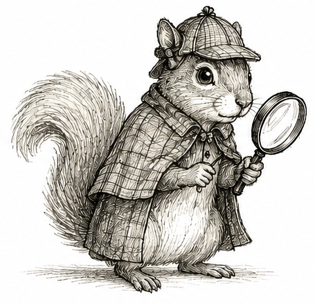{width=40% fig-align="center" fig-alt="A squirrel dressed as Sherlock Holmes wearing a deerstalker cap and cape while holding a magnifying glass."}

***

Open up any major newspaper, flip to the health section, and you will find the latest medical study showing something is linked to something else. *Wine to cancer. Coffee to anxiety. Smartphones to poor sleep.* Pick a habit, pick a condition, and somewhere out there a scientist has found a link between them and written a paper about it. Sometimes the headlines are even phrased as a question. *Are eggs bad for your heart?*

I want to know the answer. I love eggs. Scrambled eggs are one of life’s simple pleasures, and I am not giving them up without good reason. So I click on the article, nervously scanning for the conclusion. Instead, I find another study showing that people who eat more eggs have a higher rate of heart disease. Or a lower rate. It seems to depend on the week. I should know better.

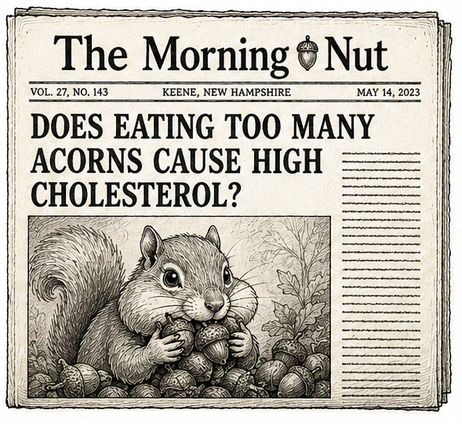{width=50% fig-align="center" fig-alt="A fictional newspaper called The Morning Nut from Keene, New Hampshire, with the headline 'Does Eating Too Many Acorns Cause High Cholesterol?' and a photograph of a squirrel eating acorns."}

Someone once joked that whenever a headline is phrased as a question, the answer is almost always "no." Are eggs bad for your heart? *No.* Does your morning coffee cause anxiety? *No.* It is a surprisingly effective rule of thumb.

Scientists develop a similar reflex. We see the words "linked to," roll our eyes ever so slightly, mumble something about confounding, and get on with our day. Another association. Another headline. It'll probably be forgotten by next week. Somewhere around the time we learn how to calculate a mean, another lesson gets drilled into us: *association is not causation.* It is one of the first things every statistics student learns, and rightly so. But what does that actually mean?

Every morning I sit in my office looking out at the large green elm outside my window. There is almost always a squirrel in it. Over the years I have watched that squirrel happily munch away on whatever seeds or fruits a green elm produces. (I should probably know what they are called.) I have never once seen it eat a walnut. Based on my observations alone, I might conclude that squirrels prefer green elms to walnut trees. That seems like a reasonable conclusion. Until I tell you there isn't a walnut tree anywhere outside my office. The squirrel was never given the choice.

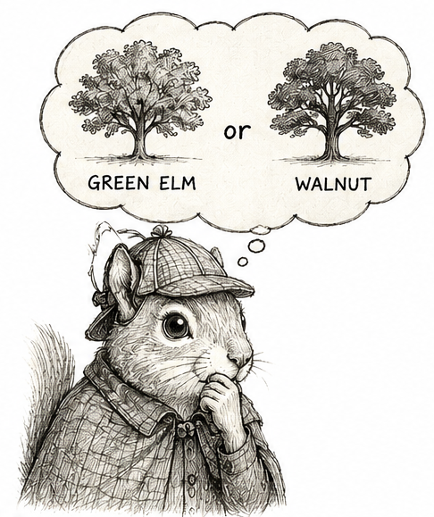{width=40% fig-align="center" fig-align="center" fig-alt="A squirrel dressed as Sherlock Holmes thoughtfully comparing a green elm tree and a walnut tree."}

In a nutshell, that is what we call in science an *observational* - or *naturalistic* study. The squirrel is simply living its life. I am not telling it where to climb or what to eat. I am just sitting back, watching, and taking notes. Nature decides what the squirrel does; I merely observe. 

Much of science works exactly this way. A few years back, a study reported that people who regularly skipped meals were more likely to develop heart problems later in life [@chen_abstract_2024]. Some friends were so concerned for me because I happened to be experimenting with intermittent fasting at the time. But stop and think for a moment about the people who skip meals. Busy people. Stressed people. People who are sleeping too little, exercising too little, grabbing fast food when they do find time to eat. Is it the fasting that leads to heart disease, or everything else that tends to come along for the ride? Just like the squirrel, we never saw what would have happened had those same people lived different lives. 

That is what makes observational studies both fascinating and frustrating. When nature writes the story, things can appear related for all sorts of reasons. Sometimes the relationship is genuine. Sometimes it is little more than coincidence. From the data alone, it can be surprisingly difficult to tell these possibilities apart.

Statisticians have a word for associations that are misleading: *spurious.* I always have to look that one up. The Cambridge Dictionary defines it as “false and not what it appears to be.” I like that definition. It makes the data sound almost mischievous, as though they are trying to trick us. And sometimes they do. There is even an entire website devoted to these deceptive relationships: [Tyler Vigen’s Spurious Correlations](https://www.tylervigen.com/spurious-correlations). 

One of my favorite examples comes from my home state of New Hampshire. There is a remarkably strong association between the annual number of burglaries and the number of babies named Johnny. I even had a friend named Johnny growing up. I can assure you he was not secretly masterminding statewide burglary rings. The association is real. The explanation is nonsense. The phrase *association is not causation* exists for a reason.

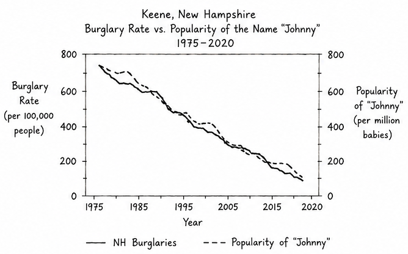{width=80% fig-align="center" fig-alt="A fake line graph showing that annual burglaries in New Hampshire track closely with the number of babies named Johnny over the same period."}

—

*But I wonder if we learned that lesson a little too well?*  

After enough contradictory nutrition studies and enough absurd examples like Johnny and burglaries, it becomes tempting to dismiss observational studies altogether. Another association? *Next.* That reaction is understandable. But it can make us timid. We become so careful not to overclaim that we sometimes stop short of the harder, more useful question: What would it take for this association to be causal?

Imagine Holmes arriving at the scene of a crime. He notices fingerprints on the murder weapon.

"Fingerprints don’t prove murder."

That's true. They don't. The butler may be the murderer. Or perhaps he handled the weapon earlier that day. Or perhaps someone planted the evidence. But imagine if Holmes shrugged, closed his notebook, and went home. That would make for a very short detective novel. Sure, fingerprints are not proof. But they are evidence. Holmes' job is not to dismiss the evidence because another explanation is possible. His job is to investigate those explanations until only the most convincing one remains.

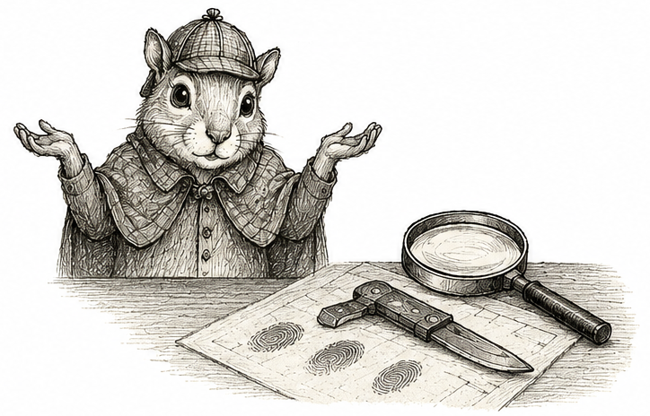{width=60% fig-align="center" fig-alt="A squirrel dressed as Sherlock Holmes shrugging while examining fingerprints on a knife beside a magnifying glass."}

Science is much the same. The hard part is not dreaming up theories. That is easy. Whenever we observe an association, there is almost always multiple stories we could tell. Perhaps one variable causes the other. Or perhaps some third factor causes them both. The hard part is deciding whether that alternative explanation can withstand careful scrutiny. Like any good detective, we are not trying to find an explanation. We are trying to find the explanation that best accounts for the evidence after reasonable alternatives have been investigated.

—

Few stories illustrate this better than the debate over smoking and lung cancer. Today, it is difficult to imagine the question ever being controversial. Cigarette packages carry warning labels. Physicians routinely advise patients to quit. But in the early 1950s, none of that was settled. Scientists debated whether smoking truly caused lung cancer. One pathologist observed the nicotine stains on the fingers of many cigarette smokers, remarking that cancers of the fingers were essentially unheard of [@hueper_quest_1956]. If tobacco tar really caused cancer, why did it seem so devastating to the lungs but not to the skin on the hands? 

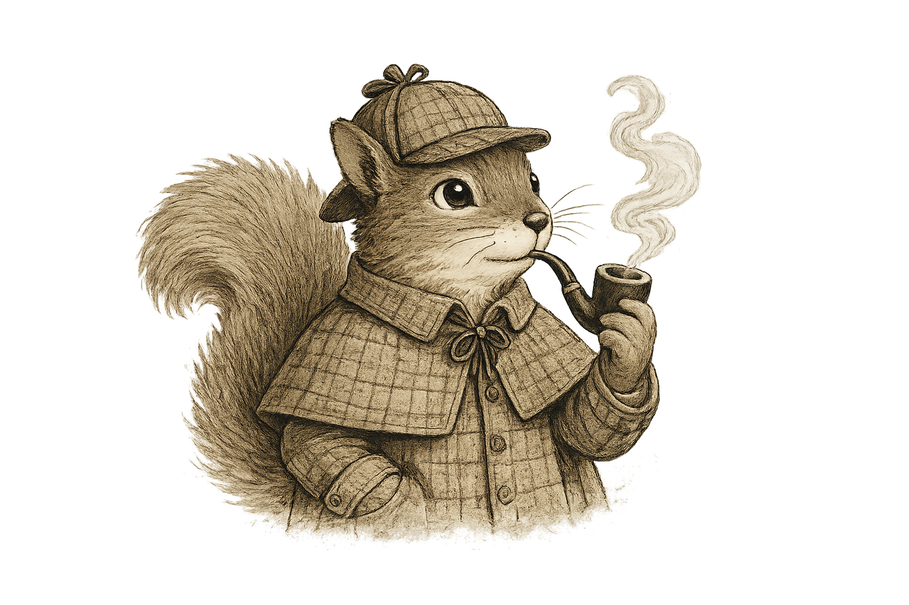{width=60% fig-align="center" fig-alt="A squirrel dressed as Sherlock Holmes while thoughtfully smoking a curved pipe."}

To help settle the debate, the American Cancer Society turned to two statistically minded epidemiologists: E. Cuyler Hammond, its director of statistical research and assistant director Daniel Horn. With the help of nearly 20,000 volunteers across the United States, they enrolled 187,783 men between the ages of 50 and 69. At enrollment, each man completed a questionnaire about his smoking habits. Then the researchers did something wonderfully simple: they waited. For nearly four years, volunteers tracked who died and, whenever possible, what they died from. By the end of the study, 11,870 men had died. Hammond and Horn compared those deaths across smoking groups.

Differences in mortality were striking. Overall, cigarette smokers experienced 397 lung cancer deaths, compared with only 37 that would have been expected had they experienced the same lung cancer rate as men who never smoked. This corresponds to a relative risk of 10.7. Even more striking was what happened as cigarette consumption increased. The more people smoked, the greater their risk became. Men who had never smoked experienced about 3.4 lung cancer deaths per 100,000 person-years. Among men smoking two or more packs of cigarettes each day, the rate climbed to 217.3—roughly 64 times higher. This was a remarkably strong association. And it became stronger with increasing exposure. If I told you today that a new medication increased your risk of cancer ninefold—let alone sixtyfold—I suspect you would stop taking it before you finished reading this chapter.

But this was still an observational study. One prominent skeptic of was the statistician Ronald Fisher, so influential and important to statistics and science that he was eventually knighted. He did not dispute the data. Instead, he questioned was whether the observations alone were enough to conclude that smoking caused lung cancer [@fisher_dangers_1957,@fisher_cigarettes_1958]. He reasoned:

> " any statistical association, observed without the precautions of a definite experiment, always allows-namely, (1) that the supposed effect is really the cause, or in this case that incipient cancer, or a pre-cancerous condition with chronic inflammation, is a factor in inducing the smoking of cigarettes, or (2) that cigarette-smoking and lung cancer, though not mutually causative, are both influenced by a common cause, in this case the individual genotype." [@fisher_dangers_1957]

Let's unpack this. We’ll use a graph. Later we’ll make these graphs precise; for now, think of them as simply sketches of two competing explanations. Fisher argued that more than one explanation was consistent with the data. One is the one we now accept: smoking causes lung cancer. This is shown on the left. The arrow runs from Smoking to Cancer. If smoking causes cancer, then people who smoke more should develop lung cancer more often, exactly as Hammond and Horn observed.

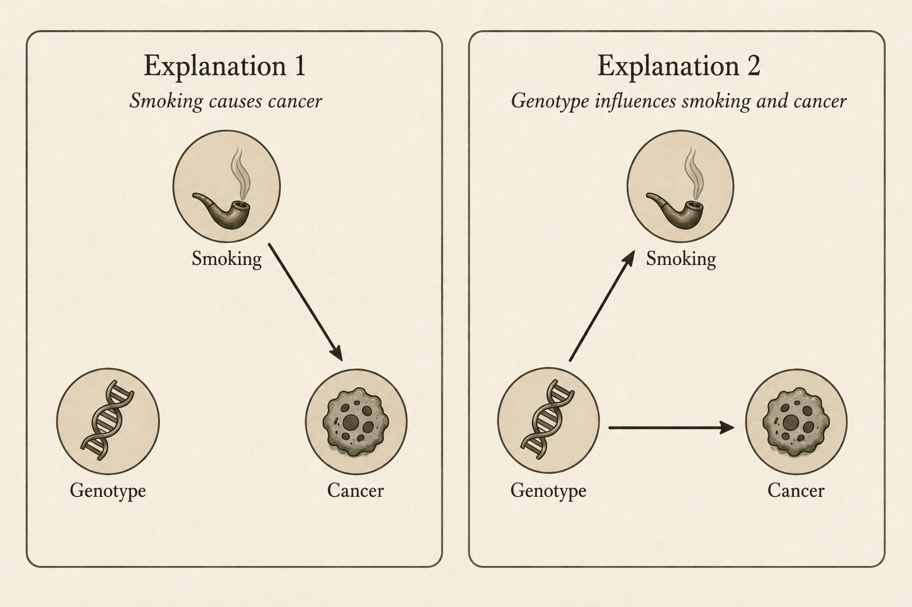{width=70% fig-align="center" fig-align="center" fig-alt="Two side-by-side causal diagrams. In both diagrams, Smoking is at the top, Genotype at the lower left, and Cancer at the lower right. In Explanation 1, there is a single arrow from Smoking to Cancer. In Explanation 2, there are arrows from Genotype to Smoking and from Genotype to Cancer."}

The second explanation is is that both smoking and lung cancer might be consequences of some third factor. Because of his interest in genetics, he suggested genotype as a candidate. Some people might inherit a genotype that makes them more enjoyable, more addictive, or easier to tolerate. If those same genes also increase the risk of lung cancer, then smokers would still develop lung cancer more often than non-smokers, even if smoking itself played no causal role. This alternative is shown on the right, where Genotype points to both Smoking and Cancer.

In the second explanation, genotype is a confounder: a common cause of both the exposure (smoking) and the outcome (lung cancer). (Confounders are the villains of this textbook, forever threatening our ability to draw causal conclusions from the associations we observe.) The mere possibility of confounding was enough to cast doubt on the claim that smoking causes lung cancer. Perhaps smokers were older. Perhaps they worked in occupations with hazardous exposures. Perhaps they lived in more polluted cities. Fortunately, possibilities like these could be investigated. Researchers could control for these confounders by comparing smokers and non-smokers within the same age group, occupation, or region. Throughout the 1950s and 1960s, they repeatedly performed analyses like these, and the association between smoking and lung cancer persisted [@doll_lung_1956,@doll_mortality_1964]. One by one, the measured confounders were ruled out.

Genotype, however, was an entirely different beast. It was unmeasured. Measured confounders can be controlled by comparing people with the same value of the confounder. An unmeasured confounder cannot. We cannot compare people with the same genotype if we do not know what their genotype is. An unmeasured confounder is an invisible alternative explanation, forever capable of casting doubt on an observed association. Fisher understood this perfectly. For him, the mere possibility of an unmeasured confounder was enough to remain skeptical. Because genotype could not be measured, he argued that the observational evidence alone could never distinguish between the two competing explanations.

—

If both explanations predict exactly the same association, how can we ever decide between them? This question is not merely historical. Open almost any modern observational study and, somewhere near the end, you will find an acknowledgment that unmeasured confounding cannot be ruled out, followed by a call for better data or future studies. It is practically a ritual.

In 1959, Jerome Cornfield and several of his colleagues had a clever idea [@cornfield_smoking_2009]. Rather than arguing that Fisher’s explanation was impossible, he asked what the world would have to look like if Fisher were right. Suppose the entire association between smoking and lung cancer were explained by an unmeasured genotype. What would necessarily have to be true? 

The argument that follows is one of my favorites because, once you draw the right picture, the answer is almost impossible to miss. Let $R_S$ and $R_N$ be the risk of lung cancer among smokers and non-smokers. We begin by plotting the point $(R_N,R_S)$. The horizontal coordinate is the risk among non-smokers; the vertical coordinate is the risk among smokers. 

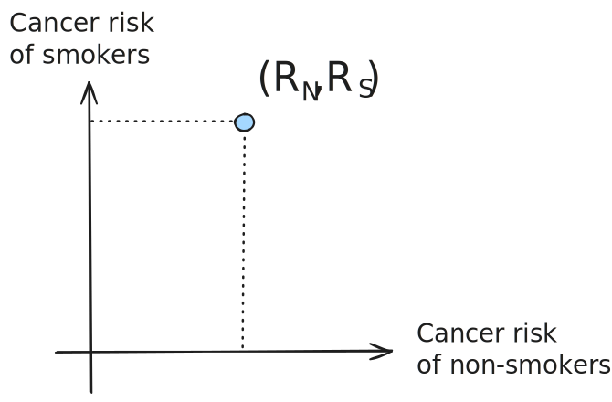{width=70% fig-align="center"}

The rectangle simply helps us locate the point. Because smokers have a higher risk of lung cancer than non-smokers, the rectangle is taller than it is wide. Now connect the origin to the point we just plotted.

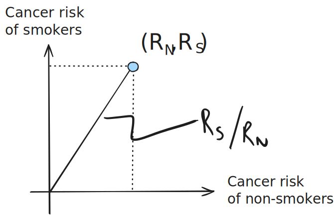{width=70% fig-align="center"}

The slope of this line is $R_S/R_N,$ which is exactly the relative risk. Steeper lines correspond to larger relative risks. Thus, instead of thinking of the relative risk as a number, we can think of it as the steepness of a line. 

Now suppose Fisher’s explanation is correct. Smoking itself has no effect on lung cancer. Instead, everyone faces the same background risk of lung cancer, which we denote by $B$. Carrying the genotype adds an additional risk, which we denote by $\Delta$. Among smokers, suppose a fraction $w_S$ carry the genotype. Then the lung cancer risk among smokers is simply the common background risk plus the additional risk contributed by the genotype:
$$R_S = B + w_S\Delta.$$
Likewise, if a fraction $w_N$ of non-smokers carry the genotype,
$$R_N = B + w_N\Delta.$$

Imagine removing the common background risk $B$ from everyone. Graphically, this shifts our point left by $B$ units and downward by $B$ units, leaving the point
$$(w_N\Delta,\;w_S\Delta).$$

We add this new point to the graph.

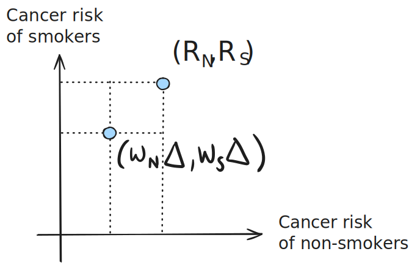{width=70% fig-align="center"}

Notice what happened. The two points differ only by the background risk. Moving from one point to the other means subtracting exactly the same quantity, $B$, from both coordinates. Consequently, the two points lie at opposite corners of a square of side length $B$. 

Connect the origin to this second point.

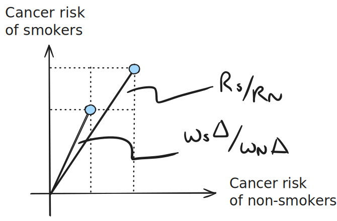{width=70% fig-align="center"}

The slope of the original line is
$$\frac{R_S}{R_N}
=
\frac{B+w_S\Delta}{B+w_N\Delta},$$
while the slope of the new line is
$$\frac{w_S\Delta}{w_N\Delta}
=
\frac{w_S}{w_N}.$$
The picture now tells the rest of the story. Removing the common background risk moves the point left and downward by the same amount. This makes the line from the origin steeper. Therefore,
$$ \frac{w_S}{w_N} > \frac{R_S}{R_N}.$$
This is Cornfield’s inequality.

Its interpretation is striking. If smokers have 11 times the lung cancer risk of non-smokers, then Fisher’s hypothetical genotype must be more than 11 times as common among smokers. If heavy smokers have 64 times the risk of never smokers, then the genotype must be more than 64 times as common among heavy smokers. Cornfield summarized the result this way:

> "the excess lung-cancer risk among cigarette smokers is so great that the results can not be interpreted as arising from an indirect association … since this hypothetical agent would have to be at least as strongly associated with lung cancer as cigarette use; no such agent has been found or suggested."

Cornfield’s argument did not prove that smoking causes lung cancer. It did something subtler. Rather than dismissing Fisher’s explanation, Cornfield accepted it (at least temporarily) and followed it to its logical conclusion. Fisher’s explanation was certainly possible, but only if one accepted an extraordinarily implausible hidden genotype. The burden had shifted. It was no longer enough to say that another explanation could exist. That explanation now had to bear the weight of its own consequences.

That is the broader lesson. Faced with competing explanations, we need not shrug our shoulders and conclude that “association is not causation.” Instead, we write down each explanation as clearly as we can and follow it wherever logic leads. Once we do, our assumptions no longer serve merely as beliefs. They become tools for reasoning - mathematical objects that can be manipulated, questioned, combined, and followed to their logical conclusions. A good detective does not wait for a confession. He keeps asking questions until one story holds together and the others fall apart.

---

Q. Some current unresolved.

Q. Fisher gave two alternative explanations for an association between two variables. Are there only two? If not, what other alternatives are there?

