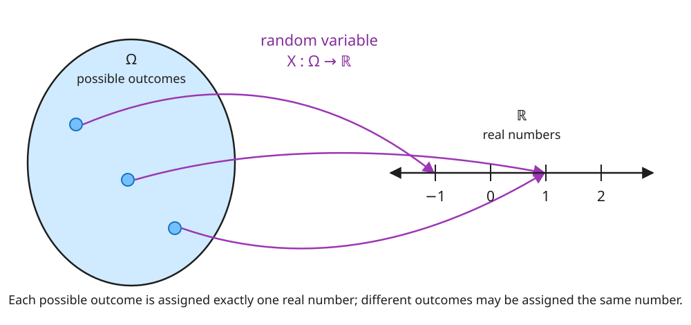
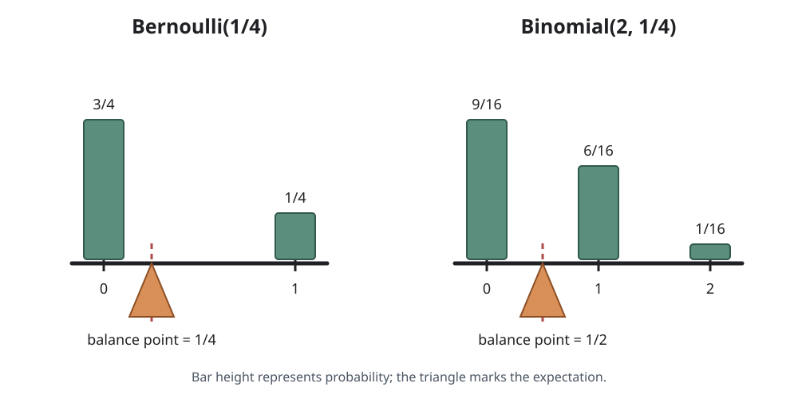
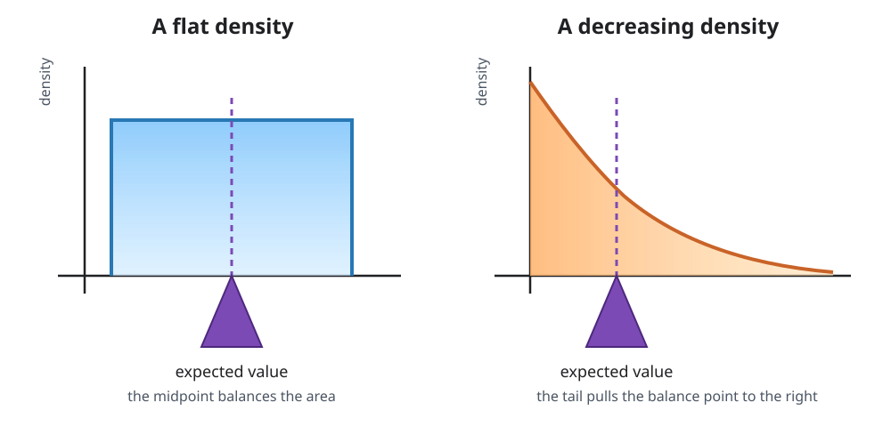
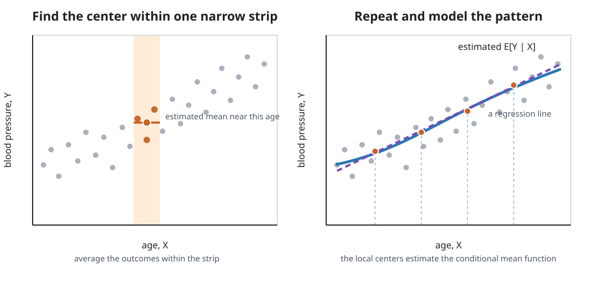

Several concepts kept surfacing when we talked about clinical trials: random variables, expectations, independence, among others. All of these come from probability. This is our formal language for talking about scenarios with uncertain outcomes: Are we in an AI bubble? Are the Badgers likely to make the basketball tournament this year? Will my bus arrive in the next ten minutes *and* have space for me?

We provide a brief review. We hope to neither offend anyone with a strong background in probability and statistics, nor scare people away from moving forward with these notes. Readers who would like a fuller review can consult Timo Seppäläinen's [*Notes on Elementary Probability*](https://people.math.wisc.edu/~seppalai/notes-for-courses/prob-basics.pdf).

## Random variables

Nothing centers more in causal inference than [random variables]{.glossary-term data-glossary="Random variable"}. These take capital letters such as $X$, $A$, and $Y$. In the Women's Health Initiative (WHI) trial, for example, $A$ represented a patient's treatment assignment: $A=1$ for assignment to hormone therapy and $A=0$ for assignment to placebo. We use lowercase letters such as $x$, $a$, and $y$ for values that were actually observed---or as a probabilist might say: *realized*. Before a patient is assigned, $A$ represents the uncertain assignment; after assignment, $a$ is the value we record for that patient.

The word *variable* can confuse. It sounds like the $x$ used to represent an unknown number in middle-school algebra. A random variable is not a number; it's a **function**. Like any function, it takes an input and spits out an output. Its input is one of the possible outcomes of the uncertain experiment or scenario we are describing. Its output is a real number. A random variable therefore lets us extract and numerically encode some aspect of an uncertain scenario: a participant's age group, treatment assignment, or coronary heart disease outcome, for example.

{fig-align="center" width="92%"}

::: {.callout-note title="Optional technical note: probability spaces" collapse="true"}
A random variable is formally defined on a *probability space*. A probability space consists of:

- a set $\Omega$ of all possible outcomes, called the *sample space*;
- a collection of subsets of $\Omega$ called *events*, to which probabilities can be assigned; and
- a probability measure $P$ that assigns those events numbers between 0 and 1 and satisfies the probability axioms.

A random variable $X$ is a suitably well-behaved function from $\Omega$ to the real numbers. When we write $P(X=1)$, we are using shorthand for the probability of the event containing every outcome $\omega\in\Omega$ that $X$ maps to 1:

$$
P(X=1)=P\bigl(\{\omega\in\Omega:X(\omega)=1\}\bigr).
$$

From here on, we assume that an appropriate probability space exists whenever we introduce random variables. We also assume that random variables discussed together are defined on the same probability space, even when we do not say so explicitly.
:::

### Distributions

Every random variable has a *distribution*. A distribution tells us the probability that the variable takes particular values or falls within particular sets. For example, $P(X=1)$ is the probability that $X$ equals 1, while

$$
P(X\in[1,10])
$$

is the probability that $X$ falls in the closed interval from 1 to 10. A distribution can also be described through its cumulative distribution function (cdf),

$$
F_X(x):=P(X\leq x).
$$

We call a random variable *discrete* if it takes a countable number of possible values. We call it *continuous* if its cdf can be represented using a density $f_X$ such that

$$
F_X(x)=\int_{-\infty}^x f_X(u)\,du.
$$

Several distributions occur so often that they have names. Some especially useful examples are:

- **Bernoulli:** If $X$ is  $\operatorname{Bernoulli}(p)$, then $X$ takes two values $0$ and $1$. It takes the value $1$ with probability $p$ and the value $0$ with probability $1-p$.

- **Binomial:** If $X$ is $\operatorname{Binomial}(n,p)$, where $n$ is a positive integer and $0\leq p\leq 1$, then

  $$
  P(X=x)=\binom{n}{x}p^x(1-p)^{n-x},\qquad x\in\{0,1,\ldots,n\}.
  $$

- **Poisson:** If $X$ is $\operatorname{Poisson}(\lambda)$, where $\lambda>0$, then

  $$
  P(X=x)=\frac{e^{-\lambda}\lambda^x}{x!},\qquad x\in\{0,1,2,\ldots\}.
  $$

- **Normal:** If $X$ is $\operatorname{Normal}(\mu,\sigma^2)$, where $\mu\in\mathbb R$ and $\sigma^2>0$, then

  $$
  f_X(x)=\frac{1}{\sqrt{2\pi\sigma^2}}
  \exp\left\{-\frac{(x-\mu)^2}{2\sigma^2}\right\},\qquad x\in\mathbb R.
  $$

One of the beauties of causal inference is that we can often leave the exact distribution unspecified. We can say that some distribution exists without knowing---or needing to know---its precise form.

### Joint distributions

Studying a single random variable is rarely interesting. How, after all, would we study cause and effect with just one variable? Our investigations involve several variables at a time. These variables are usually functions of the same underlying outcome. Their *joint distribution* tells us the probability that they collectively take particular values or fall within particular sets.

For the pair $(X,A)$ in the WHI trial, we might ask for $P(X=0,A=1)$: the probability that a participant is 50--59 years old *and* is assigned to hormone therapy. We might instead ask for $P(A=1,Y=1)$, the probability that a participant is assigned to hormone therapy *and* experiences a coronary heart disease event, or for $P(X\in\{1,2\},Y=0)$, the probability that a participant is at least 60 years old and does not experience the outcome.

The joint distribution describes how variables are associated: that is, how their values tend to vary together. Knowing only that two variables are each normally distributed tells us nothing about their relationship. They might be unrelated, strongly related, or even perfectly correlated. If instead we specify their joint distribution---for example, a bivariate or multivariate normal distribution---we must also describe how the variables relate through covariances or correlations. The distribution of each variable separately describes one variable at a time; a joint distribution describes both the individual variables and their relationships.

## Expectation

The *expectation*, *mean*, or *expected value* of a random variable is a single number meant to give us a notion of a random variable's "center." Its written like $E[X]$. You might already know that if $X$ is $\operatorname{Bernoulli}(p)$, then its expected value $E[X]$ is $p$; if $X$ is $\operatorname{Binomial}(n,p)$, then $E[X]=np$.

To see why we think of these values as centers, imagine a rigid bar marked with the possible values of $X$. At each value, place an amount of weight equal to its probability. The expectation is the point at which the bar balances. More likely values exert more influence on the balance point than less likely values. For a $\operatorname{Bernoulli}(1/4)$ random variable, the balance point is $1/4$. For a $\operatorname{Binomial}(2,1/4)$ random variable, it is $1/2$.

{fig-align="center" width="95%"}

For a discrete random variable, this balance-point picture coincides with the following definition of expectation. If $X$ takes values $x_j$, then

$$
E[X]:=\sum_j x_jP(X=x_j).
$$

We multiply each possible value by the probability placed there and add the results. Put differently, its a weighted sum of the possible values of $X$ with weights given by the respective probability that the value occurs. For $X\sim\operatorname{Bernoulli}(1/4)$,

$$
E[X]=0\left(\frac34\right)+1\left(\frac14\right)=\frac14.
$$

For $X\sim\operatorname{Binomial}(2,1/4)$, the probabilities at 0, 1, and 2 are $9/16$, $6/16$, and $1/16$, respectively. Therefore,

$$
E[X]=0\left(\frac{9}{16}\right)+1\left(\frac{6}{16}\right)+2\left(\frac{1}{16}\right)=\frac12.
$$

The mean does not have to be one of the values the variable can take. A fair six-sided die has mean $3.5$, even though a roll can never equal $3.5$.

The normal distribution provides another natural example of a center. Take $X\sim\operatorname{Normal}(\mu,\sigma^2)$. Its expected value is $E[X]=\mu$. The normal curve is centered at $\mu$ in a very literal sense. Every interval to the right of $\mu$ has a matching interval the same distance to the left with the same probability. In fact, its **density** is symmetric about $\mu$: if we cut the density at $\mu$, reflect the left side, and place it over the right side, the two curves coincide.

{fig-align="center" width="95%"}

The two sides therefore balance around $\mu$: neither side pulls the average away from it. For example, the probability that $X$ lies between $\mu$ and $\mu+1.96\sigma$ is approximately $0.475$. The probability that it lies between $\mu-1.96\sigma$ and $\mu$ is also approximately $0.475$. The expected value is therefore naturally $\mu$, the point around which the distribution is symmetric.

Continuous random variables do not generally have such an obvious point of symmetry. We can instead think of the area under the density curve as a thin sheet of material. Its horizontal center of mass---the point at which the density would balance---is the expected value. Regions where the density is higher contain more area and therefore exert more influence on that balance point.

{fig-align="center" width="95%"}

If $X$ has density $f_X$, this horizontal center of mass is calculated by

$$
E[X]:=\int_{\mathbb R}x f_X(x)\,dx.
$$

Discrete variables and variables with densities are not the only random variables we care about. Consider the amount of alcohol a person consumes in a day. A person who does not drink that day consumes exactly zero, so the variable has positive probability at zero. Among people who do drink, the amount consumed can vary continuously over positive values. The resulting variable is neither discrete nor continuous in the senses defined above. Suffice it to say that we can define the expected value $E[Y]$ for these more general random variables $Y$, but since its definition is a bit more involved, we leave it as a technical note.

::: {.callout-note title="Optional technical note: expectation for a general random variable" collapse="true"}
Defining expectation for every kind of random variable uses a **Lebesgue--Stieltjes integral**, a more general kind of integral than the one ordinarily encountered in calculus. Instead of integrating with respect to length, represented by $dx$, we integrate with respect to the cdf $X$, represented by $dF_X(x)$. Conceptually, $F_X$ places probability weight across the real line, and the integral adds values after weighting them by that probability.

If $F_X$ is the cumulative distribution function of $X$, then

$$
E[X]:=\int_{\mathbb R}x\,dF_X(x),
$$

provided this integral is defined. When $X$ is discrete, $F_X$ jumps at each possible value and the integral reduces to

$$
E[X]=\sum_j x_jP(X=x_j).
$$

When $X$ has a density $f_X$, the probability weight can be written as $dF_X(x)=f_X(x)\,dx$, and the definition reduces to

$$
E[X]=\int_{\mathbb R}x f_X(x)\,dx.
$$

More generally,

$$
E[g(X)]=\int_{\mathbb R}g(x)\,dF_X(x).
$$
:::

There are a few things we need to know about expectation. We can take expectations of functions of one or more random variables, including $X+Y$, $XY$, and $X^2$. More generally, we can write $E[g(X,Y)]$. The joint distribution of $X$ and $Y$ determines this expectation.

Most importantly, expectation is **linear**: for random variables $X$ and $Y$ and scalars $a$ and $b$,

$$
E[aX+bY]=aE[X]+bE[Y].
$$

In words, expectation respects addition and multiplication by constants. We get the same answer whether we first scale and add the random variables and then take the expectation, or first take each expectation and then scale and add the resulting numbers. We will use this property repeatedly.

Expectation also lets us describe how far a variable tends to be from its mean. The **variance** of $X$ is the average squared distance between $X$ and $E[X]$:

$$
\operatorname{Var}(X):=E\left[(X-E[X])^2\right].
$$

Here, distance is measured by squared difference. Squaring prevents positive and negative deviations from canceling and gives greater weight to larger deviations.

## Conditional expectation

### As subgroup means

We have already encountered conditional expectations in the clinical-trial section. For example,

$$
E[Y\mid A=1]
$$

described åthe mean outcome among participants assigned to hormone therapy. We read $E[Y\mid A=1]$ as "the mean of $Y$ given that $A=1$." The condition after the vertical bar told us which group to consider, while $Y$ tells us what to average within that group.

We can condition on more than one variable. Recall that $X=0$ denotes participants who are 50--59 years old. Then

$$
E[Y\mid A=1,X=0]
$$

captures the mean outcome among participants who were both assigned to hormone therapy and 50--59 years old. We first restrict attention to outcomes for which the event $\{A=1,X=0\}$ occurs and then take the mean of $Y$ within that group.

Interpreting conditional expectation as a subgroup mean only gets us so far. Imagine that $X$ records a person's exact age---not an age group, but age measured down to the year, month, day, minute, second, etc. We might want to condition on someone being exactly 35 years, 11 months, 10 days, and 5 minutes old. The probability of that exact age is zero. So there is no group at exactly that age to average over.

### As best guesses

For a more general interpretation, we view expectation as a best guess. If we must guess the value of a random variable $Y$ before observing it, and we measure the quality of our guess using squared error, the best constant guess is $E[Y]$:

$$
E[Y]=\underset{c\in\mathbb R}{\operatorname{argmin}}\;E[(Y-c)^2].
$$

This best-guess interpretation agrees with what we already know about the means of familiar random variables. For a Bernoulli random variable, the best constant guess under squared error is its success probability $p$. For a binomial random variable, it is $np$. It also agrees with the balance-point picture: the value that balances the probability weights is the value that minimizes the mean squared distance to them.

Now suppose we are allowed to observe another random variable $X$ before guessing $Y$. We can improve our guess by allowing it to depend on the value of $X$. Among all guesses that are functions of $X$, the conditional expectation $E[Y\mid X]$ has the smallest mean squared error:

$$
E[Y\mid X]
=\underset{g(X)}{\operatorname{argmin}}\;E\left[(Y-g(X))^2\right].
$$

In this sense, $E[Y\mid X]$ is our best guess for $Y$ using the information in $X$.

For example, suppose $Y$ is a person's systolic blood pressure. If we know nothing about the person, our best single guess is the overall mean blood pressure, $E[Y]$. Now suppose we learn the person's age $X$. The conditional expectation $E[Y\mid X]$ allows our guess to change with the age we observe. If we observe that the person is 30, its value is the mean blood pressure among 30-year-olds, written $E[Y\mid X=30]$. If the person is 70, its value is the mean among 70-year-olds, written $E[Y\mid X=70]$. Thus, a conditional mean is a best guess that uses the information we have observed.

In this blood-pressure-and-age example, which should be higher: $E[Y\mid X=30]$ or $E[Y\mid X=70]$?

We would generally think

$$
E[Y\mid X=70]>E[Y\mid X=30]
$$

because systolic blood pressure tends to be higher among older adults. This is a comparison of the conditional mean blood pressures at the two ages. It does not say that every 70-year-old has higher blood pressure than every 30-year-old.

A fair six-sided die is rolled, and $Y$ is the number rolled. What is your best guess for $Y$ if you have no information about the roll? What is your best guess if you know that the number rolled is odd? What is your best guess if you know that it is even?

With no information about the roll, the best guess is the mean of the six possible values:

$$
E[Y]=3.5.
$$

If we know that $Y$ is odd, its possible values are $1$, $3$, and $5$. The best guess is their conditional mean:

$$
E[Y\mid Y\text{ is odd}]=3.
$$

If we know that $Y$ is even, its possible values are $2$, $4$, and $6$. The best guess is their conditional mean:

$$
E[Y\mid Y\text{ is even}]=4.
$$

Without any information, the best guess is the mean. Once we learn whether the roll is odd or even, the best guess is the corresponding **conditional mean**.

$E[Y\mid X]$ can hide it is. It is not a single number, like expectation, but rather a function of $X$, something more like $g(X)$. Like any function, it takes an input and returns an output. In the blood-pressure example, the input is age and the output is our best guess for blood pressure. An input of 30 gives the single number $E[Y\mid X=30]$, while an input of 70 gives $E[Y\mid X=70]$.

This best-guess idea turns out to be precise enough to use it to define conditional expectation. There are a few caveats, but they will not cause problems for the conditional expectations we study in practice. They are technical enough, however, that we leave them to an optional note.

::: {.callout-note title="Optional technical note: making the best-guess idea precise" collapse="true"}
The precise best-guess statement requires $Y$ to have a finite mean and a finite variance. This is not a concern for the variables we usually encounter: most cannot wander arbitrarily far toward infinity or negative infinity, or their probabilities of taking extreme values become small quickly enough.

The minimization is over the choice of the function $g$. Because $X$ is real-valued, we consider measurable functions $g:\mathbb R\to\mathbb R$ for which $g(X)$ has finite first and second moments. Measurability is a mild technical condition that ensures $g(X)$ is itself a random variable, so its probabilities and expectations are defined. It excludes pathological functions, not the familiar functions we ordinarily use.

Subject to these conditions, we can use the best-guess idea as our definition: the **conditional expectation** $E[Y\mid X]$ is the unique random variable, up to differences that occur with probability zero, of the form $g(X)$ that minimizes

$$
E\left[(Y-g(X))^2\right].
$$
:::

### As probabilities

We introduced conditional expectation before conditional probability, which may feel backward. This order lets us begin with one idea that applies to many kinds of random variables. The more familiar conditional probability then follows when the random variables are discrete. Take $Y$ to be binary, for example. Then,

$$
E[Y\mid X]=P(Y=1\mid X).
$$

Thus, the conditional expectation of a binary outcome $Y$ given $X$ is the probability that the outcome occurs given $X$. For a particular value $x$ of $X$, this probability is

$$
E[Y\mid X=x]=P(Y=1\mid X=x).
$$
The right-hand side is the familiar form of conditional probability.

Conditional expectation also gives us the usual form of conditional probability for two events. Let $B$ and $C$ be events with $P(B)>0$. Define $1_C$ to equal one when $C$ occurs and zero otherwise. Define $1_B$ in the same way. Conditioning on the event $B$ is equivalent to conditioning on $1_B=1$. Therefore,

$$
E[1_C\mid 1_B=1]
=P(C\mid B),
$$

From an elementary probability course, you may recognize

$$
P(C\mid B)=\frac{P(C\cap B)}{P(B)}.
$$

This is the probability that $C$ occurs given that $B$ has occurred. Because $1_C$ records whether $C$ occurs and $1_B$ records when $B$ occurs, this probability is also the conditional mean of $1_C$ given $1_B = 1$.

### As regression functions

The conditional expectation $E[Y\mid X]$ is a function of $X$. When $Y$ is binary, this function gives the probability of the outcome at each value of $X$.

$$
E[Y\mid X]=P(Y=1\mid X).
$$

This should look familiar from regression. In regression, we call $Y$ the outcome and $X$ a predictor. A regression model specifies how the predicted probability of the outcome depends on the predictor. For a binary outcome, it is therefore a model for the conditional expectation $E[Y\mid X]$.

Suppose $X$ is also binary. It might indicate whether a person was exposed or unexposed. We need one predicted probability when $X=0$ and another when $X=1$. On the probability scale, we could write

$$
P(Y=1\mid X)=\alpha+\beta X.
$$

The predicted probability is $\alpha$ for the unexposed group and $\alpha+\beta$ for the exposed group. The coefficient $\beta$ is the risk difference between the two groups. This is a linear probability model. Because $X$ has only two possible values, the model can represent any two group probabilities.

Students more often see logistic regression for a binary outcome. Logistic regression models the log odds of the outcome rather than the probability itself.

$$
\operatorname{logit}\{P(Y=1\mid X)\}=\alpha+\beta X.
$$

The coefficient $\alpha$ is the log odds for the unexposed group. The coefficient $\beta$ is the log odds ratio comparing the exposed and unexposed groups, so $\exp(\beta)$ is the odds ratio. The predicted probabilities are $\operatorname{expit}(\alpha)$ when $X=0$ and $\operatorname{expit}(\alpha+\beta)$ when $X=1$. In conditional-expectation notation, $\alpha=\operatorname{logit}\{E[Y\mid X=0]\}$ and $\alpha+\beta=\operatorname{logit}\{E[Y\mid X=1]\}$.

Now suppose the outcome $Y$ is continuous. It might be systolic blood pressure. If $X$ is binary, a simple linear regression can be written

$$
E[Y\mid X]=\alpha+\beta X.
$$

The coefficient $\alpha$ is the mean blood pressure in the group with $X=0$. The quantity $\alpha+\beta$ is the mean in the group with $X=1$. The coefficient $\beta$ is the difference between the two group means. Again, the model can represent any two conditional means because $X$ is binary.

Regression requires more thought when the predictor is continuous. Suppose $X$ is age and $Y$ is systolic blood pressure. Our goal is to learn the mean blood pressure at each age, which is $E[Y\mid X]$. If we had samples of $X$ and $Y$, we might look at a narrow range of ages and average the observed blood pressures in that strip. Repeating this across ages traces an estimate of the conditional mean.

{fig-align="center" width="100%"}

A simple linear regression tries to summarize this pattern with a straight line:

$$
E[Y\mid X] \approx \alpha+\beta X
$$

and assumes that mean blood pressure follows a straight line across age. The coefficient $\beta$ is the difference in mean blood pressure associated with a one-year difference in age. Unlike the model with a binary predictor, this model imposes a shape on the conditional mean.

The same issue arises in multiple regression. A model such as

$$
E[Y\mid X,Z] \approx \alpha+\beta X+\gamma Z
$$

assumes that the predictors enter additively and linearly. It leaves out curved relationships and interactions unless we include terms for them. The model is correctly specified only when the function of $X$ and $Z$ on the left matches the true conditional mean on the right.

### Manipulating conditional expectations

Many familiar rules for expectation also have conditional versions. A useful way to remember them is to keep the conditioning variable $X$ along for the ride. Three will be especially important.

**Linearity.** Just like regular expectation, conditional expectation respects adding random variables and scaling them by constants. We can first combine $Y$ and $W$ and then take the conditional expectation, or take their conditional expectations first and then combine the results. Either order gives the same answer.

$$
E[aY+bW\mid X]=aE[Y\mid X]+bE[W\mid X].
$$

There is a warning here, though. Linearity applies to the random variables being averaged, which appear to the left of the vertical bar. It does not apply to the variables after the bar. In general,

$$
E[Y\mid X+Z] \neq E[Y\mid X]+E[Y\mid Z].
$$

Even multiplying a conditioning variable by a nonzero constant behaves differently. When $a\neq 0$, observing $aX$ gives us the same information as observing $X$, so

$$
E[Y\mid aX]=E[Y\mid X],
$$

not $aE[Y\mid X]$.

**Taking out what is known.** Once we condition on $X$, we know the value of any function $h(X)$. Suppose we want the best guess for $h(X)Y$ using $X$. The value $h(X)$ is already known, so we multiply it by our best guess for $Y$ using $X$. This gives

$$
E[h(X)Y\mid X]=h(X)E[Y\mid X].
$$

**Law of iterated expectation.** Conditional expectations allow us to average in stages. We can first find the best guess for $Y$ using $X$ and then average those guesses over the distribution of $X$. This recovers the overall mean of $Y$.

$$
E[E[Y\mid X]]=E[Y].
$$

We can also apply the same rule while keeping $X$ along for the ride. We first find the best guess using both $X$ and $Z$. We then average over the remaining uncertainty in $Z$ while retaining $X$. This recovers the best guess using $X$ alone.

$$
E\left[E[Y\mid X,Z]\mid X\right]=E[Y\mid X].
$$

## Independence

Before turning to the formal definition, it is worth dwelling on the idea that independence is about *shared information*. If two random variables are independent, learning the value of one tells us nothing about the value of the other. The information does not change what we know about the other variable.

One way to make this idea concrete is to imagine placing a bet. Suppose a roulette wheel is fair and each spin is independent. You are about to bet on whether the next spin will land on red. Someone tells you that the previous five spins all landed on black. Should that information change your bet? No. The wheel has no memory; the probability of red on the next spin is unchanged. The history may feel informative, but it provides no useful information about the next spin. The history is *independent* of the next spin.

Contrast that with betting on a card game. If you are deciding whether to bet that the next card will be an ace, learning which cards have already been dealt *does* help: cards are drawn without replacement, so the number of aces already dealt tells you something about whether the next card will be an ace. Those two quantities are therefore not independent. Similarly, if knowing whether a basketball team's leading scorer will play tells you something about whether the team will win, player availability and the game outcome are not independent.

Return to the WHI trial. Imagine its random assignment as a coin flip that determines whether a participant is assigned to hormone therapy ($A=1$) or placebo ($A=0$). Before seeing the flip, suppose I tell you the participant's age group $X$. Would that information help you predict the result of the random assignment? No: the randomization procedure does not use age to assign treatment. Looking in the other direction, if I tell you the treatment assignment, have you learned anything about the participant's age? Again, no. Treatment assignment $A$ is *independent* of age $X$. We write

$$
A\mathrel{\perp\!\!\!\perp}X.
$$

We can make independence precise with conditional expectation. Independence means that $X$ provides no information about any aspect of $Y$. In terms of best guesses, $X$ and $Y$ are independent exactly when knowing $X$ does not improve our best guess for any suitable function $g(Y)$. In other words,

$$
E[g(Y)\mid X]=E[g(Y)].
$$

This equality must hold for every suitable function $g$.

::: {.callout-note title="Optional technical note on the functions g" collapse="true"}
It is enough to require this equality for every bounded measurable function $g$. Measurability ensures that $g(Y)$ is a random variable with probabilities and expectations that are defined. Boundedness ensures that its mean is finite. Requiring the equality for all such functions is equivalent to independence.
:::

One important special case comes from using $Y$ itself. If $X$ and $Y$ are independent, then our best guess for $Y$ using $X$ is the same as our best guess without it:

$$
E[Y\mid X]=E[Y].
$$

The reverse is not necessarily true. If $E[Y\mid X]=E[Y]$, we cannot conclude that $X$ and $Y$ are independent. This equality tells us only that $X$ does not change our best guess for the value of $Y$. The variable $X$ could still tell us something else about $Y$, such as whether $Y$ is likely to be unusually large or unusually small.

The consequence we use most in causal inference often concerns potential outcomes. In the WHI trial, for example, randomization also makes treatment assignment $A$ independent of the potential outcome $Y(1)$. Therefore,

$$
E[Y(1)\mid A]=E[Y(1)].
$$

The left side would ordinarily be a function of $A$. Independence tells us that this function is constant. Evaluating it at $A=1$ gives

$$
E[Y(1)\mid A=1]=E[Y(1)].
$$

We will often describe this as removing $A$ from the conditioning event. Independence tells us that knowing $A$ does not change our best guess for $Y(1)$, so conditioning on $A$ makes no difference.

### Conditional independence

Ordinary independence is often too much to expect in an observational study. Treatment decisions may depend on a patient's characteristics, and those same characteristics may be related to the patient's outcome. Treatment assignment and the potential outcomes may therefore share information. This differs from a randomized trial, where randomization gives us independence between treatment assignment and the potential outcomes.

Conditional independence asks a more practical question. Does one variable provide any *additional* information about another once we already know a third variable? Suppose $A$ is treatment assignment, $Y(a)$ is a potential outcome, and $X$ contains patient characteristics measured before treatment. Treatment assignment $A$ and the potential outcome $Y(a)$ may not be independent. Sicker patients may be more likely to receive treatment and may also have worse outcomes. But once we know the patient characteristics $X$, we can ask whether learning $A$ tells us anything more about $Y(a)$.

If it does not, then $A$ and $Y(a)$ are independent given $X$. We write

$$
Y(a)\mathrel{\perp\!\!\!\perp}A\mid X.
$$

The phrase "given $X$" matters. We are not claiming that treatment assignment and the potential outcome share no information at all. We are claiming that treatment assignment provides no extra information about the potential outcome beyond the information already contained in $X$.

Here is a simpler example where conditional independence follows directly from how the experiment works. Suppose we randomly select one of two coins. Coin 1 lands heads with probability $1/4$, while Coin 2 lands heads with probability $3/4$. We then flip the selected coin twice. Let $Z$ identify the coin, let $X=1$ indicate heads on the first flip, and let $Y=1$ indicate heads on the second flip.

If we do not know which coin was selected, the first flip provides information about the second. Both coins are equally likely to be selected, so

$$
P(Y=1)=\frac12.
$$

But seeing heads on the first flip makes it more likely that we selected Coin 2. In fact,

$$
P(Y=1\mid X=1)=\frac58.
$$

Thus, $X$ and $Y$ are not independent. Once we know which coin was selected, however, the first flip provides no additional information about the second. The two flips are independent for either coin, so

$$
P(Y=1\mid X,Z)=P(Y=1\mid Z).
$$

Therefore, the two flips are independent given the selected coin.

$$
X\mathrel{\perp\!\!\!\perp}Y\mid Z.
$$

More generally, $X$ and $Y$ are independent given $Z$ when learning $X$ does not change our best guess for any suitable function of $Y$ once we already know $Z$. We define this by requiring

$$
E[g(Y)\mid X,Z]=E[g(Y)\mid Z].
$$

for every suitable function $g$. When it does, we write

$$
X\mathrel{\perp\!\!\!\perp}Y\mid Z.
$$

Unexpectedly, random variables can be independent without being conditionally independent, and they can be conditionally independent without being independent.

::: {.callout-note title="Optional technical note on the functions g" collapse="true"}
It is enough to require this equality for every bounded measurable function $g$. Measurability ensures that $g(Y)$ is a random variable with probabilities and expectations that are defined. Boundedness ensures that its mean is finite. Requiring the equality for all such functions is equivalent to conditional independence.
:::

### Manipulating expectations using independence

Independence lets us simplify several calculations involving expectations and variances. Conditional independence gives us the same kinds of simplifications while keeping the variables we condition on along for the ride.

**Removing information.** If $X$ and $Y$ are independent, knowing $X$ does not change our best guess for $Y$. We can therefore remove $X$ from the conditioning information.

$$
E[Y\mid X]=E[Y].
$$

If $X$ and $Y$ are independent given $Z$, knowing $X$ adds nothing to the information already provided by $Z$. We can remove $X$ while keeping $Z$.

$$
E[Y\mid X,Z]=E[Y\mid Z].
$$

For the observational-study example, the assumption $Y(a)\mathrel{\perp\!\!\!\perp}A\mid X$ allows us to write

$$
E[Y(a)\mid A,X]=E[Y(a)\mid X].
$$

**Products.** Independence lets expectation pass through a product. We can take the expectation of each variable separately and then multiply the results.

$$
E[XY]=E[X]E[Y].
$$

Conditional independence gives the corresponding rule after conditioning on $Z$.

$$
E[XY\mid Z]=E[X\mid Z]E[Y\mid Z].
$$

**Variances of sums.** The variance of a sum usually includes a covariance term. When $X$ and $Y$ are independent, that covariance is zero, so their variances add.

$$
\operatorname{Var}(X+Y)=\operatorname{Var}(X)+\operatorname{Var}(Y).
$$

The same rule holds conditionally when $X$ and $Y$ are independent given $Z$.

$$
\operatorname{Var}(X+Y\mid Z)
=\operatorname{Var}(X\mid Z)+\operatorname{Var}(Y\mid Z).
$$

## Estimators

So far, $X$, $Y$, and $Z$ have represented random variables for one person. A study gives us copies of these random variables, one for each person in our sample. We distinguish the copies with subscripts

$$
(X_1,Y_1,Z_1),\ldots,(X_n,Y_n,Z_n).
$$

We assume these triples are independent across people and have the same joint distribution. The capital letters still matter. Before we collect the data, $X_i$, $Y_i$, and $Z_i$ are random variables. After we observe person $i$, the realized values are written $x_i$, $y_i$, and $z_i$.

We eventually want to learn something about the distribution of $X$, $Y$, and $Z$. The particular quantity we want to learn is called an **estimand**. An estimand might be an overall mean such as

$$
E[Y],
$$

or a conditional mean such as

$$
E[Y\mid X=1].
$$

The estimand is a feature of the joint distribution of $X$, $Y$, and $Z$. We usually do not know its value, which is why we collected a sample.

An **estimator** is a function of the random variables in our sample that we use to estimate the estimand. The name is not very imaginative. An estimator is simply the rule we use to estimate the quantity (i.e. estimand) we want to know. Because it is a function of random variables, an estimator is itself a random variable. Its value can change from one possible sample to another.

Once we observe the data and evaluate the estimator, the resulting number is an **estimate**. The estimand is the thing we want. The estimator is the rule before we see the sample. The estimate is the number that the rule produces for the sample we actually observed.

Suppose our estimand is the mean $E[Y]$. The natural estimator is the sample mean

$$
\overline Y_n=\frac{1}{n}(Y_1+\cdots+Y_n).
$$

Linearity gives

$$
E[\overline Y_n]=E[Y].
$$

Independence allows us to add their variances, which gives

$$
\operatorname{Var}(\overline Y_n)
=\frac{\operatorname{Var}(Y)}{n}.
$$

The sample mean therefore has the same expected value as the population mean we want to learn, but its variance becomes smaller as the sample size grows.

Now suppose $X$ is binary and our estimand is the conditional mean

$$
E[Y\mid X=1].
$$

We estimate it by taking the sample mean of $Y$ among the people for whom $X_i=1$. Calling this estimator $\widehat\mu_1$, we can write

$$
\widehat\mu_1
=\frac{Y_1X_1+\cdots+Y_nX_n}{X_1+\cdots+X_n}.
$$

The denominator $X_1+\cdots+X_n$ counts how many people in the sample have $X_i=1$. The numerator adds their values of $Y_i$. When $X_i=0$, the product $Y_iX_i$ is zero, so person $i$ contributes nothing to the numerator. The ratio is therefore exactly the mean of $Y_i$ among the people with $X_i=1$. It is defined as long as at least one person in the sample has $X_i=1$.

An estimator is not automatically a good estimator merely because we use it to estimate an estimand. We need to ask how it behaves across the different samples we could have drawn.

**Bias.** An estimator $\widehat\theta$ is unbiased for an estimand $\theta$ when

$$
E[\widehat\theta]=\theta.
$$

The expectation here averages the estimator over repeated samples of the random variables. An unbiased estimator gets the right answer on average, even though it will not get exactly the right answer in every sample. Its bias is

$$
\operatorname{Bias}(\widehat\theta)
=E[\widehat\theta]-\theta.
$$

Bias will be especially important for causal inference. In an observational study, an association between treatment and outcome can be a biased estimator of a causal effect. Collecting more observations makes that association more precisely estimated, but it does not by itself turn the association into the causal effect. A very precise answer to the wrong question is still the wrong answer.

**Variability.** Two unbiased estimators can differ in how much they vary from sample to sample. We prefer an estimator with less variability because it will usually land closer to the estimand. The variance $\operatorname{Var}(\widehat\theta)$ describes this sampling variability. For the sample mean, the variance $\operatorname{Var}(Y)/n$ shows why larger samples give us more precise estimates.

**Mean squared error.** Bias and variability can be considered together through mean squared error.

$$
E[(\widehat\theta-\theta)^2]
=\operatorname{Var}(\widehat\theta)
+\operatorname{Bias}(\widehat\theta)^2.
$$

An estimator can sometimes accept a small amount of bias in exchange for a large reduction in variability. Mean squared error describes the combined result.

**Consistency.** An estimator is consistent when it gets closer to the estimand as the sample size grows. More precisely, $\widehat\theta_n$ is consistent for $\theta$ when

$$
\widehat\theta_n\longrightarrow\theta
$$

in probability as $n$ grows. Consistency is a large-sample property. An estimator may be biased in a finite sample and still be consistent if that bias disappears as the sample grows.
