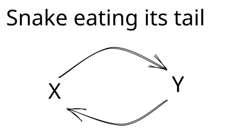
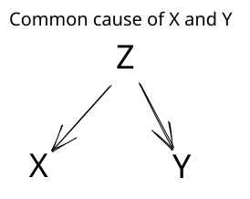
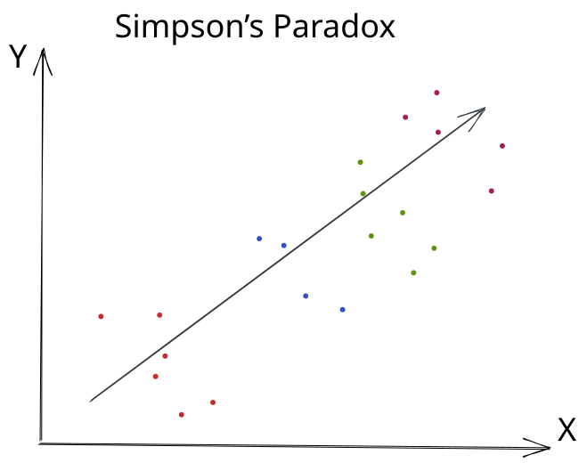
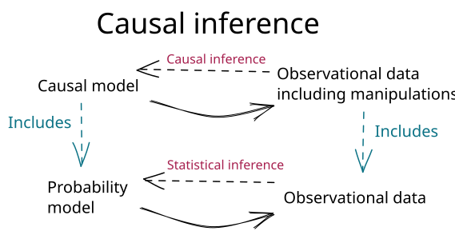

Suppose we want to understand the relationship between coffee and anxiety. Let $X$ be the number of cups of coffee a person drinks each day and let $Y$ be that person's score on an anxiety scale. We collect data on coffee consumption and anxiety, and then fit a regression model:

$$Y = \alpha + \beta X + \varepsilon.$$

Here, $\alpha$ is the intercept, $\beta$ is the slope, and $\varepsilon$ is a mean-zero random variable.

How should we interpret $\beta$?

The coefficient $\beta$ is the expected difference in anxiety score associated with drinking one additional cup of coffee per day. If $\beta=2$, then people who drink one additional cup of coffee per day have an expected anxiety score that is two points higher.

That is already useful. It summarizes the pattern in our data. It can help us predict anxiety scores for people who drink different amounts of coffee. But notice the care in the wording: an additional cup of coffee is *associated with* a two-point difference in anxiety. We did not say that drinking another cup *causes* anxiety to increase by two points.

Why are we so cautious? For one thing, we could fit another regression with the variables reversed:

$$X = \alpha' + \beta'Y + \varepsilon'.$$

Now anxiety is being used to predict coffee consumption. Here, $\alpha'$ is the intercept, $\beta'$ is the slope, and $\varepsilon'$ is the error.

Suppose $\alpha=4$ and $\beta=2$. What are $\alpha'$ and $\beta'$?

We cannot determine them from $\alpha$ and $\beta$ alone. These coefficients describe the regression of $Y$ on $X$. They do not provide enough information to calculate the regression of $X$ on $Y$.

It may be tempting to rearrange the first equation and conclude that $\alpha'=-2$ and $\beta'=1/2$. But the line that minimizes prediction errors for $Y$ is not generally the same line, turned around, that minimizes prediction errors for $X$. To calculate $\alpha'$ and $\beta'$, we would also need information about the means, variances, and covariance of $X$ and $Y$.

Both regressions can describe the association. They may also invite opposite causal stories. Coffee may affect anxiety, or people may drink more coffee because anxiety interferes with sleep and leaves them tired the next day. The data do not label one variable as the cause and the other as the effect.

This is not merely a quirk of linear regression. The following general fact states the idea more precisely.

::: {.proposition-box}
**A general fact.** We can specify the joint distribution of $X$ and $Y$ in either direction:

1. Draw $X$ first. Independently draw a uniform random number $U$, and then use $X$ and $U$ to specify $Y$.
2. Draw $Y$ first. Independently draw a uniform random number $U$, and then use $Y$ and $U$ to specify $X$.
:::

From the data on $X$ and $Y$ alone, these two specifications are indistinguishable. We therefore need information beyond the data to determine which causal direction, if either, is correct.

Optional: Why does the uniform random number work?

For real-valued $X$ and $Y$, we can choose a rule that assigns a conditional distribution of $Y$ to each value of $X$. After drawing $X$, use the conditional distribution assigned to the value that was drawn. A uniform random number $U$ chooses a percentile from that distribution. For example, $U=0.25$ selects its 25th percentile and $U=0.90$ selects its 90th percentile.

Repeating this procedure, first drawing $X$, then drawing an independent $U$, and finally selecting the corresponding conditional percentile of $Y$, reproduces the joint distribution of $(X,Y)$.

We can reverse the procedure: draw $Y$, independently draw $U$, and use it to select a percentile from the distribution of $X$ conditional on that value of $Y$. This reproduces the same joint distribution in the opposite order.

The picture below summarizes the problem as a snake eating its tail. A probability model can describe $Y$ using $X$, and it can describe $X$ using $Y$. If we interpreted both descriptions causally, we would conclude that $X$ causes $Y$ and that $Y$ causes $X$. The circular picture is not meant to propose a plausible causal mechanism. It shows why the probability model alone cannot tell us which causal arrow, if either, is appropriate.

{width="70%" fig-align="center"}

::: {.key-takeaway}
Main point

**The joint distribution of the observed variables does not, by itself, determine how those variables are causally related.**
:::

At first, this ambiguity may not seem especially troubling. Perhaps the data cannot tell us whether $X$ causes $Y$ or $Y$ causes $X$, but we might still conclude that one must cause the other.

We have already seen why that conclusion does not follow. In the smoking and lung cancer example, a confounder could, in principle, explain the entire association. The association alone could not distinguish among three possibilities: smoking causes lung cancer, lung cancer causes smoking, or a third variable causes both.

The following case studies show how consequential this problem can be. In the first, researchers identified a confounder that provided a compelling explanation for an apparent association. In the second, accounting for a confounder did more than explain the association: it reversed its direction.

## Night Lights and Childhood Myopia

::: {.example-intro}
Example 1

In May 1999, *Nature* published a short report by Graham Quinn and colleagues on night-time lighting and childhood myopia [@quinn_myopia_1999]. The researchers asked the parents of children seen in a pediatric ophthalmology clinic about the lighting conditions in which their children had slept during their first two years of life. They reported a strong association: children exposed to more ambient light at night were more likely to develop myopia.

The study included 479 children. The reported prevalence of myopia increased across the three nighttime lighting conditions:

- Among 172 children who slept in darkness, 10% had myopia.
- Among 232 children who slept with a night light, 34% had myopia.
- Among 75 children who slept with room lighting, 55% had myopia.
:::

Compared with sleeping in darkness, what was the relative risk of myopia for each lighted condition?

For children who slept with a night light, the relative risk was

$$
RR_{\text{night light}} = \frac{0.34}{0.10} = 3.4.
$$

For children who slept with room lighting, the relative risk was

$$
RR_{\text{room light}} = \frac{0.55}{0.10} = 5.5.
$$

Myopia was 3.4 times as common among children who slept with a night light and 5.5 times as common among children who slept with room lighting, compared with children who slept in darkness. These calculations describe the observed associations. They do not tell us that nighttime lighting caused myopia.

The result attracted attention because it suggested a simple environmental cause of myopia. Let $X$ indicate the nighttime lighting condition and let $Y$ indicate whether the child develops myopia. It is easy to tell a causal story in which exposure to light at night affects the development of the eye.

What do you think might confound the relationship between night-light use and childhood myopia? Why?

Parental myopia could confound the relationship. Parents with myopia may be more likely to use a night-light in their child's room, and their children may inherit a greater risk of developing myopia. Parental myopia could therefore help explain both the exposure and the outcome.

In March 2000, however, *Nature* published a response from Jane Gwiazda and colleagues [@gwiazda_myopia_2000]. They were unable to confirm the original association. They also found that myopic parents were more likely to use night-time lighting for their children, providing evidence for the confounding explanation above.

{width="60%" fig-align="center"}

Parental myopia is a common cause of the exposure and outcome. As we saw in Data Detective, this is what we call a confounder. Confounding can create an association even when the exposure does not cause the outcome.

Sometimes a common cause does something even more surprising: it can reverse the apparent direction of an association.

## Kidney-Stone Treatments

::: {.example-intro}
Example 2

Our second case study begins in a London hospital during a period when the treatment of kidney stones was changing. From 1972 through 1980, patients in the study were treated with open surgery. From 1980 through 1985, physicians increasingly used a less invasive procedure called percutaneous nephrolithotomy. In 1986, C. R. Charig and colleagues published a historical comparison of these and other kidney-stone treatments [@charig_renal_1986].

Among the patients they studied, open surgery succeeded for 273 of 350 patients, while percutaneous nephrolithotomy succeeded for 289 of 350 patients.
:::

What is the overall relative risk of successful treatment, comparing open surgery with percutaneous nephrolithotomy?

The risk of success was $273/350$ with open surgery and $289/350$ with percutaneous nephrolithotomy. Therefore,

$$
RR = \frac{273/350}{289/350} = 0.94.
$$

Overall, patients who received open surgery were about $0.94$ times as likely to have a successful treatment as patients who received percutaneous nephrolithotomy. Equivalently, the observed probability of success was about $6\%$ lower with open surgery.

Eight years later, Steven Julious and Mark Mullee revisited these data [@julious_confounding_1994]. They pointed out that kidney stones vary in size and that stone size was related both to treatment and to the chance of success. When they compared patients with similarly sized stones, the pattern reversed.

For small stones:

- Open surgery succeeded for 81 of 87 patients.
- Percutaneous nephrolithotomy succeeded for 234 of 270 patients.

For large stones:

- Open surgery succeeded for 192 of 263 patients.
- Percutaneous nephrolithotomy succeeded for 55 of 80 patients.

What is the relative risk of successful treatment within each kidney-stone size?

For patients with small stones,

$$
RR_{\text{small}} = \frac{81/87}{234/270} = 1.07.
$$

For patients with large stones,

$$
RR_{\text{large}} = \frac{192/263}{55/80} = 1.06.
$$

Within each kidney-stone size, patients who received open surgery were more likely to have a successful treatment. The direction of the association is the opposite of the overall comparison.

Open surgery was used much more often for difficult, large stones, while percutaneous nephrolithotomy was used much more often for easier, small stones. Combining the two stone sizes therefore compares treatment groups with very different mixtures of patients. Once we compare patients with similarly sized stones, open surgery has the higher observed success rate in both groups.

Based on these results, which treatment would you recommend?

If successful stone removal were our only consideration, the comparisons within kidney-stone size would favor open surgery. These comparisons are more informative than the overall comparison because stone size influenced treatment choice and was also related to treatment success.

A clinical recommendation would require more than these success rates. Percutaneous nephrolithotomy is less invasive, and clinicians would also consider complications, recovery time, cost, other characteristics of the stone, and the patient's preferences. Moreover, these data came from a historical comparison rather than a randomized trial.

## Simpson's Paradox

The example we just saw showed us [Simpson's paradox]{.glossary-term data-bs-toggle="tooltip" data-bs-title="A reversal in which the direction of an association in the combined data is opposite to its direction within groups defined by a third variable." tabindex="0"}. **Simpson's paradox** occurs when the direction of an association in the combined data is opposite to its direction within groups defined by a third variable. In the kidney-stone example, the overall comparison favored percutaneous nephrolithotomy, while the comparisons within both stone sizes favored open surgery.

Simpson's paradox is not limited to binary exposures and outcomes. The same reversal can occur when $X$ and $Y$ are continuous. In the picture below, color indicates membership in a third group. Within every color, the points move downward as $X$ increases, showing a negative association between $X$ and $Y$. If we ignore the colors and combine all the points, the dark arrow moves upward, showing a positive association.

{width="70%" fig-align="center"}

## Something more than statistics

Statistical inference uses observed data to learn about a probability model. From data, we can infer means and probabilities. We can also infer measures of association, such as risk differences, relative risks, odds ratios, and correlations. These quantities tell us how variables are distributed and how they are related.

Causal inference aims at a different target. We want to answer causal questions, such as: How much might an exposure cause an outcome to occur or change? A probability model alone cannot answer this question. It can tell us how the exposure and outcome occur together, but it cannot tell us how the outcome would change if the exposure changed.

To answer causal questions, we need to say more than what is contained in the joint distribution of the variables. One important part of this “more” is directionality. We specify which variables can cause which other variables. A **causal model** makes this directionality explicit by describing each variable in terms of its direct causes. Because it adds causal structure to a probability model, a causal model subsumes a probability model.

The bottom of the figure represents statistical inference. We use observed data to learn about a probability model. The top represents causal inference. We use data to learn about a causal model. This lets us infer quantities such as how much an exposure causes an outcome to change.

{width="68%" fig-align="center"}

**How do we add this directionality? What, more precisely, is a causal model?**
