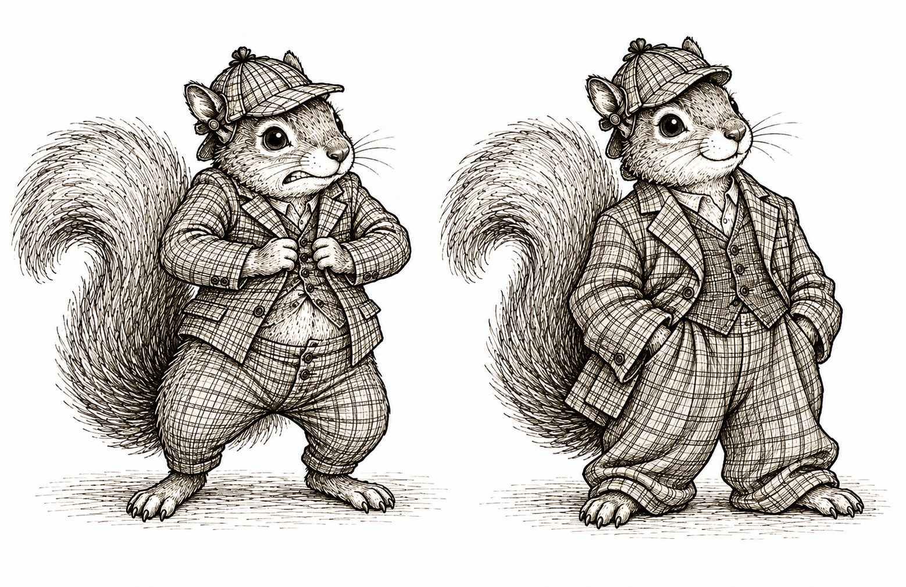

{width=75% fig-align="center" fig-alt="Two squirrels in checked hats: one struggles to button a suit that is much too tight; the other looks relaxed and confident in a roomy, baggy suit."}

## Introduction

In the previous section, we committed to a story about how the world generated our variables. To make that story concrete, we also specified every distribution, function, parameter, and number needed to generate data.

But these are two different commitments. We may be willing to say which variables the world used to generate which others without pretending that we know exactly how the world did it. How much of the story do we actually need to specify?

Like the squirrels above, we can give ourselves more room. **Leaving the assignment functions unspecified lets us keep the causal story without squeezing it into a particular functional form.** We still commit to the parents and independent noise; we leave room for how those inputs generate each variable.

This problem becomes hard to ignore when we work with data from the world. We observe the data and try to tell a plausible story for how the world generated them. The right heart catheterization study gives us a concrete example.

::: {.example-intro}
<span class="example-label">Case study: Right heart catheterization</span>

Between 1989 and 1994, the Study to Understand Prognoses and Preferences for Outcomes and Risks of Treatments followed critically ill adults receiving care in five teaching hospitals in the United States. In 1996, Connors and colleagues used data from 5,735 of these patients to study right heart catheterization, or RHC, a procedure used to measure cardiac function [@connors1996].

**Resources** &nbsp; [Study and dataset](https://hbiostat.org/data/repo/rhc) | [Data dictionary](https://hbiostat.org/data/repo/crhc) | [Download CSV](https://hbiostat.org/data/repo/rhc.csv) | [Data repository](https://hbiostat.org/data/)
:::

We investigate three variables. Let $X$ be the patient's mean blood pressure on day one. Let $A$ indicate whether the patient received RHC on the qualifying day. Let $Y$ indicate whether the patient died within 30 days.

Before looking at the data, we tell the following story.

1. First, the world gives us the patient's mean blood pressure $X$.
2. Next, the decision about RHC is made. That decision $A$ may depend on $X$.
3. Finally, the patient either dies within 30 days or survives. The outcome $Y$ may depend on $X$ and $A$.

Forgive us for keeping the story so simple. A serious analysis would consider many baseline characteristics, as the original study did, rather than blood pressure alone. For now, the simpler story lets us focus on how we turn a story into something formal.

## Attempts to specify everything

Suppose we want to generate data from our story. We might begin with

$$
X\leftarrow\operatorname{Normal}(\mu,\sigma^2),
$$

$$
A\leftarrow
\operatorname{Bernoulli}
\left\{
\operatorname{logit}^{-1}(\alpha_0+\alpha_1X)
\right\},
$$

$$
Y\leftarrow
\operatorname{Bernoulli}
\left\{
\operatorname{logit}^{-1}(\beta_0+\beta_1X+\beta_2A)
\right\}.
$$

These assignments preserve our three-variable story, but they say considerably more. We have declared that mean blood pressure follows a normal distribution. We have made the log odds of RHC a linear function of mean blood pressure. We have also made the log odds of death an additive linear function of mean blood pressure and RHC. To generate any data, we must go further and choose numerical values for all seven parameters.

We could guess. For example, we might take $\mu=100$ and $\sigma=15$ for the first assignment and choose plausible-looking coefficients for the other two. @fig-rhc-initial-models compares two such guesses with the observed data. Our guesses miss both the distribution of mean blood pressure and its relationship with RHC receipt.

```{r}
#| label: fig-rhc-initial-models
#| fig-cap: "Observed features of the RHC data compared with our initial choices of parameter values."
#| fig-alt: "Two panels compare observed RHC data with poorly chosen models. The first overlays a guessed normal distribution on the observed distribution of mean blood pressure. The second compares observed RHC proportions across mean blood pressure with a guessed logistic curve that moves in the wrong direction."
#| echo: false
#| fig-width: 9
#| fig-height: 4.5
rhc <- read.csv("data/rhc.csv")
rhc_model <- data.frame(
  X = rhc$meanbp1,
  A = as.integer(rhc$swang1 == "RHC"),
  Y = as.integer(rhc$dth30 == "Yes")
)
rhc_model <- rhc_model[complete.cases(rhc_model), ]

breaks <- unique(quantile(rhc_model$X, probs = seq(0, 1, 0.1)))
rhc_model$severity_group <- cut(rhc_model$X, breaks, include.lowest = TRUE)
empirical_rhc <- aggregate(cbind(X, A) ~ severity_group, rhc_model, mean)

fitted_x_mean <- mean(rhc_model$X)
fitted_x_sd <- sd(rhc_model$X)
fitted_a <- glm(A ~ X, family = binomial(), data = rhc_model)
x_grid <- seq(min(rhc_model$X), max(rhc_model$X), length.out = 300)

observed_fill <- "#DCE8D5"
observed_green <- "#315C43"
guess_green <- "#7A8738"
fitted_green <- "#2F7655"

old_par <- par(mfrow = c(1, 2), mar = c(4, 4, 2.5, 1))

hist(rhc_model$X, probability = TRUE, breaks = 30,
     col = observed_fill, border = "white",
     xlab = "Mean blood pressure (mm Hg)", main = "Distribution of X")
curve(dnorm(x, 100, 15), add = TRUE, col = guess_green, lwd = 3)

plot(empirical_rhc$X, empirical_rhc$A, pch = 19, col = observed_green,
     ylim = c(0, 0.8), xlab = "Mean blood pressure (mm Hg)",
     ylab = "Proportion receiving RHC", main = "Probability of A = 1")
lines(x_grid, plogis(-1.5 + 0.01 * x_grid), col = guess_green, lwd = 3)

par(old_par)
```

Part of the problem is we do not know the parameter values. We can try to use the data. For the normal assignment, we can use the observed mean and standard deviation. For the RHC assignment, we can fit a logistic regression. @fig-rhc-fitted-models uses these fitted values. The fitted normal curve now has the right mean and standard deviation, but it still misses the two separate bumps in the observed distribution. The fitted logistic curve summarizes the broad relationship between blood pressure and RHC receipt, but it does not reproduce every feature of the empirical relationship.

```{r}
#| label: fig-rhc-fitted-models
#| fig-cap: "Observed features of the RHC data compared with models whose parameters were fitted using the data."
#| fig-alt: "Two panels compare observed RHC data with fitted models. The fitted normal curve has the observed mean and standard deviation but misses the two clusters in the blood pressure distribution. The fitted logistic curve captures the broad decline in RHC receipt as mean blood pressure increases."
#| echo: false
#| fig-width: 9
#| fig-height: 4.5
old_par <- par(mfrow = c(1, 2), mar = c(4, 4, 2.5, 1))

hist(rhc_model$X, probability = TRUE, breaks = 30,
     col = observed_fill, border = "white",
     xlab = "Mean blood pressure (mm Hg)", main = "Distribution of X")
curve(dnorm(x, fitted_x_mean, fitted_x_sd), add = TRUE,
      col = fitted_green, lwd = 3)

plot(empirical_rhc$X, empirical_rhc$A, pch = 19, col = observed_green,
     ylim = c(0, 0.8), xlab = "Mean blood pressure (mm Hg)",
     ylab = "Proportion receiving RHC", main = "Probability of A = 1")
lines(x_grid, predict(fitted_a, data.frame(X = x_grid), type = "response"),
      col = fitted_green, lwd = 3)

par(old_par)
```

::: {.main-point}
**Even with well-chosen parameters, the model form itself can be wrong.**
:::


<details class="lesson-question">
<summary>The fitted normal distribution still does not describe the observed distribution of mean blood pressure very well. What could we change about the assignment for $X$?</summary>

We could replace the normal distribution with a distribution that better captures the observed shape. We could also leave the distribution of $X$ unspecified. The second choice preserves our story about which variables generate which others without requiring us to choose a particular distribution for $X$.

</details>

Spelling out every detail of a model is not entirely useful. But it does make us commit to details that may not be essential to our causal story. We could keep adding transformations, interactions, parameters, and new distributions. But do we really need to get all of those details right before we can say what we mean by causality?

<div class="section-break" aria-hidden="true"><span class="acorn-mark"></span></div>

## Another way to generate variables

To see what we can relax, it helps to look more closely at how a random variable can be generated. Consider the assignment for RHC. We might generate $A$ directly from a Bernoulli distribution,

$$
A\leftarrow\operatorname{Bernoulli}\{p(X)\},
$$

where $p(X)$ is the probability of RHC for a patient with blood pressure $X$.

However, we can generate exactly the random variable another way. Let $\epsilon_A$ be uniformly distributed between zero and one. We also take $\epsilon_A$ to be independent of $X$; in the language of the previous chapter, the two variables share no information. We write these two statements as

$$
\epsilon_A\sim\operatorname{Uniform}(0,1),
\qquad \epsilon_A\mathrel{\perp\!\!\!\perp}X.
$$

To see how this works, consider a patient with blood pressure $X=x$ for whom $p(x)=0.4$. The world draws a value of $\epsilon_A$ somewhere between zero and one. If that value falls between zero and $0.4$, we assign $A=1$. If it falls above $0.4$, we assign $A=0$.

The uniform distribution turns this probability question into a geometry problem. The probability of landing in any interval between zero and one is the length of that interval. The interval from zero to $0.4$ has length $0.4$, so

$$
P(\epsilon_A\leq0.4)=0.4.
$$

The remaining interval has length $0.6$, so

$$
P(\epsilon_A>0.4)=0.6.
$$

For example, a draw of $\epsilon_A=0.3$ falls in the first interval, so we assign $A=1$. A draw of $\epsilon_A=0.8$ falls in the second interval, so we assign $A=0$. Two patients with the same recorded blood pressure can therefore receive different values of $A$.

```{r}
#| label: fig-uniform-to-bernoulli
#| fig-cap: "Generating a Bernoulli random variable from a uniform random variable when $p(X)=0.4$."
#| fig-alt: "A horizontal line runs from zero to one with a cutoff at 0.4. Uniform draws from zero through 0.4 produce A equal to one, while draws above 0.4 produce A equal to zero. A draw at 0.3 is shown in the first region and a draw at 0.8 in the second."
#| echo: false
#| fig-width: 8
#| fig-height: 2.8
old_par <- par(mar = c(3, 1, 1, 1))

plot(NA, xlim = c(-0.03, 1.03), ylim = c(-0.15, 0.85),
     axes = FALSE, xlab = "", ylab = "", bty = "n")
rect(0, 0.2, 0.4, 0.52, col = "#BFD5B8", border = NA)
rect(0.4, 0.2, 1, 0.52, col = "#E6EEDF", border = NA)
segments(0, 0.2, 1, 0.2, col = "#315C43", lwd = 2)
segments(c(0, 0.4, 1), 0.16, c(0, 0.4, 1), 0.24,
         col = "#315C43", lwd = 2)
text(c(0, 1), 0.09, labels = c("0", "1"), col = "#244635")
text(0.4, -0.06, labels = "p(X) = 0.4", col = "#244635")
text(0.2, 0.68, expression(A == 1), col = "#244635", font = 2, cex = 1.2)
text(0.7, 0.68, expression(A == 0), col = "#244635", font = 2, cex = 1.2)
points(c(0.3, 0.8), c(0.41, 0.41), pch = 19, cex = 1.5,
       col = c("#2F7655", "#708238"))
text(c(0.3, 0.8), c(0.31, 0.31), labels = c("0.3", "0.8"),
     col = "#244635")

par(old_par)
```

The same argument works for any value of $p(X)$. Once we know $X$, the value $p(X)$ is a number between zero and one. The interval from zero to $p(X)$ has length $p(X)$, so the probability that a uniform random variable lands in that interval is $p(X)$. The remaining interval has length $1-p(X)$.

We can now write the assignment in general. We assign $A=1$ when $\epsilon_A$ is no greater than $p(X)$. Otherwise, we assign $A=0$.

$$
A\leftarrow
\begin{cases}
1, & \epsilon_A\leq p(X),\\
0, & \epsilon_A>p(X).
\end{cases}
$$

If we call the function described by these two cases $f_A$, we can write the same assignment more compactly as

$$
A\leftarrow f_A(X,\epsilon_A).
$$

The notation $f_A$ is doing more work than it may look. The assignment function sucks up the function $p$ and any parameters used to define it. Once those details are part of $f_A$, we no longer need to display them separately in the assignment.

Given $X$, this assignment produces $A=1$ with probability $p(X)$ and $A=0$ with probability $1-p(X)$. It is therefore generates a random variables with the same distribution as the original assignment

$$
A\leftarrow\operatorname{Bernoulli}\{p(X)\}.
$$

We have rewritten the original Bernoulli assignment as an assignment function with an additional source of randomness. The probability $p(X)$ depends on blood pressure, while $\epsilon_A$ supplies the additional randomness.

This construction is not peculiar to binary variables. Consider the normal assignment

$$
W\leftarrow\operatorname{Normal}\{\mu(X),\sigma^2\}
$$

Let $\Phi$ be the cdf of a standard normal random variable. In words, $\Phi(z)$ is the probability that a standard normal random variable is less than or equal to $z$. Its inverse, $\Phi^{-1}(u)$, takes a probability $u$ between zero and one and returns the corresponding value of a standard normal random variable.

Now let $\epsilon_W$ be uniformly distributed between zero and one and independent of $X$. We can write the assignment as

$$
W\leftarrow\mu(X)+\sigma\Phi^{-1}(\epsilon_W),
\qquad
\epsilon_W\sim\operatorname{Uniform}(0,1),
\qquad \epsilon_W\mathrel{\perp\!\!\!\perp}X.
$$

The transformation $\Phi^{-1}(\epsilon_W)$ turns the uniform random variable into a standard normal random variable. Multiplying it by $\sigma$ gives it standard deviation $\sigma$, and adding $\mu(X)$ gives it mean $\mu(X)$. The resulting assignment generates a variable with the same distribution as the original assignment

$$
W\leftarrow\operatorname{Normal}\{\mu(X),\sigma^2\}.
$$

We can also turn this construction into an assignment function. Define

$$
f_W(X,\epsilon_W)
=\mu(X)+\sigma\Phi^{-1}(\epsilon_W).
$$

Then we can write

$$
W\leftarrow f_W(X,\epsilon_W).
$$

Here, $f_W$ sucks up the function $\mu$, the parameter $\sigma$, and any parameters used to define $\mu$. The shorter assignment keeps the inputs $X$ and $\epsilon_W$ visible while allowing all those other details to remain inside the assignment function.

We could play the same game with a Poisson random variable, or any random variable for that matter. The uniform draw tells us which percentile to select from the distribution we want to generate. We can then let the assignment function suck up the rule for selecting that percentile, along with any parameters that describe the distribution. The details may change from one distribution to another, but the recipe stays the same. The assignment function uses the other variables in the story together with some additional randomness to generate the variable on the left.

The same idea applies when a variable in our story is a random vector. Suppose, for example, that we collect baseline mean blood pressure and temperature into $X$. We can write

$$
X\leftarrow f_X(\epsilon_X).
$$

Generating the two components together may require something richer than one uniform random variable. That is okay. We collect whatever additional randomness we need into $\epsilon_X$. We can find some random input and assignment function that work, and we can take that random input to be independent of the variables that came before $X$ in our story.


::: {.main-point}
Writing one assignment as a function of other variables and an independent noise term does not restrict which conditional distributions we can represent. Any distribution for a variable given the variables already generated can be reproduced in this form. The assignment function incorporates the parameters and the rule for transforming the noise so that the desired conditional distribution is reproduced.
:::

::: {.callout-note title="Optional technical note on generating random variables and vectors" collapse="true"}
For a real-valued random variable, a conditional distribution can be represented using a measurable function of its conditioning variables and an independent $\operatorname{Uniform}(0,1)$ random variable. One construction applies the generalized inverse of the conditional cdf to the uniform variable. This is sometimes called the inverse-transform method.

A random vector can be generated in the same general way. Take a collection of independent uniform random variables. Use the first to generate the first component from its distribution. Use the second to generate the second component from its distribution conditional on the first component, and continue in this way. The conditional distributions carry the dependence between the components, so this construction can generate correlated components as well as independent ones. We can collect the uniform random variables into $\epsilon$. This gives a representation of the form

$$
X\leftarrow f(\epsilon).
$$

Thus, the notation for an assignment function does not restrict an assignment to a real-valued random variable or require a single source of uniform randomness.
:::

<div class="section-break" aria-hidden="true"><span class="acorn-mark"></span></div>

## Structural causal models

We can now write the RHC story without committing to named distributions or particular functional forms:

$$
X\leftarrow f_X(\epsilon_X),
$$

$$
A\leftarrow f_A(X,\epsilon_A),
$$

$$
Y\leftarrow f_Y(X,A,\epsilon_Y).
$$

Each assignment contains the same three ingredients.

**The first ingredient is an assignment function.** The functions $f_X$, $f_A$, and $f_Y$ are the rules the world uses to generate the variables. We are saying that these rules exist, even though we do not know exactly what they are.

**The second ingredient is a collection of other variables used by the assignment function.** The assignment for $X$ does not use any other variables. The assignment for $A$ uses $X$. The assignment for $Y$ uses both $X$ and $A$. We call these other variables the parents.

$$
\operatorname{Pa}_X=\varnothing,
\qquad
\operatorname{Pa}_A=\{X\},
\qquad
\operatorname{Pa}_Y=\{X,A\}.
$$

::: {.definition-box}
[**Parents**]{.glossary-term data-glossary="Parent"}. The parents of a variable are the other variables used as inputs to its assignment function. Noise terms are not included among the parents.
:::

Consider the following three collections of assignments.

The assignments in **Collection A** are

$$
\begin{aligned}
X&\leftarrow f_X(\epsilon_X),\\
A&\leftarrow f_A(X,\epsilon_A),\\
Y&\leftarrow f_Y(X,A,\epsilon_Y).
\end{aligned}
$$

The assignments in **Collection B** are

$$
\begin{aligned}
X&\leftarrow f_X(\epsilon_X),\\
W&\leftarrow f_W(\epsilon_W),\\
Y&\leftarrow f_Y(X,W,\epsilon_Y).
\end{aligned}
$$

The assignments in **Collection C** are

$$
\begin{aligned}
X&\leftarrow f_X(\epsilon_X),\\
A&\leftarrow f_A(X,\epsilon_A),\\
Y&\leftarrow f_Y(A,\epsilon_Y).
\end{aligned}
$$

<details class="lesson-question">
<summary>For each collection of assignments, what are the parents of each variable?</summary>

For Collection A, $\operatorname{Pa}_X=\varnothing$, $\operatorname{Pa}_A=\{X\}$, and $\operatorname{Pa}_Y=\{X,A\}$.

For Collection B, $\operatorname{Pa}_X=\varnothing$, $\operatorname{Pa}_W=\varnothing$, and $\operatorname{Pa}_Y=\{X,W\}$.

For Collection C, $\operatorname{Pa}_X=\varnothing$, $\operatorname{Pa}_A=\{X\}$, and $\operatorname{Pa}_Y=\{A\}$. Although $X$ is used to generate $A$ and $A$ is used to generate $Y$, $X$ is not a parent of $Y$ because it is not an input to the assignment function for $Y$.

</details>

**The third ingredient is a noise variable.** The variables $\epsilon_X$, $\epsilon_A$, and $\epsilon_Y$ contain whatever else the world uses to generate $X$, $A$, and $Y$. Calling them noise does not mean that they are mistakes or measurement errors. They contain the remaining randomness in each assignment.

We do the same thing for every variable in our story. Give it an assignment function, list its parents, and give it a noise variable. Make sure the noise variables are independent, and voilà. We have a structural causal model.

::: {.definition-box}
[**Structural causal model**]{.glossary-term data-glossary="Structural causal model (SCM)"}. Let $V_1,\ldots,V_K$ be the variables in our story. A structural causal model defines each variable $V_j$ through an assignment

$$
V_j\leftarrow f_j(\operatorname{Pa}_j,\epsilon_j),
\qquad j=1,\ldots,K,
$$

Each assignment contains an assignment function $f_j$, a collection of parent variables $\operatorname{Pa}_j$, and a noise variable $\epsilon_j$. The function takes the values of the parents and the noise as inputs and returns a value for $V_j$. The noise variables $\epsilon_1,\ldots,\epsilon_K$ are independent.
:::

We will usually abbreviate structural causal model as **SCM**.

We have already assumed that our assignments have a topological order. Now that we have introduced parents, we can state that assumption more simply. We can order the variables so that the parents of each variable appear before that variable.

We should be clear about what an SCM is not specifying. We do not have to give a formula for each assignment function or name a probability distribution for each noise variable. Those functions and distributions exist as part of the model, but we can leave them unknown.

We should also be clear about what an SCM is specifying. We specify which variables are parents of each variable. We assume that each assignment function takes its stated parents and noise variable as inputs and returns a value in the right space. We also assume that the noise variables are independent as an entire collection. By writing

$$
A\leftarrow f_A(X,\epsilon_A),
$$

we say that the world uses $X$, together with the additional randomness in $\epsilon_A$, to generate $A$. Which variables appear as inputs is part of our causal story.

That last assumption is easy to read past. With several noise terms, independence means more than checking them two at a time. Two noise terms together might reveal a third, and three might reveal a fourth. For example, if two noise terms record independent coin flips and a third records whether the flips agree, no one term reveals another, but the first two together determine the third.More generally, learning any collection of noise terms must tell us nothing about the noise terms that remain. This is the independence assumption we make in an SCM.

Consider to the WHI trial. Let $X$ collect baseline characteristics, let $A$ be randomized assignment to hormone replacement therapy or placebo, and let $Y$ indicate a coronary heart disease event.

<details class="lesson-question">
<summary>Write an SCM for this story. What are the parents of each variable?</summary>

We can write

$$
\begin{aligned}
X&\leftarrow f_X(\epsilon_X),\\
A&\leftarrow f_A(\epsilon_A),\\
Y&\leftarrow f_Y(X,A,\epsilon_Y).
\end{aligned}
$$

The parents are $\operatorname{Pa}_X=\operatorname{Pa}_A=\varnothing$ and $\operatorname{Pa}_Y=\{X,A\}$. The assignment for $A$ does not use $X$ because treatment was randomized without using the participant's baseline characteristics.

The noise terms are independent.

</details>

We should pause to give credit where credit is due. SCMs have early roots in the structural-equation-modeling literature. Pearl and Verma brought these ideas into causal inference in a form close to the one we use here [@pearlverma1991]. Pearl subsequently made SCMs central to modern causal inference [@pearl2009causality]. The version with general assignment functions and independent noise terms is often called a nonparametric structural equation model with independent errors, or NPSEM-IE.

<div class="section-break" aria-hidden="true"><span class="acorn-mark"></span></div>

## What follows probabilistically

An SCM gives us two useful facts about the probability model.

**Our first useful fact is that all the randomness of our variables lives in the noise terms.** Once the noise terms have taken their values, we can follow the assignment functions in topological order to determine every other variable.

This also means that we can use the same underlying randomness to construct several random variables on the same probability space. Consider again the assignment

$$
Y\leftarrow f_Y(X,A,\epsilon_Y).
$$

Using the same $X$ and $\epsilon_Y$, we could just as easily generate other random variables like

$$
Y_0 \leftarrow f_Y(X,0,\epsilon_Y)
$$

and

$$
Y_1 \leftarrow f_Y(X,1,\epsilon_Y).
$$

Because $Y$, $Y_0$, and $Y_1$ are all constructed from the same underlying random variables, they live on the same probability space. We can therefore compare $Y$ with $Y_0$, compare $Y$ with $Y_1$, or compare $Y_1$ with $Y_0$. For example, $Y-Y_0$, $Y-Y_1$, and $Y_1-Y_0$ are themselves random variables whose distributions and expectations we can study.


**Our second useful fact is that an SCM also leaves clues about which variables share information and which do not.** In the previous section, we saw that the assignments give us a simpler way to decompose the joint distribution. We can now say the same thing using conditional independence. Once we know the parents of a variable, variables that came before it but are not its parents provide no extra information about it.

Here is the precise version of that idea:

::: {.proposition-box}
**Local Markov property.** Suppose $V_1,\ldots,V_K$ is a topological order. Given its parents, each variable $V_j$ is independent of the variables that came before it and are not its parents.

$$
V_j\mathrel{\perp\!\!\!\perp}
V_{\{1,\ldots,j-1\}\setminus\operatorname{Pa}_j}
\mid \operatorname{Pa}_j.
$$
:::

Take the following SCM:

$$
X\leftarrow f_X(\epsilon_X),
$$

$$
W\leftarrow f_W(X,\epsilon_W),
$$

$$
A\leftarrow f_A(X,\epsilon_A),
$$

$$
Y\leftarrow f_Y(X,A,W,\epsilon_Y).
$$

The variables are written in a topological order: $X,W,A,Y$. When the world generates $A$, its assignment uses $X$ but not $W$. The additional randomness used to generate $A$ is also independent of the additional randomness used to generate $W$. Once we know $X$, learning $W$ therefore gives us no extra information about $A$. We write

$$
A\mathrel{\perp\!\!\!\perp}W\mid X.
$$

This shows the local Markov property at work.

Let's do this again, but for the WHI trial. Its assignment for $A$ did not use $X$.

<details class="lesson-question">
<summary>What does the local Markov property tell us about $A$ and $X$? What does it not tell us about $A$ and $Y$?</summary>

The local Markov property gives

$$
A\mathrel{\perp\!\!\!\perp}X.
$$

Knowing a participant's baseline characteristics does not improve our guess about which treatment that participant will be assigned. In the language of conditional expectation,

$$
E[g(A)\mid X]=E[g(A)]
$$

for any suitable function $g$. Because $A$ is binary, we can make this especially concrete:

$$
P(A=1\mid X)=P(A=1).
$$

The probability of assignment to hormone therapy is the same regardless of a participant's baseline characteristics.

This does not say that $A$ and $Y$ are independent. In fact, $A$ appears in the assignment function for $Y$:

$$
Y\leftarrow f_Y(X,A,\epsilon_Y).
$$

Our story allows the observed outcome to depend on treatment assignment. We hope it might. Otherwise, what was the point of the trial? The SCM therefore gives us $A\mathrel{\perp\!\!\!\perp}X$, but it does not give us $A\mathrel{\perp\!\!\!\perp}Y$.

</details>

<div class="section-break" aria-hidden="true"><span class="acorn-mark"></span></div>

## Where the SCM can go wrong

Leaving the assignment functions general does not protect us from telling the wrong story. There are two especially easy ways to get it wrong.

**We can leave out an important parent.** Mean blood pressure is not the only baseline characteristic that physicians used when deciding whether to perform RHC, nor is it the only baseline characteristic related to mortality. A more credible story would collect age, diagnoses, other physiologic measurements, and other relevant baseline characteristics into $X$. When we have reason to think that the world used a variable in an assignment function, including it is generally safer than pretending it is irrelevant.

Deciding which variables belong in an assignment function is not always easy. Gelman argues that “anything that plausibly could have an effect will not have an effect that is exactly zero” [@gelman2011causality, p. 961]. I am sympathetic to that view. It makes sense to be generous about including variables that might matter, especially when we can later use methods that handle many weak relationships well. Still, variables can play different roles in our story. The structural causal model makes us think about those roles and put each variable into the assignment functions where we believe the world actually uses it.

**The noise terms might not be independent.** Suppose an unrecorded feature of illness severity affects both the decision to use RHC and the risk of death. That feature would be hiding inside both $\epsilon_A$ and $\epsilon_Y$. Knowing something about one noise term would tell us something about the other, contrary to our assumption that they are independent.

This is quite plausible in the simplified RHC story. For example, suppose some aspect of cardiac function affects both whether a physician orders RHC and whether the patient dies. We can repair the structure of our story by giving that shared input its own variable $U$:

$$
U\leftarrow f_U(\epsilon_U),
$$

$$
X\leftarrow f_X(\epsilon_X),
$$

$$
A\leftarrow f_A(X,U,\epsilon_A),
$$

$$
Y\leftarrow f_Y(X,A,U,\epsilon_Y).
$$

The shared information now travels through $U$ instead of hiding inside both $\epsilon_A$ and $\epsilon_Y$. The noise terms $\epsilon_U$, $\epsilon_X$, $\epsilon_A$, and $\epsilon_Y$ can again satisfy the independence requirement in our definition. We do not need to have observed $U$ for it to be part of the story. Adding it fixes the structure of the causal model. It does not magically make the causal question answerable from the data we observed.

::: {.callout-note title="Technical note on our starting point" collapse="true"}
We begin upstream with a story about how the world generates its variables. The SCM encodes that story through parents, assignment functions, and independent noise variables. Conditional independences, graphs, and eventually potential outcomes then follow from that starting point.

A traditional potential-outcomes approach can begin farther downstream. It defines potential outcomes and states assumptions about them directly. Some statements treated as assumptions in that framework are consequences of the SCM in ours.

Researchers who begin with potential outcomes still have to decide whether their assumptions are credible descriptions of the world. The difference is that they do not have to encode those assumptions in an underlying story built from assignment functions. We prefer to do so because it makes us explain where the assumptions come from and check that they fit together as one coherent story.
:::
