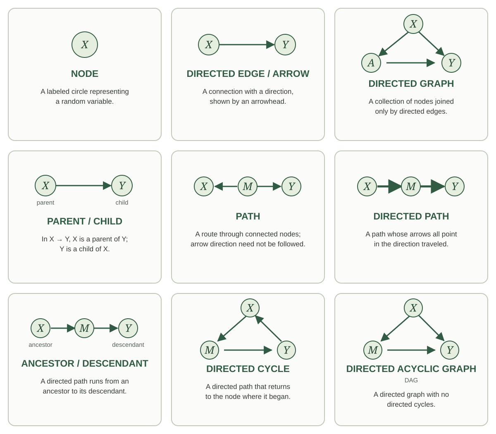

{width=85% fig-align="center" fig-alt="The squirrel in its checked hat and waistcoat presents a chalkboard. On the left are assignments for X, A, and Y, their parent sets, and independent noise. On the right the same parent structure is shown by arrows from X to A, X to Y, and A to Y."}

## Introduction

SCMs are pretty cumbersome. For every variable, we have to write down an assignment function, its parents, and a source of independent noise, and then most of those details end up unspecified anyway. Once you are comfortable with how SCMs work, though, you do not need to write out all that machinery every time. What really changes from one SCM to the next is which variables are in the system and which are parents of which. So is there a more convenient way to keep track of just that?

*There is.* A graph gives us a nice shortcut for describing our SCM. We draw a [node]{.glossary-term} for each variable and an arrow from each [parent]{.glossary-term} to its [child]{.glossary-term}. The graph therefore keeps track of the part of the SCM that changes from one problem to the next, without making us write out the assignment functions and independent noise every time.

Some of you may have seen causal graphs before and wondered why we waited this long to introduce them. The delay was deliberate. A graph is a convenient shortcut, but we wanted to understand what it is a shortcut for first. Causal inference is about random variables and how the world generates them. Each variable in our story is a random variable, its parents are random variables, and the remaining randomness is represented by a random variable too. The SCM made all of that explicit. The graph lets us suppress some of that machinery and focus on the relationships among the variables.

That shortcut turns out to be useful for more than just saving us some writing. The graph will also help us reason about the random variables in our SCM. But as we start working with graphs, we should always be able to translate what we see in the graph back into a statement about those random variables.

## Building a graph from an SCM

::: {.example-intro}
Case study: Cramming for an exam.  Suppose our story concerns students deciding whether to drink coffee the evening before an exam.  Let $S$ be stress before that decision, $C$ be coffee consumption that evening, $H$ be hours spent studying afterward, $L$ be sleep that night, and $Y$ be the exam score the next morning.
:::

We tell the story through the following SCM:

$$
\begin{aligned}
S&\leftarrow f_S(\epsilon_S),\\
C&\leftarrow f_C(S,\epsilon_C),\\
H&\leftarrow f_H(S,C,\epsilon_H),\\
L&\leftarrow f_L(S,C,H,\epsilon_L),\\
Y&\leftarrow f_Y(S,H,L,\epsilon_Y),
\end{aligned}
$$

with independent noise terms. In this story, stress may affect coffee consumption, studying, sleep, and the exam score. Coffee may affect studying and sleep. Studying may affect sleep and the exam score, and sleep may affect the exam score.

**First, put the nodes down.** Draw one circle for each random variable in our story, with the variable's name in the middle. Each labeled circle is a **node.** We have five variables, so we draw five nodes.

{width=600 fig-align="center" fig-alt="Five circles with centered labels S, C, H, L, and Y, with no arrows."}

**Next, put an arrow down.** Look at the assignment for $C$:

$$
C\leftarrow f_C(S,\epsilon_C).
$$

Stress $S$ is a parent of coffee consumption $C$, so draw an arrow from the circle labeled $S$ to the circle labeled $C$. An arrow is also called a [**directed edge**]{.glossary-term}. Its direction matters: the arrow points into the variable whose assignment uses the parent.

{width=600 fig-align="center" fig-alt="The same five labeled circles, now with one arrow from S to C."}

**Now do this for every parent in every assignment.** The assignment for $H$ gives us arrows from $S$ and $C$ into $H$. The assignment for $L$ gives us arrows from $S$, $C$, and $H$ into $L$. The assignment for $Y$ gives us arrows from $S$, $H$, and $L$ into $Y$. No arrows point into $S$ because its assignment has no parents.

{#fig-coffee width=600 fig-align="center" fig-alt="The completed graph on the same five labeled circles: S points to C, H, L, and Y; C points to H and L; H points to L and Y; and L points to Y."}

We call this our **causal graph** for this SCM. A causal graph is a [**directed graph**]{.glossary-term data-glossary="Directed graph"}: its nodes are connected by arrows, and every arrow has a direction. For another SCM, we do the same thing: put a node down for every random variable and draw an arrow from each parent to the variable whose assignment uses it. This gives us the general definition:

::: {.definition-box}
**Causal graph.** Given an SCM with variables $V_1,\ldots,V_K$, its causal graph has one node for each variable and an arrow $V_i\to V_j$ exactly when $V_i$ is a parent of $V_j$. We use the same label for a random variable and the node that represents it.
:::

This also explains our choice of the word **parents.** In a graph, a parent of a node is a node with an arrow pointing into it, and the parents in our assignments are exactly the parents in the graph.

Now try the RHC example. Let $X$ be mean blood pressure, $A$ indicate receipt of RHC, and $Y$ indicate death within 30 days. Our SCM is

$$
\begin{aligned}
X&\leftarrow f_X(\epsilon_X),\\
A&\leftarrow f_A(X,\epsilon_A),\\
Y&\leftarrow f_Y(X,A,\epsilon_Y),
\end{aligned}
$$

with independent noise terms.

Draw the causal graph for the RHC SCM.

We draw three nodes, labeled $X$, $A$, and $Y$. The assignment for $X$ has no parents, so no arrows point into $X$. The assignment for $A$ uses $X$, so we draw $X\to A$. The assignment for $Y$ uses both $X$ and $A$, so we draw $X\to Y$ and $A\to Y$.

{#fig-rhc width=440 fig-alt="Three nodes labeled X, A, and Y. Arrows run from X to A, X to Y, and A to Y."}

Also try this for the WHI trial. Here $X$ collects baseline characteristics, $A$ is randomized assignment to hormone therapy or placebo, and $Y$ indicates a coronary heart disease event. The SCM is

$$
\begin{aligned}
X&\leftarrow f_X(\epsilon_X),\\
A&\leftarrow f_A(\epsilon_A),\\
Y&\leftarrow f_Y(X,A,\epsilon_Y),
\end{aligned}
$$

with independent noise terms.

Draw the causal graph for the WHI SCM. How does it differ from the RHC graph in @fig-rhc?

{#fig-whi width=440 fig-alt="Nodes X and A each have an arrow pointing to Y. There is no arrow between X and A."}

Both $X$ and $A$ are parents of $Y$, so we draw $X\to Y$ and $A\to Y$. Neither $X$ nor $A$ has any parents. Compared with the RHC graph in @fig-rhc, the arrow $X\to A$ is absent: the randomized treatment assignment does not use $X$.

For a mediation example, let $X$ collect baseline characteristics, $A$ indicate randomized assignment to a reminder, $M$ indicate attendance, and $Y$ indicate whether blood pressure is measured at the appointment. The reminder can affect measurement only through attendance. We suppose

$$
\begin{aligned}
X&\leftarrow f_X(\epsilon_X),\\
A&\leftarrow f_A(\epsilon_A),\\
M&\leftarrow f_M(X,A,\epsilon_M),\\
Y&\leftarrow f_Y(X,M,\epsilon_Y),
\end{aligned}
$$

with independent noise terms.

Draw the causal graph for the appointment-reminder SCM. Should there be an arrow from $A$ to $Y$?

{#fig-appointment-reminder width=440 fig-alt="Arrows run from X to M, X to Y, A to M, and M to Y. There is no arrow from A to Y."}

In @fig-appointment-reminder, the parents of $M$ are $X$ and $A$, and the parents of $Y$ are $X$ and $M$. This gives four arrows: $X\to M$, $A\to M$, $X\to Y$, and $M\to Y$.

There is no arrow $A\to Y$ because $A$ is not an input to the assignment for $Y$. We can follow arrows from $A$ through $M$ to $Y$, but that does not make $A$ a parent of $Y$. Attendance carries the reminder's effect on whether blood pressure is measured.

## Recovering the SCM from a graph

We have built a graph from an SCM. Can we go backward? If we know the graph, is there a unique SCM that produces it?

Yes, and it is easiest to see with an example. Suppose we are given this graph:

{#fig-translate-scm width=440 fig-alt="Arrows run from X to W, X to A, W to Y, and A to Y."}

In @fig-translate-scm, no arrows point into $X$, so its assignment uses only its noise term. The arrows into $W$ and $A$ both come from $X$. Finally, the arrows into $Y$ come from $W$ and $A$. We therefore write

$$
\begin{aligned}
X&\leftarrow f_X(\epsilon_X),\\
W&\leftarrow f_W(X,\epsilon_W),\\
A&\leftarrow f_A(X,\epsilon_A),\\
Y&\leftarrow f_Y(W,A,\epsilon_Y),
\end{aligned}
$$

where $\epsilon_X$, $\epsilon_W$, $\epsilon_A$, and $\epsilon_Y$ are independent. Notice that $X$ is not an input to the assignment for $Y$, because there is no arrow from $X$ to $Y$.

Now try the same translation yourself with this graph:

{#fig-translate-practice width=440 fig-alt="Arrows run from X to A, A to M, X to Y, and M to Y."}

Write the SCM represented by @fig-translate-practice. Include the requirement on its noise terms.

We write

$$
\begin{aligned}
X&\leftarrow f_X(\epsilon_X),\\
A&\leftarrow f_A(X,\epsilon_A),\\
M&\leftarrow f_M(A,\epsilon_M),\\
Y&\leftarrow f_Y(X,M,\epsilon_Y),
\end{aligned}
$$

where $\epsilon_X$, $\epsilon_A$, $\epsilon_M$, and $\epsilon_Y$ are independent. The variable $X$ has no parents. The parents of $A$ are $\{X\}$, the parents of $M$ are $\{A\}$, and the parents of $Y$ are $\{X,M\}$. Each assignment comes directly from the arrows pointing into its node.

In both examples we did exactly the same thing. For each variable, we took the variables with arrows pointing into it as its parents, added its own noise term, and required all the noise terms to be independent. The graph doesn't tell us the functions or the noise distributions, but our SCMs leave those unspecified anyway. So the answer to our question is yes: a graph gives us back an SCM, and an SCM gives us a graph.

::: {.main-point}
A graph and an SCM determine each other. That means we can study the SCM through its graph: we learn what a feature of the graph says about the SCM, and from then on we look for that feature directly in the picture.
:::

## Looking for cycles

Let's put that idea to work. We want our SCMs to have a topological order, so that no assignment uses a variable before it has been assigned. Checking for one from the assignments means working through a list and tracing where each variable gets used.

Take the following SCM, for example:

$$
\begin{aligned}
X&\leftarrow f_X(Y,\epsilon_X),\\
M&\leftarrow f_M(X,\epsilon_M),\\
Y&\leftarrow f_Y(M,\epsilon_Y).
\end{aligned}
$$

Try putting these assignments in a topological order. To generate $X$, we need $Y$. To generate $Y$, we need $M$. To generate $M$, we need $X$. No matter how we arrange the assignments, at least one assignment uses a variable before that variable has been assigned. This SCM does not have a topological order.

Take a look at this SCM's causal graph.

{width=600 fig-align="center" fig-alt="A directed cycle: X points to M, M points to Y, and Y points back to X."}

What stands out in this graph? Follow the arrows. Start at $X$ and follow the arrow to $M$. At $M$, follow the arrow to $Y$. Then follow the arrow back to $X$. We started at $X$, followed the arrows in their directions, and returned to where we started. Is this a coincidence?

Not really. What we have found is a [**directed cycle**]{.glossary-term}. Start at one node and follow an arrow in its direction. Continue following arrows in their directions. If we eventually return to the node where we started, the arrows we followed form a directed cycle. In this graph, the directed cycle is

$$
X\to M\to Y\to X.
$$

Think about what following these arrows says about an order. Each arrow takes us from a parent to a child, and every parent must appear before its child. Following the arrows therefore gives us a sequence: this variable must come before that variable, which must come before the next one. If the arrows eventually return to the first variable, they tell us that the first variable must also come after itself. That is a contradiction. An SCM whose graph contains a directed cycle cannot have a topological order.

Now change the SCM slightly. Instead of $Y$ being a parent of $X$, suppose $X$ is a parent of $Y$. Our SCM is now

$$
\begin{aligned}
X&\leftarrow f_X(\epsilon_X),\\
M&\leftarrow f_M(X,\epsilon_M),\\
Y&\leftarrow f_Y(X,M,\epsilon_Y).
\end{aligned}
$$

This SCM does have a topological order: $X,M,Y$.

Now return to its causal graph. We changed just one arrow, replacing $Y\to X$ with $X\to Y$:

{width=600 fig-align="center" fig-alt="A triangle with X pointing to M and Y, and M pointing to Y. There is no directed cycle."}

Can we find a directed cycle in this graph? The drawing still forms a triangle, but we cannot follow its arrows all the way around. **A loop in the drawing is not enough: the directions of the arrows must let us travel all the way around.** The directed cycle has disappeared at exactly the same time that a topological order has become possible.

The general idea behind these two examples is this:

::: {.proposition-box}
**Cycles and topological order.** An SCM admits a topological order if and only if its associated causal graph has no directed cycles.
:::

One direction is quick. In a topological order, every arrow points from a variable earlier in the list to a variable later in the list. So each time we follow an arrow, we land somewhere later in the list than where we were. We can never move back up, which means we can never return to the node we started from. A directed cycle would have to do exactly that, so a graph with a topological order has no directed cycles.

The other direction, that a graph with no directed cycles always has a topological order, is harder. We will use it without proving it here, and the argument is in the note below for anyone who wants to see it.

::: {.callout-note title="Optional technical note: proof of the topological-order equivalence" collapse="true"}
Suppose first that a topological order exists. Give each variable its position in that order. Along any directed edge, positions strictly increase. A directed cycle would require

$$
i_1<i_2<\cdots<i_m<i_1,
$$

which is impossible.

For the reverse direction, suppose the causal graph with a finite number of nodes has no directed cycles. Start with an empty list. Repeatedly select a remaining node with no incoming edges from other remaining nodes, append it to the list, and remove that node and its outgoing edges. This procedure is Kahn's algorithm.

Why can we always select a node? If a nonempty remaining graph had no such node, every remaining node would have a parent in that graph. Start anywhere and repeatedly follow an incoming edge backward. Because there are finitely many nodes, we must eventually revisit a node. The edges between repeated visits form a directed cycle, contradicting the assumption.

The procedure therefore lists every node. If $X\to Y$, then $Y$ cannot be selected until $X$ has been removed: otherwise it would still have that incoming edge. Thus $X$ appears before $Y$. The list is a topological order of the graph and, by the definition of its edges, of the assignments.
:::

Here is the payoff.

::: {.main-point}
Want to know whether your SCM has a topological order? You do not need to comb through the assignments. Look for a directed cycle in its causal graph. If you find none, you're done: a topological order exists.
:::

Since we only work with SCMs that have a topological order, our causal graphs never contain a directed cycle. A graph with no directed cycles is called *acyclic*, so our causal graphs are [**directed acyclic graphs**]{.glossary-term data-glossary="Directed acyclic graph (DAG)"}, or **DAGs**. If you have taken an epidemiology class, you may have seen this term before.

Let's practice.

{#fig-order-practice width=600 fig-align="center" fig-alt="A and B both point to C; C points to D and E."}

Does the SCM corresponding to @fig-order-practice have a topological order? If so, give one.

One order is $A,B,C,D,E$. In that order, the assignments are

$$
\begin{aligned}
A&\leftarrow f_A(\epsilon_A),\\
B&\leftarrow f_B(\epsilon_B),\\
C&\leftarrow f_C(A,B,\epsilon_C),\\
D&\leftarrow f_D(C,\epsilon_D),\\
E&\leftarrow f_E(C,\epsilon_E),
\end{aligned}
$$

with independent noise terms. We could put $B$ before $A$, or $E$ before $D$, or both. There are four possible orders. Changing the order in these ways does not change the parent sets or the graph.

{#fig-cycle-practice width=600 fig-align="center" fig-alt="A points to B, B to C, C to D and E, and D back to B."}

Does the SCM corresponding to @fig-cycle-practice have a topological order? If so, give one.

No. The graph contains the directed cycle $B\to C\to D\to B$. After putting $A$ first, we still cannot order $B,C,D$. Their proposed assignments require $D$ before $B$, $B$ before $C$, and $C$ before $D$. Having one node with no parents does not guarantee that the entire graph can be ordered.

Return to the coffee graph in @fig-coffee. Does its SCM have a topological order? Would adding $Y\to C$ preserve that possibility?

The order $S,C,H,L,Y$ works for the original graph. Adding $Y\to C$ creates the directed cycle $C\to H\to Y\to C$, so the modified graph cannot have a topological order. The new assignment for $C$ would require the exam score before we could generate coffee consumption, even though generating that score already requires variables generated after coffee consumption.

## Revisiting the local Markov property

We have just seen the causal graph earn its keep. A property of the SCM became something we could see in its graph.

The same thing happens with the local Markov property. From the SCM, we learned that given a variable’s parents, earlier variables in a topological order that are not its parents provide no additional information about it. The graph shows us those parents, so it gives us a quicker way to find these conditional independences.

Return to the graph in @fig-translate-scm.

Choose the topological order $X,W,A,Y$. When we reach $A$, its parent is $X$. The other preceding variable is $W$. Therefore,

$$
A\mathrel{\perp\!\!\!\perp}W\mid X.
$$

When we reach $Y$, its parents are $W$ and $A$. The remaining preceding variable is $X$, so

$$
Y\mathrel{\perp\!\!\!\perp}X\mid W,A.
$$

Return to the coffee graph in @fig-coffee and use the order $S,C,H,L,Y$. What does the local Markov property say about the exam score $Y$ and coffee consumption $C$?

The parents of $Y$ are $S,H,L$. Coffee consumption $C$ comes before $Y$ but is not one of its parents. Therefore,

$$
Y\mathrel{\perp\!\!\!\perp}C\mid S,H,L.
$$

Among students with the same stress, studying, and sleep values, learning their coffee consumption gives no extra information about the exam score under this SCM.

For the WHI graph in @fig-whi, use the order $X,A,Y$. What does the local Markov property give us for $A$?

The variable $X$ comes before $A$, but it is not a parent of $A$. The variable $A$ has no parents. Thus,

$$
A\mathrel{\perp\!\!\!\perp}X.
$$

Randomization makes treatment assignment independent of baseline characteristics in this story.

In the appointment-reminder graph in @fig-appointment-reminder, use the order $X,A,M,Y$. The parents of $Y$ are $X,M$. What does the local Markov property tell us?

The variable $A$ comes before $Y$ but is not a parent of $Y$. Therefore,

$$
Y\mathrel{\perp\!\!\!\perp}A\mid X,M.
$$

Once we know baseline characteristics and attendance, learning reminder assignment provides no additional information about whether blood pressure was measured. We have recovered the same statement we obtained from the assignments in the previous section, now by looking at the graph.

## Keeping track of graph terminology

We have picked up quite a few words for talking about graphs. It is useful to collect them in one place. A [**path**]{.glossary-term} is a sequence of arrows joined end to end; we may travel either with or against their directions. A [**directed path**]{.glossary-term} is a path whose arrows line up head to tail, so that we can follow every arrow in its direction. If there is a directed path from $X$ to $Y$, then $X$ is an [**ancestor**]{.glossary-term} of $Y$, and $Y$ is a [**descendant**]{.glossary-term} of $X$.

The chart collects these terms together with the terminology introduced earlier. Each small picture illustrates the definition immediately beneath it.

{width=100% fig-align="center" fig-alt="Nine illustrated vocabulary cards define node, directed edge or arrow, directed graph, parent and child, path, directed path, ancestor and descendant, directed cycle, and directed acyclic graph or DAG."}

The same definitions are included in the glossary. We will add more graph language in the next section when we study d-separation.
