{width=85% fig-align="center" fig-alt="The squirrel in its checked hat and waistcoat presents a chalkboard. On the left are assignments for X, A, and Y, their parent sets, and independent noise. On the right the same parent structure is shown by arrows from X to A, X to Y, and A to Y."}

## Introduction

Our SCMs are starting to feel cumbersome. We write an assignment for every variable, give each assignment a function, and then leave the details of those functions unspecified. What we keep emphasizing is which variables are parents of which others, together with the requirement that the remaining randomness be independent. Is there a more convenient way to represent this?

There is. **A graph gives us a shortcut for displaying this structure.** It turns out that some things we want to say about random variables are much easier to see and say with a graph. We can keep track of the same parent relationships without writing out every assignment.

Some of you may have seen causal graphs before and wondered why we have waited this long to introduce them. The delay was deliberate. Causal inference is about random variables and how the world generates them. We wanted to spend time with those random variables before taking shortcuts. Each variable in our story is a random variable. Its parents are random variables. The remaining randomness is also represented by a random variable. A graph will help us study them, but we should always be able to translate what we see in the graph back into a statement about those random variables.

## Building a graph from an SCM

Each SCM gives us a graph. Let's make things interesting with five variables. Suppose our story concerns a student deciding whether to drink coffee the evening before an exam. Let $S$ be stress before that decision, $C$ be coffee consumption that evening, $H$ be hours spent studying afterward, $L$ be sleep that night, and $Y$ be the exam score the next morning.

We tell the following story through an SCM:

$$
\begin{aligned}
S&\leftarrow f_S(\epsilon_S),\\
C&\leftarrow f_C(S,\epsilon_C),\\
H&\leftarrow f_H(S,C,\epsilon_H),\\
L&\leftarrow f_L(S,C,H,\epsilon_L),\\
Y&\leftarrow f_Y(S,H,L,\epsilon_Y),
\end{aligned}
$$

with independent noise terms. In this story, stress may affect coffee consumption, studying, sleep, and the exam score. Coffee may affect studying and sleep. Studying may affect sleep and the exam score, and sleep may affect the exam score. These are the relationships we are choosing for this example.

**First, put the nodes down.** Draw one circle for each random variable in our story, with the variable's name in the middle. Each labeled circle is a **node**. We have five variables, so we draw five circles.

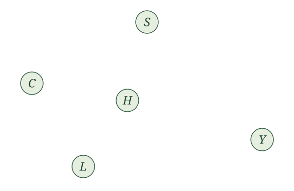{width=600 fig-align="center" fig-alt="Five circles with centered labels S, C, H, L, and Y, with no arrows."}

**Next, put an arrow down.** Look at the assignment for $C$:

$$
C\leftarrow f_C(S,\epsilon_C).
$$

Stress $S$ is a parent of coffee consumption $C$, so draw an arrow from the circle labeled $S$ to the circle labeled $C$. An arrow is also called a **directed edge**. Its direction matters: the arrow points into the variable whose assignment uses the parent.

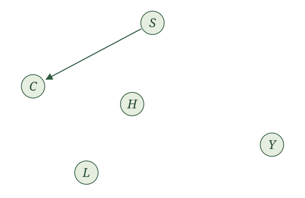{width=600 fig-align="center" fig-alt="The same five labeled circles, now with one arrow from S to C."}

**Now do this for every parent in every assignment.** The assignment for $H$ gives us arrows from $S$ and $C$ into $H$. The assignment for $L$ gives us arrows from $S$, $C$, and $H$ into $L$. The assignment for $Y$ gives us arrows from $S$, $H$, and $L$ into $Y$. No arrows point into $S$ because its assignment has no parents.

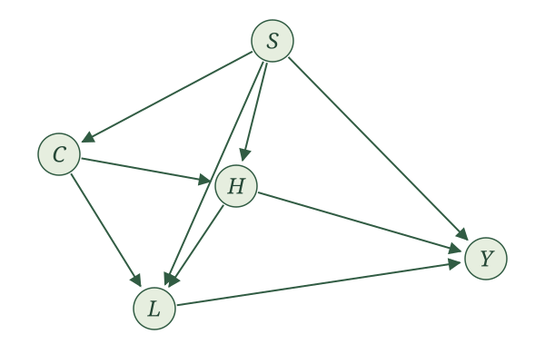{width=600 fig-align="center" fig-alt="The completed graph on the same five labeled circles: S points to C, H, L, and Y; C points to H and L; H points to L and Y; and L points to Y."}

The rule is simple: draw an arrow from each parent to the variable whose assignment uses it. Thus, we draw $X\to Y$ exactly when $X$ is a parent of $Y$.

::: {.definition-box}
**Causal graph.** Given an SCM with variables $V_1,\ldots,V_K$, its causal graph has one node for each variable and an arrow $V_i\to V_j$ exactly when $V_i\in\operatorname{Pa}_j$. We use the same label for a random variable and the node that represents it.
:::

Now we can explain our choice of the word **parents**. It was not chosen on a whim. In graph terminology, a parent of a node is a node with an arrow pointing into it. The parents in our assignments become the parents in our graph.

We leave the noise terms out of these drawings. They are still part of the SCM, and we still require them to be independent as an entire collection.

Now try the RHC example. Let $X$ be mean blood pressure, $A$ indicate receipt of RHC, and $Y$ indicate death within 30 days. Our SCM is

$$
\begin{aligned}
X&\leftarrow f_X(\epsilon_X),\\
A&\leftarrow f_A(X,\epsilon_A),\\
Y&\leftarrow f_Y(X,A,\epsilon_Y),
\end{aligned}
$$

with independent noise terms.

Draw the causal graph for the RHC SCM.

We draw three nodes, labeled $X$, $A$, and $Y$. The assignment for $X$ has no parents, so no arrows point into $X$. The assignment for $A$ uses $X$, so we draw $X\to A$. The assignment for $Y$ uses both $X$ and $A$, so we draw $X\to Y$ and $A\to Y$.

{width=440 fig-alt="Three nodes labeled X, A, and Y. Arrows run from X to A, X to Y, and A to Y."}

Now try this for the WHI trial. Here $X$ collects baseline characteristics, $A$ is randomized assignment to hormone therapy or placebo, and $Y$ indicates a coronary heart disease event. The SCM is

$$
\begin{aligned}
X&\leftarrow f_X(\epsilon_X),\\
A&\leftarrow f_A(\epsilon_A),\\
Y&\leftarrow f_Y(X,A,\epsilon_Y),
\end{aligned}
$$

with independent noise terms.

Draw the causal graph for the WHI SCM. How does it differ from the RHC graph?

{width=440 fig-alt="Nodes X and A each have an arrow pointing to Y. There is no arrow between X and A."}

Both $X$ and $A$ are parents of $Y$, so we draw $X\to Y$ and $A\to Y$. Neither $X$ nor $A$ has any parents. Compared with the RHC graph, the arrow $X\to A$ is absent: the randomized treatment assignment does not use $X$.

For a mediation example, return to the appointment-reminder story from the exercises. Let $X$ collect baseline characteristics, $A$ indicate randomized assignment to a reminder, $M$ indicate attendance, and $Y$ indicate whether blood pressure is measured at the appointment. The reminder can affect measurement only through attendance. We wrote

$$
\begin{aligned}
X&\leftarrow f_X(\epsilon_X),\\
A&\leftarrow f_A(\epsilon_A),\\
M&\leftarrow f_M(X,A,\epsilon_M),\\
Y&\leftarrow f_Y(X,M,\epsilon_Y),
\end{aligned}
$$

with independent noise terms.

Draw the causal graph for the appointment-reminder SCM. Should there be an arrow from $A$ to $Y$?

{width=440 fig-alt="Arrows run from X to M, X to Y, A to M, and M to Y. There is no arrow from A to Y."}

The parents of $M$ are $X$ and $A$, and the parents of $Y$ are $X$ and $M$. This gives four arrows: $X\to M$, $A\to M$, $X\to Y$, and $M\to Y$.

There is no arrow $A\to Y$ because $A$ is not an input to the assignment for $Y$. We can follow arrows from $A$ through $M$ to $Y$, but that does not make $A$ a parent of $Y$. Attendance carries the reminder's effect on whether blood pressure is measured.

## Recovering the SCM from a graph

We have defined a graph from an SCM. Can we go backward? If we know the graph, is there one unique SCM that gives us that graph?

Yes, in the form we have been using, with the assignment functions and noise distributions left unspecified. The arrows tell us exactly which parents to put into each assignment. We give each variable its own noise term and require those noise terms to be independent. The graph does not tell us a formula for a function or a distribution for a noise term; those details were already left unspecified in our SCMs.

::: {.main-point}
The graph tells us exactly how to write the SCM's assignments with unspecified functions. For each variable, use the variables with arrows pointing into it as its parents, add its noise term, and require all the noise terms to be independent.
:::

**That is what makes the graph powerful: anything we can learn from the SCM’s parent structure and independent noise assumption, with its functions and noise distributions left unspecified, we can learn from the graph.** Particular formulas or noise distributions could tell us more, but we have not specified those in either representation.

For example, suppose we are given this graph:

{width=440 fig-alt="Arrows run from X to W, X to A, W to Y, and A to Y."}

No arrows point into $X$, so its assignment uses only its noise term. The arrow into $W$ comes from $X$, and the arrow into $A$ also comes from $X$. Finally, the arrows into $Y$ come from $W$ and $A$. We therefore write

$$
\begin{aligned}
X&\leftarrow f_X(\epsilon_X),\\
W&\leftarrow f_W(X,\epsilon_W),\\
A&\leftarrow f_A(X,\epsilon_A),\\
Y&\leftarrow f_Y(W,A,\epsilon_Y),
\end{aligned}
$$

where $\epsilon_X$, $\epsilon_W$, $\epsilon_A$, and $\epsilon_Y$ are independent. Notice that $X$ is not an input to the assignment for $Y$: there is no arrow from $X$ to $Y$.

Now try the same translation for this graph:

{width=440 fig-alt="Arrows run from X to A, A to M, X to Y, and M to Y."}

Write the SCM represented by this graph. Include the requirement on its noise terms.

We write

$$
\begin{aligned}
X&\leftarrow f_X(\epsilon_X),\\
A&\leftarrow f_A(X,\epsilon_A),\\
M&\leftarrow f_M(A,\epsilon_M),\\
Y&\leftarrow f_Y(X,M,\epsilon_Y),
\end{aligned}
$$

where $\epsilon_X$, $\epsilon_A$, $\epsilon_M$, and $\epsilon_Y$ are independent. The parents of $A$ are $\{X\}$, the parents of $M$ are $\{A\}$, and the parents of $Y$ are $\{X,M\}$. The variable $X$ has no parents. Each assignment comes directly from the arrows pointing into its node.

## Graph language and cycles

Our causal graphs are **directed**: every edge has an arrow telling us which way it goes. We already know the word *parent*. If $X\to Y$, then $X$ is a parent of $Y$, and $Y$ is a **child** of $X$. We need a little more language to talk about relationships that extend beyond one arrow.

A **path** joins distinct nodes by edges, without requiring us to follow the arrows. A **directed path** follows every arrow in its direction. For example, in our coffee graph, $C\to H\to Y$ is a directed path from coffee consumption to the exam score.

If there is a directed path from $X$ to $Y$, we call $X$ an **ancestor** of $Y$ and $Y$ a **descendant** of $X$. Parents are ancestors, but an ancestor need not be a parent. In this section, a node is not its own ancestor or descendant. A **nondescendant** of $X$ is any other node that is not a descendant of $X$.

{width=600 fig-align="center" fig-alt="The coffee graph: S points to C, H, L, and Y; C points to H and L; H points to L and Y; L points to Y."}

In the coffee graph, what are the parents and ancestors of $Y$? What are the children and descendants of $C$?

The parents of $Y$ are $S,H,L$. Its ancestors are $S,C,H,L$: coffee consumption is an ancestor through studying or sleep, even though it is not a parent of the exam score.

The children of $C$ are $H,L$. Its descendants are $H,L,Y$.

**A directed cycle takes us back to where we started.** We follow arrows through distinct nodes and then follow an arrow back to the starting node. Consider this graph:

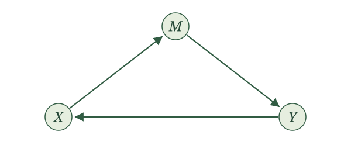{width=600 fig-align="center" fig-alt="A directed cycle: X points to M, M points to Y, and Y points back to X."}

Reading off its assignments gives

$$
\begin{aligned}
X&\leftarrow f_X(Y,\epsilon_X),\\
M&\leftarrow f_M(X,\epsilon_M),\\
Y&\leftarrow f_Y(M,\epsilon_Y).
\end{aligned}
$$

Try putting these assignments in a topological order. To generate $X$, we need $Y$. To generate $Y$, we need $M$. To generate $M$, we need $X$. There is no variable we can put first. These proposed assignments do not satisfy the topological-order assumption we have made for our SCMs. Writing down functions and noise terms alone does not make this a story we can generate one variable at a time.

Now change just one arrow, replacing $Y\to X$ with $X\to Y$:

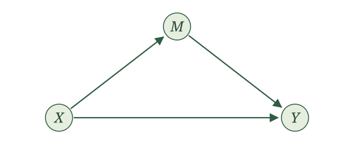{width=600 fig-align="center" fig-alt="A triangle with X pointing to M and Y, and M pointing to Y. There is no directed cycle."}

This graph gives us

$$
\begin{aligned}
X&\leftarrow f_X(\epsilon_X),\\
M&\leftarrow f_M(X,\epsilon_M),\\
Y&\leftarrow f_Y(X,M,\epsilon_Y).
\end{aligned}
$$

We can generate the variables in the order $X,M,Y$. The drawing still forms a triangle, but we cannot follow its arrows around the triangle. **A loop in the drawing is not enough: the directions of the arrows must let us travel all the way around.**

::: {.proposition-box}
**Cycles and topological order.** A finite collection of assignments admits a topological order if and only if its associated directed graph has no directed cycles.
:::

One direction is easy to picture. In a topological order, every arrow moves forward. We cannot keep moving forward and return to our starting point. For the other direction, a graph without directed cycles always gives us a place to start: a node with no parents. Once we remove that node and its outgoing arrows, we can find the next place to start, and keep going.

::: {.callout-note title="Optional technical note: proof of the topological-order equivalence" collapse="true"}
Suppose first that a topological order exists. Give each variable its position in that order. Along any directed edge, positions strictly increase. A directed cycle would require

$$
i_1<i_2<\cdots<i_m<i_1,
$$

which is impossible.

Conversely, suppose the finite directed graph has no directed cycles. Start with an empty list. Repeatedly select a remaining node with no incoming edges from other remaining nodes, append it to the list, and remove that node and its outgoing edges. This procedure is Kahn's algorithm.

Why can we always select a node? If a nonempty remaining graph had no such node, every remaining node would have a parent in that graph. Start anywhere and repeatedly follow an incoming edge backward. Because there are finitely many nodes, we must eventually revisit a node. The edges between repeated visits form a directed cycle, contradicting the assumption.

The procedure therefore lists every node. If $X\to Y$, then $Y$ cannot be selected until $X$ has been removed: otherwise it would still have that incoming edge. Thus $X$ appears before $Y$. The list is a topological order of the graph and, by the definition of its edges, of the assignments.
:::

A **directed acyclic graph**, or **DAG**, is a directed graph with no directed cycles. Our SCMs already assume a topological order. The proposition tells us exactly what that assumption looks like in a picture: **their causal graphs are DAGs.**

Let's practice finding an order, or explaining why none exists.

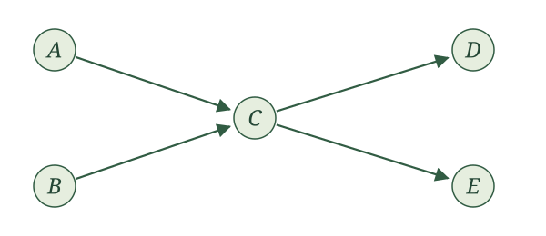{width=600 fig-align="center" fig-alt="A and B both point to C; C points to D and E."}

Find a topological order for this graph. Is it the only one? Write the corresponding assignments in your chosen order.

One order is $A,B,C,D,E$. In that order, the assignments are

$$
\begin{aligned}
A&\leftarrow f_A(\epsilon_A),\\
B&\leftarrow f_B(\epsilon_B),\\
C&\leftarrow f_C(A,B,\epsilon_C),\\
D&\leftarrow f_D(C,\epsilon_D),\\
E&\leftarrow f_E(C,\epsilon_E),
\end{aligned}
$$

with independent noise terms. We could put $B$ before $A$, or $E$ before $D$, or both. There are four possible orders. Changing the order in these ways does not change the parent sets or the graph.

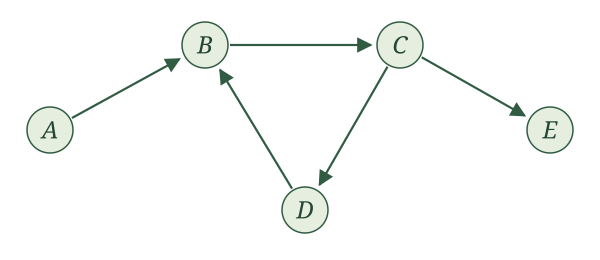{width=600 fig-align="center" fig-alt="A points to B, B to C, C to D and E, and D back to B."}

We can put $A$ first. Does that mean this graph has a topological order?

No. The graph contains the directed cycle $B\to C\to D\to B$. After putting $A$ first, we still cannot order $B,C,D$. Their proposed assignments require $D$ before $B$, $B$ before $C$, and $C$ before $D$. Having one node with no parents does not guarantee that the entire graph can be ordered.

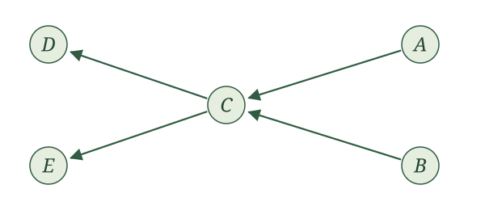{width=600 fig-align="center" fig-alt="A and B are drawn on the right and point left toward C; C points left toward D and E. This has the same edges as the earlier acyclic example."}

The arrows now point to the left. Does $A,B,C,D,E$ still give a topological order?

Yes. This is the same graph as the first practice example, drawn differently. A topological order depends on which variables are parents, not on their positions on the page. Every parent still comes before its child in $A,B,C,D,E$.

Return to the coffee graph. Give a topological order. Would adding $Y\to C$ preserve the possibility of a topological order?

The order $S,C,H,L,Y$ works for the original graph. Adding $Y\to C$ creates the directed cycle $C\to H\to Y\to C$, so the modified graph cannot have a topological order. The new assignment for $C$ would require the exam score before we could generate coffee consumption, even though generating that score already requires variables generated after coffee consumption.

## How associations transmit

We now have a convenient picture of who generates whom. What can that picture tell us about which variables share information?

Start small. An edge, a chain, a fork, and a collider are the building blocks we will use. For now, each drawing is the entire graph for its example. There are no additional paths hiding outside the picture. Whenever we say a structure *can transmit association*, we mean that it permits dependence between its endpoints. We are not saying that every choice of functions and noise distributions must produce dependence.

**An edge can transmit association.**

{width=600 fig-align="center" fig-alt="A single directed edge from X to Y."}

If $Y$ uses $X$ in its assignment, learning $X$ can tell us something about $Y$. For a concrete example, let the noise terms be independent fair coin flips, represented by $\operatorname{Bernoulli}(1/2)$ variables, and write

$$
X\leftarrow\epsilon_X,\qquad Y\leftarrow X+\epsilon_Y.
$$

If we learn that $Y=0$, we know $X=0$. Before learning $Y$, either value of $X$ was equally likely. The two random variables share information.

**A chain can transmit association through an intermediate variable.**

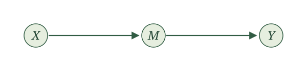{width=600 fig-align="center" fig-alt="A chain: X points to M, and M points to Y."}

Think of a reminder affecting attendance, which affects whether a measurement is collected. In a simplified story with just these three variables, information can travel from the reminder through attendance to measurement. A concrete SCM with this graph is

$$
X\leftarrow\epsilon_X,\qquad
M\leftarrow X+\epsilon_M,\qquad
Y\leftarrow M+\epsilon_Y,
$$

again with independent fair-coin noise terms. This numerical example illustrates the graph; its sums are not binary attendance indicators. Learning that $Y=0$ tells us that every term in the sum was zero, including $X$.

What happens if we already know $M$? The assignment for $Y$ uses $M$ and fresh independent noise. Once $M$ is known, learning $X$ gives us no extra information about $Y$:

$$
X\mathrel{\perp\!\!\!\perp}Y\mid M.
$$

**A fork can transmit association through a shared parent.**

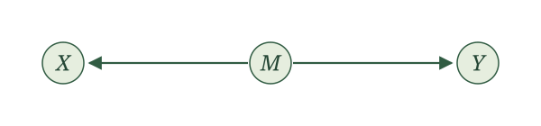{width=600 fig-align="center" fig-alt="A fork: M points to both X and Y."}

For example, illness severity might affect both a treatment decision and an outcome. The treatment and outcome can share information because both use severity. Consider

$$
M\leftarrow\epsilon_M,\qquad
X\leftarrow M+\epsilon_X,\qquad
Y\leftarrow M+\epsilon_Y,
$$

with independent fair-coin noise terms. If $Y=0$, then $M=0$, which makes $X=0$ more likely than it was before we learned $Y$. Association can travel along a path even when its arrows do not all point in the direction we are traveling.

If we already know $M$, however, the remaining randomness in $X$ and $Y$ is independent. Once again,

$$
X\mathrel{\perp\!\!\!\perp}Y\mid M.
$$

In the fair-coin fork example, find $P(X=0)$ and $P(X=0\mid Y=0)$. What changes if we already know $M=0$?

For $X=0$, both $M$ and $\epsilon_X$ must be zero, so $P(X=0)=1/4$. Learning $Y=0$ tells us $M=0$, leaving only the independent coin flip $\epsilon_X$, so $P(X=0\mid Y=0)=1/2$.

If we already know $M=0$, then $P(X=0\mid M=0)=1/2$. Learning $Y=0$ in addition does not change this probability. More generally, the conditional independence holds for either value of $M$.

**A collider behaves differently.**

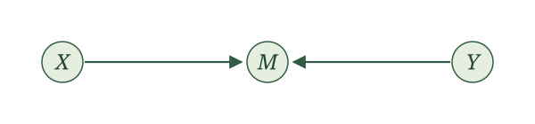{width=600 fig-align="center" fig-alt="A collider: X and Y both point to M."}

The arrows collide at $M$. Here the endpoints are generated from separate independent noise terms. Their shared child does not by itself make them associated:

$$
X\mathrel{\perp\!\!\!\perp}Y.
$$

But learning the child's value can change things. Imagine that two independent sources contribute to a total. If we learn the total and then learn that one contribution was large, we have learned something about how large the other contribution could have been.

For a concrete example, write

$$
X\leftarrow\epsilon_X,\qquad
Y\leftarrow\epsilon_Y,\qquad
M\leftarrow X+Y+\epsilon_M,
$$

with independent fair-coin noise terms. Before learning $M$, $X$ and $Y$ are independent. Among cases with $M=1$, however, learning $Y=1$ forces $X=0$. Knowing the total makes the two contributions informative about each other. This is an example of **collider bias**.

In the collider example, suppose $M=1$. What are the possible values of $(X,Y,\epsilon_M)$? Find $P(X=0\mid M=1)$ and $P(X=0\mid M=1,Y=1)$.

The possibilities are $(1,0,0)$, $(0,1,0)$, and $(0,0,1)$, each equally likely. Thus,

$$
P(X=0\mid M=1)=\frac23.
$$

If we also know $Y=1$, only $(0,1,0)$ remains, so

$$
P(X=0\mid M=1,Y=1)=1.
$$

Learning $Y$ changes what we know about $X$ once we condition on $M$.

::: {.main-point}
Chains and forks can transmit association; conditioning on the middle variable blocks that path. A collider blocks the path until we condition on the collider or, potentially, learn about it through one of its descendants.
:::

| Structure | Without conditioning | Conditioning on the middle variable |
|---|---|---|
| Chain: $X\to M\to Y$ | $X$ and $Y$ can be associated | $X\perp\!\!\!\perp Y\mid M$ |
| Fork: $X\leftarrow M\to Y$ | $X$ and $Y$ can be associated | $X\perp\!\!\!\perp Y\mid M$ |
| Collider: $X\to M\leftarrow Y$ | $X\perp\!\!\!\perp Y$ | $X$ and $Y$ can be associated |

The table concerns each isolated three-variable graph. In a larger graph, another path might still connect the endpoints. We will need to consider all paths before concluding that two variables are independent.

::: {.callout-note title="Optional technical note: why the three structures imply these independences" collapse="true"}
For the chain, write $X=f_X(\epsilon_X)$, $M=f_M(X,\epsilon_M)$, and $Y=f_Y(M,\epsilon_Y)$. Independence of the noise terms makes $\epsilon_Y$ independent of $(X,M)$. For a bounded measurable function $g$, define $h(m)=E[g(f_Y(m,\epsilon_Y))]$. Then

$$
E[g(Y)\mid X,M]=h(M)=E[g(Y)\mid M],
$$

which gives $Y\perp\!\!\!\perp X\mid M$.

For the fork, $M=f_M(\epsilon_M)$, $X=f_X(M,\epsilon_X)$, and $Y=f_Y(M,\epsilon_Y)$. Conditional on $M$, the noise terms $\epsilon_X$ and $\epsilon_Y$ remain independent with their original distributions. Thus the conditional joint distribution of $X,Y$ factors into their conditional marginal distributions, giving $X\perp\!\!\!\perp Y\mid M$.

For the collider, $X=f_X(\epsilon_X)$ and $Y=f_Y(\epsilon_Y)$ are functions of independent noise terms, so $X\perp\!\!\!\perp Y$. Conditioning on their shared child does not preserve this argument. The fair-coin example in the text demonstrates that conditional dependence is possible.
:::

Suppose independent preparation $P$ and independent exam-day luck $L$ both contribute to a score $Y$, with graph $P\to Y\leftarrow L$. Can preparation and luck become associated among students with the same score? How is this different from conditioning on the middle of a chain?

Yes. Score is a collider. Among students with a fixed score, learning that one student had especially good luck may change what we infer about that student's preparation. The graph permits this association; a particular model determines whether and how it occurs. Conditioning on the middle of an isolated chain instead blocks the path between its endpoints.

## The local Markov property

We have seen that a graph helps us reason about association. Now return to a fact we already learned from SCMs: once we know a variable's parents, the preceding variables that are not its parents give us no extra information about it. This is the local Markov property from the previous section. We can now see the relevant sets in a graph.

Consider our earlier example:

{width=440 fig-align="center" fig-alt="X points to W and A; W and A point to Y."}

Choose the topological order $X,W,A,Y$. When we reach $A$, its parent is $X$. The other preceding variable is $W$. The local Markov property gives

$$
A\mathrel{\perp\!\!\!\perp}W\mid X.
$$

We can see a fork $A\leftarrow X\to W$ and a collider $A\to Y\leftarrow W$. Knowing $X$ blocks the fork, and we have not conditioned on the collider. Both ways of connecting $A$ and $W$ are blocked. This agrees with what we learned from their assignments.

There is also a version that does not require us to choose an order first.

::: {.proposition-box}
**Local Markov property.** In the causal graph of an SCM with independent noise terms and a topological order, each variable is independent of its nondescendants other than its parents, given its parents.

Writing $\operatorname{ND}_V$ for the other variables that are not descendants of $V$,

$$
V\mathrel{\perp\!\!\!\perp}
\bigl(\operatorname{ND}_V\setminus\operatorname{Pa}_V\bigr)
\mid\operatorname{Pa}_V.
$$

The sets in this expression stand for the corresponding collections of random variables.
:::

**The graph tells us which variables to condition on and which variables then provide no extra information.** Circle the node we want to study, find its parents, and find its descendants. Among the remaining nodes, those that are neither the node itself nor its parents form the collection independent of it given its parents.

For $A$ in the graph above, $X$ is its parent and $Y$ its descendant. The remaining node is $W$, giving $A\perp\!\!\!\perp W\mid X$. If we had chosen the order $X,A,W,Y$, $W$ would appear after $A$. It would still be a nondescendant of $A$. The graphical statement does not depend on which valid order we happen to write down.

For $Y$, the parents are $W,A$, and there are no descendants. The remaining node is $X$, so

$$
Y\mathrel{\perp\!\!\!\perp}X\mid W,A.
$$

Knowing both inputs to the outcome assignment makes the earlier variable $X$ uninformative about the remaining randomness in $Y$.

::: {.callout-note title="Optional technical note: proof of the local Markov property" collapse="true"}
First fix a topological order $V_1,\ldots,V_K$ and let $\mathcal F_{j-1}=\sigma(\epsilon_1,\ldots,\epsilon_{j-1})$. All preceding variables, including the parents of $V_j$, are measurable functions of these preceding noise terms. For bounded measurable $g$, integrate over the independent noise $\epsilon_j$ and define

$$
h(p)=E[g(f_j(p,\epsilon_j))].
$$

Independence gives

$$
E[g(V_j)\mid\mathcal F_{j-1}]=h(\operatorname{Pa}_j).
$$

Applying the tower property, first to the preceding variables and then to the parents, gives

$$
E[g(V_j)\mid V_1,\ldots,V_{j-1}]
=h(\operatorname{Pa}_j)
=E[g(V_j)\mid\operatorname{Pa}_j].
$$

This proves the ordered version.

For the graphical version, fix a node $V$. The set of its nondescendants is closed under taking parents: if a nondescendant had a parent that was $V$ or a descendant of $V$, it would itself be a descendant. We can therefore topologically order all nondescendants first, put $V$ next, and then topologically order its descendants. Apply the ordered result at $V$ in this order. Its preceding variables are exactly its nondescendants, which proves the stated property.
:::

Return to the coffee graph. What does the local Markov property say about the exam score $Y$ and coffee consumption $C$? State the result in symbols and words.

The parents of $Y$ are $S,H,L$. It has no descendants, and its only other nondescendant is $C$. Therefore,

$$
Y\mathrel{\perp\!\!\!\perp}C\mid S,H,L.
$$

Among students with the same stress, studying, and sleep values, learning their coffee consumption gives no extra information about the exam score under this SCM. This does not say that coffee and exam scores are independent without conditioning: coffee can affect studying and sleep, and it shares stress as an ancestor with the score.

For the WHI graph $X\to Y\leftarrow A$, what does the local Markov property give us for $A$? Can we keep that conclusion after conditioning on $Y$?

The variable $A$ has no parents, and its only nondescendant is $X$. Thus $A\perp\!\!\!\perp X$. Randomization makes treatment assignment independent of baseline characteristics in this story.

We cannot automatically keep that conclusion after conditioning on $Y$. The outcome is a collider, and conditioning on it can make $A$ and $X$ associated. Independence given one collection of variables does not mean independence given any larger collection.

In the appointment-reminder graph, the parents of $M$ are $X,A$, and the parents of $Y$ are $X,M$. What does the local Markov property tell us about $Y$?

The outcome has no descendants. Among its nondescendants, $X$ and $M$ are parents and $A$ is not. Therefore,

$$
Y\mathrel{\perp\!\!\!\perp}A\mid X,M.
$$

Once we know baseline characteristics and attendance, learning reminder assignment provides no additional information about whether blood pressure was measured. We have recovered the same statement we obtained from the assignments in the previous section, now by looking at the graph.

