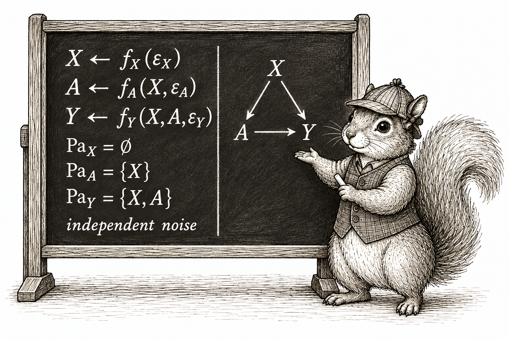
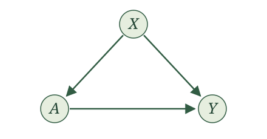
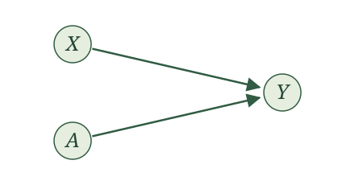
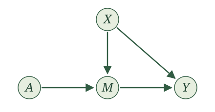
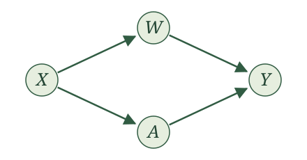
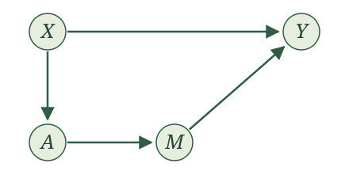

{width=85% fig-align="center" fig-alt="The squirrel in its checked hat and waistcoat presents a chalkboard. On the left are assignments for X, A, and Y, their parent sets, and independent noise. On the right the same parent structure is shown by arrows from X to A, X to Y, and A to Y."}

## Introduction

Our SCMs are starting to feel cumbersome. We write an assignment for every variable, give each assignment a function, and then leave the details of those functions unspecified. What we keep emphasizing is which variables are parents of which others, together with the requirement that the remaining randomness be independent. Is there a more convenient way to represent this?

There is. **A graph gives us a shortcut for displaying this structure.** It turns out that some things we want to say about random variables are much easier to see and say with a graph. We can keep track of the same parent relationships without writing out every assignment.

Some of you may have seen causal graphs before and wondered why we have waited this long to introduce them. The delay was deliberate. Causal inference is about random variables and how the world generates them. We wanted to spend time with those random variables before taking shortcuts. Each variable in our story is a random variable. Its parents are random variables. The remaining randomness is also represented by a random variable. A graph will help us study them, but we should always be able to translate what we see in the graph back into a statement about those random variables.

## SCMs and causal graphs

To get a graph from an SCM, draw one node for each variable in our story. A **node** is simply a point in the drawing, labeled with the variable's name. Then draw an arrow from each parent to the variable whose assignment uses it. An arrow is also called a **directed edge**. Thus, we draw $X\to Y$ exactly when $X$ is a parent of $Y$.

Now we can explain our choice of the word **parents**. It was not chosen on a whim. In graph terminology, a parent of a node is a node with an arrow pointing into it. The parents in our assignments become the parents in our graph.

We leave the noise terms out of these drawings. They are still part of the SCM, and we still require them to be independent as an entire collection.

Recall that our assignments have a topological order: we can put the variables in an order so that every parent comes before the variable it helps generate. This means that following arrows can never bring us back to the node where we started. Such a route would be a directed cycle. Our graphs have directed edges and no directed cycles, so they are called **directed acyclic graphs**, or **DAGs**. We call the DAG obtained from an SCM its **causal graph**.

Let's work through the RHC example. Let $X$ be mean blood pressure, $A$ indicate receipt of RHC, and $Y$ indicate death within 30 days. Our SCM is

$$
\begin{aligned}
X&\leftarrow f_X(\epsilon_X),\\
A&\leftarrow f_A(X,\epsilon_A),\\
Y&\leftarrow f_Y(X,A,\epsilon_Y),
\end{aligned}
$$

with independent noise terms. We draw three nodes, labeled $X$, $A$, and $Y$. The assignment for $X$ has no parents, so no arrows point into $X$. The assignment for $A$ uses $X$, so we draw $X\to A$. The assignment for $Y$ uses both $X$ and $A$, so we draw $X\to Y$ and $A\to Y$.

{width=440 fig-alt="Three nodes labeled X, A, and Y. Arrows run from X to A, X to Y, and A to Y."}

Now try this for the WHI trial. Here $X$ collects baseline characteristics, $A$ is randomized assignment to hormone therapy or placebo, and $Y$ indicates a coronary heart disease event. The SCM is

$$
\begin{aligned}
X&\leftarrow f_X(\epsilon_X),\\
A&\leftarrow f_A(\epsilon_A),\\
Y&\leftarrow f_Y(X,A,\epsilon_Y),
\end{aligned}
$$

with independent noise terms.

Draw the causal graph for the WHI SCM. How does it differ from the RHC graph?

{width=440 fig-alt="Nodes X and A each have an arrow pointing to Y. There is no arrow between X and A."}

Both $X$ and $A$ are parents of $Y$, so we draw $X\to Y$ and $A\to Y$. Neither $X$ nor $A$ has any parents. Compared with the RHC graph, the arrow $X\to A$ is absent: the randomized treatment assignment does not use $X$.

For a mediation example, return to the appointment-reminder story from the exercises. Let $X$ collect baseline characteristics, $A$ indicate randomized assignment to a reminder, $M$ indicate attendance, and $Y$ indicate whether blood pressure is measured at the appointment. The reminder can affect measurement only through attendance. We wrote

$$
\begin{aligned}
X&\leftarrow f_X(\epsilon_X),\\
A&\leftarrow f_A(\epsilon_A),\\
M&\leftarrow f_M(X,A,\epsilon_M),\\
Y&\leftarrow f_Y(X,M,\epsilon_Y),
\end{aligned}
$$

with independent noise terms.

Draw the causal graph for the appointment-reminder SCM. Should there be an arrow from $A$ to $Y$?

{width=440 fig-alt="Arrows run from X to M, X to Y, A to M, and M to Y. There is no arrow from A to Y."}

The parents of $M$ are $X$ and $A$, and the parents of $Y$ are $X$ and $M$. This gives four arrows: $X\to M$, $A\to M$, $X\to Y$, and $M\to Y$.

There is no arrow $A\to Y$ because $A$ is not an input to the assignment for $Y$. We can follow arrows from $A$ through $M$ to $Y$, but that does not make $A$ a parent of $Y$. Attendance carries the reminder's effect on whether blood pressure is measured.

We have defined a graph from an SCM. Can we go backward? If we know the graph, is there one unique SCM that gives us that graph?

Yes, in the form we have been using, with the assignment functions and noise distributions left unspecified. The arrows tell us exactly which parents to put into each assignment. We give each variable its own noise term and require those noise terms to be independent. The graph does not tell us a formula for a function or a distribution for a noise term; those details were already left unspecified in our SCMs.

::: {.main-point}
The graph tells us exactly how to write the SCM's assignments with unspecified functions. For each variable, use the variables with arrows pointing into it as its parents, add its noise term, and require all the noise terms to be independent.
:::

For example, suppose we are given this graph:

{width=440 fig-alt="Arrows run from X to W, X to A, W to Y, and A to Y."}

No arrows point into $X$, so its assignment uses only its noise term. The arrow into $W$ comes from $X$, and the arrow into $A$ also comes from $X$. Finally, the arrows into $Y$ come from $W$ and $A$. We therefore write

$$
\begin{aligned}
X&\leftarrow f_X(\epsilon_X),\\
W&\leftarrow f_W(X,\epsilon_W),\\
A&\leftarrow f_A(X,\epsilon_A),\\
Y&\leftarrow f_Y(W,A,\epsilon_Y),
\end{aligned}
$$

where $\epsilon_X$, $\epsilon_W$, $\epsilon_A$, and $\epsilon_Y$ are independent. Notice that $X$ is not an input to the assignment for $Y$: there is no arrow from $X$ to $Y$.

Now try the same translation for this graph:

{width=440 fig-alt="Arrows run from X to A, A to M, X to Y, and M to Y."}

Write the SCM represented by this graph. Include the requirement on its noise terms.

We write

$$
\begin{aligned}
X&\leftarrow f_X(\epsilon_X),\\
A&\leftarrow f_A(X,\epsilon_A),\\
M&\leftarrow f_M(A,\epsilon_M),\\
Y&\leftarrow f_Y(X,M,\epsilon_Y),
\end{aligned}
$$

where $\epsilon_X$, $\epsilon_A$, $\epsilon_M$, and $\epsilon_Y$ are independent. The parents of $A$ are $\{X\}$, the parents of $M$ are $\{A\}$, and the parents of $Y$ are $\{X,M\}$. The variable $X$ has no parents. Each assignment comes directly from the arrows pointing into its node.

