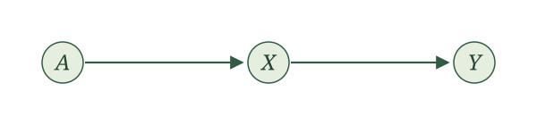
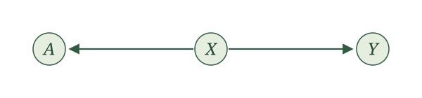
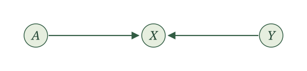
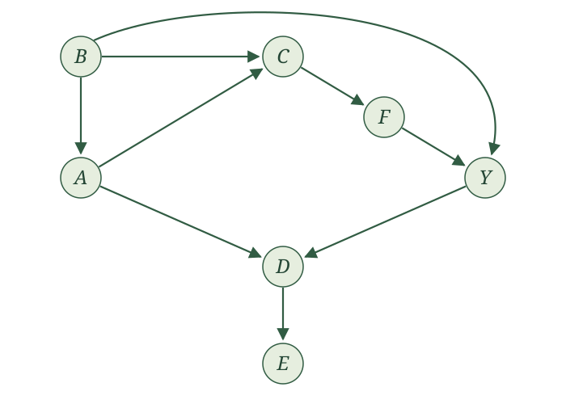
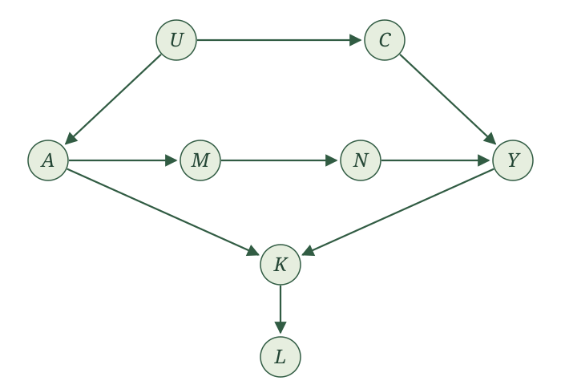
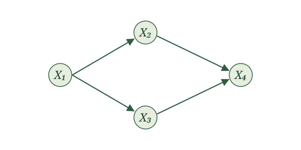

{width=85% fig-align="center" fig-alt="Two squirrels in checked hats and tailored clothing hold up their phones. A contact card travels along a green arrow from the left squirrel's phone to the right squirrel's phone."}

## Introduction

We now have a graph showing how the variables in our story are connected. Those connections give associations an origin story. If learning one variable tells us something about another, we can look through the graph for the paths along which that information might have traveled. (Recall that a **path** is a sequence of distinct nodes connected by arrows; we may follow those arrows in either direction.)

Why study associations in a book about cause and effect? Associations are what we encounter in data. We observe that variables are related, perhaps even after conditioning on other variables. Since we care about how the world generated those variables, we would like to understand how those associations came about.

The graph gives us a way to do that, but we need to be systematic. There may be several paths between two variables, and conditioning can change which paths transmit association. In this section, we develop a principled way to examine those paths and determine what independence and conditional-independence relationships the graph implies.

By association, we mean dependence, and by dependence, we mean the variables are not independent. Meanwhile, association after conditioning means conditional dependence, which means the variables are not conditionally independent. We will use these precise terms throughout the rest of the section. We will return at the end to exactly what the graph can—and cannot—tell us.

## Two variables

Begin with the smallest possible graph. Let $A$ be an exposure and $Y$ an outcome. Suppose the entire graph contains only these two variables, connected by an arrow.

{width=600 fig-align="center" fig-alt="A single directed edge from exposure A to outcome Y."}

The corresponding SCM has the form

$$
\begin{aligned}
A&\leftarrow f_A(\epsilon_A),\\
Y&\leftarrow f_Y(A,\epsilon_Y),
\end{aligned}
$$

where $\epsilon_A$ and $\epsilon_Y$ are independent. The arrow tells us that $A$ is an input to the assignment for $Y$. So $A$ and $Y$ can move together: the value $A$ takes can shape the value $Y$ takes. Put differently, if we find out the value of $A$, we may be able to make a better guess about $Y$. It works in reverse too. If we find out the value of $Y$, we may be able to make a better guess about $A$. The two variables may be dependent.

To show that dependence is possible, a single example is enough. Let the noise terms be independent $\operatorname{Bernoulli}(1/2)$ random variables and write

$$
A\leftarrow\epsilon_A,
\qquad
Y\leftarrow A+\epsilon_Y.
$$

Using linearity of conditional expectation and independence of $A$ and $\epsilon_Y$, we obtain

$$
E[Y\mid A]
=A+E[\epsilon_Y\mid A]
=A+\frac12.
$$

This conditional mean is $1/2$ when $A=0$ and $3/2$ when $A=1$. It varies with $A$, so $A$ and $Y$ are dependent.

Why is this enough? If $A$ and $Y$ were independent, then $E[Y\mid A]=E[Y]$ whenever the expectation exists. A conditional mean that varies with $A$ therefore establishes dependence. (The reverse argument does not generally work: a constant conditional mean alone does not establish independence.)

This single example establishes that the causal graph allows $A$ and $Y$ to be dependent.

Now consider a causal graph containing the same two variables but no arrow between them.

{width=600 fig-align="center" fig-alt="Two nodes, exposure A and outcome Y, with no edge connecting them."}

Here we claim that $A$ and $Y$ must be independent. To establish this, we need an argument that applies to every SCM with this graph. Such an SCM has the form

$$
A\leftarrow f_A(\epsilon_A),
\qquad
Y\leftarrow f_Y(\epsilon_Y),
$$

with independent noise terms. We can apply the local Markov property using the topological order $A,Y$. The variable $A$ precedes $Y$, and $Y$ has no parents. Thus,

$$
Y\perp\!\!\!\perp A\mid\varnothing.
$$

The empty set $\varnothing$ means that we are conditioning on no variables. This is simply independence:

$$
A\perp\!\!\!\perp Y.
$$

The assignments also explain why: $A$ and $Y$ are functions of separate independent noise terms. Taking functions of those noise terms preserves their independence. This argument applies to every SCM with this two-variable graph.

With only two variables, that's it.

## Three variables

 Once other variables enter the graph, however, $A$ and $Y$ can be connected even when there is no arrow directly between them. To understand how that can happen, we will start with three arrangements: **chains, forks, and colliders**. These are the building blocks of paths through a graph. Once we understand each one, including what happens when we condition on its middle variable, we can combine them to study more complicated graphs.

Suppose a third variable $X$ lies between the exposure $A$ and outcome $Y$. In each of the following graphs, $A$ and $X$ are connected by an arrow, and $X$ and $Y$ are connected by an arrow. The directions of the two arrows determine whether $X$ is part of a chain, a fork, or a collider. Each displayed three-variable graph is the entire graph for its example.

### Chain

{width=600 fig-align="center" fig-alt="A chain: exposure A points to mediator X, which points to outcome Y."}

A **chain** has one arrow entering the middle variable and one arrow leaving it. Here the arrows form a directed path from $A$, through $X$, to $Y$:

$$
A\to X\to Y.
$$

The corresponding SCM is

$$
\begin{aligned}
A&\leftarrow f_A(\epsilon_A),\\
X&\leftarrow f_X(A,\epsilon_X),\\
Y&\leftarrow f_Y(X,\epsilon_Y),
\end{aligned}
$$

where $\epsilon_A,\epsilon_X,\epsilon_Y$ are independent.

We call the variable $X$ a **mediator** of the $A$-$Y$ relationship. Consider three binary variables:

- $A=1$ if you set an alarm for 9 a.m.
- $X=1$ if you get out of bed by 9:01 a.m.
- $Y=1$ if you arrive on time for your 10 a.m. class.

Getting out of bed by 9:01 mediates the relationship between setting the alarm and arriving on time. $A$ goes into the assignment for $X$, and $X$ goes into the assignment for $Y$, so $A$ can influence $Y$ even though it is not an input to $Y$'s assignment.

To demonstrate that $A$ and $Y$ can be dependent, consider a simple model. You set the alarm with probability $1/2$. You get out of bed by 9:01 with probability $3/4$ if you set the alarm and $1/4$ otherwise. You arrive on time with probability $3/4$ if you get out of bed by 9:01 and $1/4$ otherwise, regardless of whether you set the alarm.

We can write these assignments using Bernoulli draws:

$$
\begin{aligned}
A&\leftarrow\operatorname{Bernoulli}(1/2),\\
X&\leftarrow\operatorname{Bernoulli}(1/4+A/2),\\
Y&\leftarrow\operatorname{Bernoulli}(1/4+X/2).
\end{aligned}
$$

Each draw uses fresh independent randomness; its probability of being one depends on the parents shown in its assignment. In particular,

$$
E[X\mid A]=\frac14+\frac A2,
\qquad
E[Y\mid X,A]=\frac14+\frac X2.
$$

To find $E[Y\mid A]$, first condition on both $X$ and $A$, then average over $X$ conditional on $A$. By iterated expectations,

$$
\begin{aligned}
E[Y\mid A]
&=E\!\left[E[Y\mid X,A]\mid A\right]\\
&=E\!\left[\frac14+\frac X2\mid A\right]\\
&=\frac14+\frac12E[X\mid A]\\
&=\frac14+\frac12\left(\frac14+\frac A2\right)\\
&=\frac38+\frac A4.
\end{aligned}
$$

The third line uses linearity of conditional expectation. Since $Y$ is binary, its conditional mean is also the probability of arriving on time: $3/8$ without the alarm and $5/8$ with it. The mean varies with $A$, so $A$ and $Y$ are dependent in this SCM. In words, you are more likely to arrive to class on time if you set an alarm!  This single example establishes that a chain allows its endpoints to be dependent.

Now condition on the mediator $X$. For any SCM with this three-variable graph, the local Markov property applies with topological order $A,X,Y$. The only parent of $Y$ is $X$, while $A$ precedes $Y$ and is not a parent. Therefore,

$$
Y\perp\!\!\!\perp A\mid X.
$$

In the alarm example, once we know whether you got out of bed by 9:01, knowing whether you set the alarm provides no additional information about arriving on time. Among those who got up by 9:01, the probability is $3/4$ with or without an alarm; among those who did not, it is $1/4$ with or without an alarm. This reflects the model's assumption that the alarm affects arrival only through getting out of bed by 9:01.

More generally, the assignment for $Y$ uses $X$ and $\epsilon_Y$. Once $X$ is fixed, the remaining randomness comes from $\epsilon_Y$, which is independent of $(A,X)$. The conditional-independence conclusion therefore holds for the general chain, not just our numerical example.

The reverse orientation, $A\leftarrow X\leftarrow Y$, is also a chain: one arrow enters the middle node and one leaves it. Our displayed chain uses $A\to X\to Y$ because it has the natural interpretation of a mediator between an exposure and an outcome.

### Fork

{width=600 fig-align="center" fig-alt="A fork: X points to both exposure A and outcome Y."}

A **fork** has two arrows leaving the middle variable:

$$
A\leftarrow X\to Y.
$$

Here $X$ is a **common cause** of $A$ and $Y$, also called a **confounder** of the $A$-$Y$ relationship. For example, blood pressure may affect both whether a patient receives RHC and whether the patient dies.

The corresponding SCM is

$$
\begin{aligned}
X&\leftarrow f_X(\epsilon_X),\\
A&\leftarrow f_A(X,\epsilon_A),\\
Y&\leftarrow f_Y(X,\epsilon_Y),
\end{aligned}
$$

where $\epsilon_X,\epsilon_A,\epsilon_Y$ are independent. Without conditioning on $X$, the common cause can make $A$ and $Y$ dependent. A single example is enough to demonstrate this possibility.

Can you construct an SCM with this fork in which $A$ and $Y$ are dependent?

One simple choice is

$$
X\leftarrow\operatorname{Bernoulli}(1/2),
\qquad A\leftarrow X,
\qquad Y\leftarrow X.
$$

The assignments for $A$ and $Y$ are deterministic: they copy $X$ and do not use their own noise terms. This is allowed in an SCM with independent noise terms.

Because $Y=A$,

$$
E[Y\mid A]=A.
$$

The conditional mean is zero when $A=0$ and one when $A=1$. It varies with $A$, so $A$ and $Y$ are dependent.

Now condition on the common cause $X$. For any SCM with this three-variable graph, apply the local Markov property with topological order $X,A,Y$. The only parent of $Y$ is $X$, and $A$ precedes $Y$ without being a parent. Thus,

$$
Y\perp\!\!\!\perp A\mid X.
$$

Once $X$ is known, the remaining randomness in $A$ and $Y$ comes from separate independent noise terms. Learning $A$ therefore gives no additional information about $Y$. In the dropdown example, knowing $X$ determines both variables completely; in the general fork, they need not be deterministic given $X$.

### Collider

{width=600 fig-align="center" fig-alt="A collider: exposure A and outcome Y both point to X."}

A **collider** has two arrows entering the middle variable:

$$
A\to X\leftarrow Y.
$$

The arrows collide at $X$, making $X$ a **common effect** of $A$ and $Y$. The corresponding SCM is

$$
\begin{aligned}
A&\leftarrow f_A(\epsilon_A),\\
Y&\leftarrow f_Y(\epsilon_Y),\\
X&\leftarrow f_X(A,Y,\epsilon_X),
\end{aligned}
$$

where $\epsilon_A,\epsilon_Y,\epsilon_X$ are independent.

Here $A$ and $Y$ are independent. To see this, apply the local Markov property with topological order $A,Y,X$. The variable $A$ precedes $Y$, and $Y$ has no parents. Therefore,

$$
Y\perp\!\!\!\perp A\mid\varnothing,
\qquad\text{or simply}\qquad
A\perp\!\!\!\perp Y.
$$

As in the disconnected two-variable graph, $A$ and $Y$ are generated from separate independent noise terms. Having a common effect does not change their independence.

But $A$ and $Y$ may be conditionally dependent given $X$. To demonstrate this possibility, consider a simplified model of studying, luck, and grades:

- $A=1$ if you study for an exam.
- $Y=1$ if you have good luck on the exam.
- $X=1$ if you get a good grade.

Suppose studying and luck are independent, each with probability $1/2$, and a good grade requires both:

$$
A\leftarrow\operatorname{Bernoulli}(1/2),
\qquad
Y\leftarrow\operatorname{Bernoulli}(1/2),
\qquad
X\leftarrow AY.
$$

The two Bernoulli draws use independent randomness. The grade assignment is deterministic and does not use an additional noise term.

Now suppose you did not get a good grade: $X=0$. If you studied ($A=1$), then $X=AY=Y$. Your lack of a good grade tells us that $Y=0$: you did not have good luck. Consequently,

$$
E[Y\mid X=0,A=1]=0.
$$

If you did not study ($A=0$), then $X=0$ regardless of your luck. Learning that you did not get a good grade tells us nothing further about $Y$. Luck remains a Bernoulli variable with probability $1/2$, so

$$
E[Y\mid X=0,A=0]=\frac12.
$$

At the same value $X=0$, learning whether you studied changes the conditional mean of luck. In particular,

$$
E[Y\mid X=0,A=1]\neq E[Y\mid X=0,A=0].
$$

If $Y$ and $A$ were conditionally independent given $X$, then $E[Y\mid X,A]=E[Y\mid X]$. The unequal conditional means show that this does not hold. Thus, although $A$ and $Y$ are independent, they are not conditionally independent given $X$ in this example.

The example establishes that conditioning on a collider can make its parents conditionally dependent. This is an example of **collider bias**. 

The table below summarizes what each arrangement tells us about independence between $A$ and $Y$, before and after conditioning on $X$. Each row treats the displayed three-variable graph as the entire graph.

| Structure | Role of $X$ | Without conditioning on $X$ | After conditioning on $X$ |
|---|---|---|---|
| Chain: $A\to X\to Y$ | Mediator | $A$ and $Y$ may be dependent | $A\perp\!\!\!\perp Y\mid X$ |
| Fork: $A\leftarrow X\to Y$ | Common cause | $A$ and $Y$ may be dependent | $A\perp\!\!\!\perp Y\mid X$ |
| Collider: $A\to X\leftarrow Y$ | Common effect | $A\perp\!\!\!\perp Y$ | $A$ and $Y$ may be conditionally dependent |

::: {.main-point}
In chains and forks, the outer variables may be dependent, but they are conditionally independent given the middle variable. In a collider, the outer variables are independent, but they can become conditionally dependent given the middle variable.
:::

## Paths

Chains, forks, and colliders are the building blocks of longer paths. As we move along a path, each internal variable is the middle of a chain, a fork, or a collider. What can these building blocks tell us about the variables at the two ends?

We will start with a few simple causal graphs, each with just one path between $A$ and $Y$. Consider

$$
A\to C\to F\to Y.
$$

This path contains two overlapping chains: $A\to C\to F$ and $C\to F\to Y$. Their middle variables are $C$ and $F$, respectively.

The endpoints $A$ and $Y$ may be dependent. But conditioning on the middle variable of either chain makes them conditionally independent:

$$
A\perp\!\!\!\perp Y\mid C,
\qquad
A\perp\!\!\!\perp Y\mid F.
$$

Can we give an example where $A$ and $Y$ are dependent without conditioning?

Let $A$ be a fair coin flip, and let each remaining variable copy its parent:

$$
C\leftarrow A,\qquad
F\leftarrow C,\qquad
Y\leftarrow F.
$$

Then $Y=A$, so learning $A$ tells us $Y$ exactly. In particular,

$$
P(Y=1)=\frac12,
\qquad
P(Y=1\mid A=1)=1.
$$

Thus, $A$ and $Y$ are dependent in this SCM.

Now consider

$$
A\leftarrow B\to C\to F\to Y.
$$

This path contains a fork, $A\leftarrow B\to C$, followed by two chains, $B\to C\to F$ and $C\to F\to Y$. Their middle variables are $B$, $C$, and $F$.

Again, $A$ and $Y$ may be dependent. But conditioning on any one of these middle variables makes them conditionally independent:

$$
A\perp\!\!\!\perp Y\mid B,
\qquad
A\perp\!\!\!\perp Y\mid C,
\qquad
A\perp\!\!\!\perp Y\mid F.
$$

What changes when the path contains a collider? Consider

$$
A\to C\leftarrow B\to Y.
$$

Here $C$ is the middle of a collider, and $B$ is the middle of a fork. Because of the collider, the endpoints are independent without conditioning:

$$
A\perp\!\!\!\perp Y.
$$

Conditioning on $C$ can make $A$ and $Y$ conditionally dependent.

Can we give an example where conditioning on $C$ makes $A$ and $Y$ conditionally dependent?

Let $A$ and $B$ be independent fair coin flips, and set

$$
C\leftarrow A+B,
\qquad
Y\leftarrow B.
$$

Among observations with $C=1$, exactly one of $A,B$ equals one. Since $Y=B$, learning $A$ tells us $Y$: if $A=0$, then $Y=1$; if $A=1$, then $Y=0$. Thus,

$$
P(Y=1\mid C=1)=\frac12,
\qquad
P(Y=1\mid C=1,A=0)=1.
$$

Learning $A$ changes the distribution of $Y$ once we condition on $C=1$. Therefore, $A$ and $Y$ are conditionally dependent given $C$ in this SCM.

But what if we condition on both $C$ and $B$? Conditioning on the collider can allow dependence, but we are also conditioning on the middle of the fork. That is enough to make the endpoints conditionally independent:

$$
A\perp\!\!\!\perp Y\mid B,C.
$$

Thus, conditioning on a collider does not undo the effect of conditioning on a middle variable in a chain or fork elsewhere along this path.

There is one more possibility that our three-variable examples could not show. Consider

$$
A\to D\leftarrow Y,
\qquad
D\to F.
$$

The path between $A$ and $Y$ contains the collider $D$, so $A\perp\!\!\!\perp Y$. Conditioning on $D$ can make the endpoints conditionally dependent. But what about conditioning on $F$?

Learning $F$ can give us information about $D$. For example, the assignment could be $F\leftarrow D$. Knowing $F$ would then tell us $D$ exactly, so conditioning on $F$ would have the same effect as conditioning on $D$.

Thus, leaving the collider itself out of the conditioning collection is not enough. To retain this independence guarantee, we must also leave out its descendants.

These examples suggest two ways to prevent dependence along a path. We can condition on a middle variable in a chain or fork. Or the path can contain a collider with neither it nor any of its descendants conditioned on. We call a path **blocked**, or **closed**, when either condition holds. Otherwise, we call it **open**.

::: {.definition-box}
**Blocked and open paths.** A path between $A$ and $Y$ is **blocked** by a collection of variables other than its endpoints if at least one of the following holds:

1. A middle variable in a chain or fork along the path is conditioned on.
2. A collider along the path is not conditioned on, and none of its descendants is conditioned on.

If neither condition holds, the path is **open** conditional on that collection.
:::

Let’s apply this definition. For the path

$$
A\leftarrow U\to V\to Y,
$$

$U$ is the middle of a fork and $V$ is the middle of a chain. The path is open without conditioning. Conditioning on $U$, on $V$, or on both blocks it.

For the path $A\to U\leftarrow V\to Y$, which collections chosen from $U,V$ block the path?

Without conditioning, the collider $U$ blocks the path. Conditioning on $U$ alone opens it. Conditioning on $V$ blocks the path at the fork, whether or not we also condition on $U$.

Thus, the path is blocked when we condition on nothing, on $V$, or on both $U,V$. It is open when we condition on $U$ alone.

Now add the arrow $U\to Z$. Which collections chosen from $U,V,Z$ block the path $A\to U\leftarrow V\to Y$?

Conditioning on either $U$ or its descendant $Z$ removes the blockage at the collider. But conditioning on $V$ always blocks this path.

The path is therefore blocked when we condition on nothing or on any collection containing $V$: $V$; $U,V$; $V,Z$; or $U,V,Z$.

It is open when we condition on $U$, on $Z$, or on $U,Z$.

::: {.callout-note title="Optional technical note: why either condition is enough when there is only one path" collapse="true"}

Suppose an SCM has a topological order and exactly one path between $A$ and $Y$. Let $S$ denote the collection of variables we condition on, excluding $A$ and $Y$. We will prove that either condition in the definition gives

$$
A\perp\!\!\!\perp Y\mid S.
$$

The graph may contain other variables and branches. The important assumption is that there is only one path between the two endpoints.

We use two elementary facts about independence:

- Functions of disjoint collections of mutually independent noise terms are independent.
- If two collections of variables are conditionally independent given $V$, conditioning additionally on variables from each collection preserves independence between what remains in the two collections.

For the second fact, imagine fixing $V=v$. The joint distribution of the two collections factors into a distribution for each collection. Conditioning separately on information from each collection preserves that factorization. The same statement applies without $V$ when the collections are independent to begin with.

**1. Conditioning on a middle variable in a chain or fork.**

Let $V$ be such a variable on the unique path, and suppose $V$ is in $S$. Since $V$ is not a collider on this path, at least one of its two adjacent arrows points away from it. Choose that side of the path.

Temporarily remove $V$ from the drawing and let $R$ be the entire connected piece on the chosen side. Let $L$ contain all remaining variables other than $V$. One endpoint lies in $R$ and the other lies in $L$.

There is exactly one edge between $V$ and $R$, and it points from $V$ into $R$. Why exactly one? Another edge from $V$ into the same connected piece would provide another route to the endpoint on that side, giving a second path between $A$ and $Y$. Likewise, there are no edges between $R$ and $L$; otherwise removing $V$ would not have separated the endpoints.

Consequently, the only input into the assignments in $R$ from outside $R$ is $V$. Substituting assignments in topological order lets us write the entire collection as

$$
R\leftarrow h(V,\epsilon_R),
$$

where $\epsilon_R$ collects the noise terms belonging to variables in $R$.

No variable in $R$ is a parent of a variable outside $R$. Thus, $V,L$ are functions only of noise terms outside $R$. Mutual independence of the SCM's noise terms gives

$$
\epsilon_R\perp\!\!\!\perp (V,L).
$$

Once $V$ is known, the remaining randomness determining $R$ is therefore independent of $L$. Hence,

$$
R\perp\!\!\!\perp L\mid V.
$$

Any additional variables in $S$ belong to $R$ or $L$. Conditioning on those variables preserves conditional independence between the two collections. Since $A$ and $Y$ lie on opposite sides and are not themselves conditioned on,

$$
A\perp\!\!\!\perp Y\mid S.
$$

This proves the first blocking rule, including situations where we also condition on colliders elsewhere along the path.

**2. A collider with neither it nor any descendant conditioned on.**

Let $V$ be a collider on the unique path, and suppose neither $V$ nor any of its descendants is in $S$.

First, neither endpoint can be a descendant of $V$. A directed path from $V$ to either endpoint would give a second route to that endpoint: it cannot follow the original path, whose adjacent arrow points into $V$. Combining that route with the original path would contradict uniqueness of the path between $A$ and $Y$.

Now remove $V$ and all its descendants. This removes neither endpoint nor any variable in $S$.

It also leaves a valid system of assignments for the remaining variables. No removed variable can be a parent of a remaining variable: a child of $V$ or of one of its descendants would itself be a descendant and would have been removed. We can therefore generate all remaining variables without using any of the removed assignments or noise terms.

The remaining graph has no path between $A$ and $Y$, because their unique path passed through $V$. They now belong to different connected pieces. Each piece is generated from its own collection of noise terms, and those noise collections are mutually independent. Thus, the collections of variables in the different pieces are independent.

Every variable in $S$ belongs to one of these remaining pieces. Conditioning on variables within the separate pieces preserves their independence. In particular,

$$
A\perp\!\!\!\perp Y\mid S.
$$

This proves the second blocking rule.

Both arguments rely on there being only one path between the endpoints. In a larger graph, blocking one path is not enough if another path remains open.

:::

## Graduate to more complicated graphs

A larger graph is a smorgasbord of chains, forks, and colliders. To understand what it tells us about independence, we need to figure out what happens when we combine these building blocks.

Our destination is a graphical rule called **d-separation**. The global Markov property tells us why this rule matters.

::: {.proposition-box}
**Global Markov property.** Consider an SCM with a topological order. If a collection of other variables $X_1,\ldots,X_k$ d-separates $A$ and $Y$ in its causal graph, then

$$
A\perp\!\!\!\perp Y\mid X_1,\ldots,X_k.
$$

The conditioning collection may be empty. In that case, the conclusion is $A\perp\!\!\!\perp Y$.
:::

The plan, then, is to find variables that d-separate $A$
and $Y$, and condition on them to make $A$ and $Y$ independent. To do that, we need to define d-separation. Let's start with an example, since it is more illustrative than jumping straight to the definition.

### List out paths

Consider the following graph. 

{#fig-dsep-five-paths width=700 fig-align="center" fig-alt="Arrows B to A, C, and Y; A to C and D; C to F; F to Y; Y to D; and D to E."}

Recall that a path from $A$ to $Y$ starts at $A$, follows arrows in either direction, and ends at $Y$, without visiting any node twice. There are five paths in @fig-dsep-five-paths:

1. $A\to C\to F\to Y$.
2. $A\leftarrow B\to C\to F\to Y$.
3. $A\leftarrow B\to Y$.
4. $A\to D\leftarrow Y$.
5. $A\to C\leftarrow B\to Y$.

The node $E$ is not on any path from $A$ to $Y$, because going from $D$ to $E$ leaves us no way to reach $Y$ without visiting $D$ again.

Which paths could make $A$ and $Y$ dependent? Our initial guess might be paths (1), (2), and (3). These paths connect $A$ and $Y$ through chains and forks, and chains and forks are what we say that transmitted dependence in our three-variable examples. 

We may also think path (4) and (5) do not make $A$ and $Y$ dependent. Path (4) has a collider at $D$, and path (5) has a collider at $C$. Colliders prevented dependence in our three-variable example.

One thing to note is that a node's role depends on the path. On path (1), $C$ is the middle of a chain. On path (5), both arrows point into $C$, so it is a collider. We examine the two arrows next to a node on the particular path we are tracing to determine a node's role.

### Choose what to condition on

Paths (4) and (5) have colliders, so for now we only need to worry about paths (1), (2), and (3). How might we try to "block" the transmission of dependence along those paths? Conditioning helped us before: in our three-variable examples, conditioning on the middle of a chain or fork made its outer variables conditionally independent.

- On path (1), both $C$ and $F$ are middle variables in chains.
- On path (2), $B$ is the middle of a fork, while $C$ and $F$ are middle variables in chains.
- On path (3), $B$ is the middle of a fork.

This suggests conditioning on $B$ and $C$: $C$ addresses path (1), $B$ addresses path (3), and both address path (2).

But conditioning can change what happens along paths (4) and (5), too. We set them aside because they contained colliders. Does that reasoning still hold after conditioning on $B,C$?

Path (4), $A\to D\leftarrow Y$, still connects $A$ and $Y$ through the collider $D$. We are not conditioning on $D$, so this path still poses no problem.

Path (5), $A\to C\leftarrow B\to Y$, is trickier. We are conditioning on its collider $C$, which can make $A$ and $B$ conditionally dependent. We can therefore no longer rely on $C$ to prevent dependence along this path. However, $B$ is the middle of the fork $C\leftarrow B\to Y$, and we are conditioning on $B$. This suggests that $B$ still ``blocks" the transmission of dependence along the full path from $A$ to $Y$.

It turns that conditioning on $B,C$ does give us

$$
A\perp\!\!\!\perp Y\mid B,C.
$$

We will justify this by showing that $B,C$ *d-separates* $A$ and $Y$. And so, the global Markov property applies giving us this conditional independent result.

::: {.callout-note title="Optional technical note: how this differs from local Markov property" collapse="true"}

This conclusion goes beyond a direct application of the local Markov property to $Y$. Its parents are $B,F$, so the local Markov property gives $Y\perp\!\!\!\perp A\mid B,F$. Our path-based argument instead gives independence conditional on $B,C$, even though $C$ is not a parent of $Y$.

What if we also condition on $D$? On path (4), $A\to D\leftarrow Y$, we would then be conditioning on a collider. Our three-variable example showed that this can make its parents conditionally dependent. This suggests that adding $D$ could undo what we accomplished by conditioning on $B,C$. And indeed, if we condition on $B,C,D$, we can longer guarantee that $A$ and $Y$ are conditional independent.

Conditioning on more variables can therefore undo the independence guarantee we obtained with $B,C$.

:::

### Blocking a single path

Before we can define d-separation, we need to know what it means to **block a path.** This makes precise the intuition we have been building: a path may allow dependence between its endpoints, and we want to understand when conditioning or colliders prevent that.

Our three-variable examples suggest two ways a path can be blocked. In a chain or fork, conditioning on the middle variable makes the outer variables conditionally independent. A collider does the opposite: its outer variables are independent without conditioning, but may become conditionally dependent when we condition on the collider. These observations suggest that a conditioned middle variable in a chain or fork, or an unconditioned collider, can block a longer path. Just one such variable is enough to block the path.

This is almost it. There is just one more possibility that our three-variable examples could not show: conditioning on a descendant of a collider. To see why this matters, return to path (4), $A\to D\leftarrow Y$. We have treated this path as blocked because $D$ is a collider that we are not conditioning on. But $D$ has a descendant, $E$, because our graph also contains $D\to E$. Conditioning on $E$ can give us information about $D$. For example, if the assignment is $E\leftarrow D$, knowing $E$ tells us $D$ exactly. So this path can be open even without conditioning on $D$: conditioning on its descendant $E$ is enough.

Our rule must therefore account for both the collider and its descendants.

::: {.definition-box}
**Blocked and open paths.** A path is **blocked** by the variables we condition on, $X_1,\ldots,X_k$, if at least one of the following holds:

1. A middle variable in a chain or fork along the path is conditioned on.
2. A collider along the path is not conditioned on, and none of its descendants is conditioned on.

If neither condition holds, the path is **open** conditional on $X_1,\ldots,X_k$.
:::

Let's apply this definition to a few paths. In each example, we focus on one path from $A$ to $Y$. We try to figure out which other variables shown could we condition on to block that path.

Consider

$$
A\leftarrow U\to V\to Y.
$$

Here $U$ is the middle of a fork and $V$ is the middle of a chain. There are no colliders, so the path is open when we condition on nothing. Conditioning on $U$ blocks the fork; conditioning on $V$ blocks the chain. Thus, the conditioning sets that block this path are $\{U\}$, $\{V\}$, and $\{U,V\}$. A single conditioned noncollider is enough.

For the path $A\to U\leftarrow V\to Y$, which conditioning sets chosen from $U,V$ block the path?

The internal node $U$ is a collider, while $V$ is the middle of a fork.

| Conditioning set | Path status | Reason |
|---|---|---|
| Nothing | Blocked | The collider $U$ is not conditioned on. |
| $U$ | Open | Conditioning on $U$ opens the collider, and $V$ is not conditioned on. |
| $V$ | Blocked | The collider $U$ is not conditioned on; the conditioned fork at $V$ also blocks the path. |
| $U,V$ | Blocked | The conditioned fork at $V$ blocks the path even though the collider at $U$ is opened. |

Consider the path $A\to U\leftarrow V\to Y$, now with the additional arrow $U\to Z$. Which conditioning sets chosen from $U,V,Z$ block the path from $A$ through $U,V$ to $Y$?

The variable $Z$ is a descendant of the collider $U$. Conditioning on either $U$ or $Z$ removes the blockage at $U$. But conditioning on $V$ always blocks the path, because $V$ is a noncollider on it.

The blocking sets are therefore the empty set and every set containing $V$: $\{V\}$, $\{U,V\}$, $\{V,Z\}$, and $\{U,V,Z\}$. The path is open given $\{U\}$, $\{Z\}$, or $\{U,Z\}$.

Notice that $Z$ can change whether the path is open even though it is not on the path itself.

### Blocking all paths

Blocking one path need not make its endpoints conditionally independent: another path may remain open. We need a criterion that considers every path.

::: {.definition-box}
**d-separation.** A collection $X_1,\ldots,X_k$ **d-separates** $A$ and $Y$ if it blocks every path between them. Otherwise, $A$ and $Y$ are **d-connected** given that collection.
:::

d-separation is a statement about a graph; conditional independence is a statement about random variables. The global Markov property connects them: if $X_1,\ldots,X_k$ d-separates $A$ and $Y$ in the causal graph of an SCM with a topological order, then

$$
A\perp\!\!\!\perp Y\mid X_1,\ldots,X_k.
$$

We can now justify our earlier conclusion in @fig-dsep-five-paths. Conditioning on $B,C$ blocks path (1) at $C$, path (2) at $B$ and $C$, and path (3) at $B$. Path (4) is blocked by its collider $D$, since neither $D$ nor its descendant $E$ is conditioned on. On path (5), conditioning on $C$ opens the collider there, but conditioning on $B$ still blocks the path.

All five paths are blocked. Therefore, $B,C$ does indeed d-separate $A$ and $Y$, and the global Markov property establishes

$$
A\perp\!\!\!\perp Y\mid B,C.
$$

Why is conditioning on $C$ alone insufficient to d-separate $A$ and $Y$?

Conditioning on $C$ blocks paths (1) and (2), but path (3), $A\leftarrow B\to Y$, remains open. It also opens the collider at $C$ on path (5), $A\to C\leftarrow B\to Y$. Since we have not conditioned on $B$, path (5) is now open too. Path (4) remains blocked at $D$. Two paths remain open, so $C$ does not d-separate $A$ and $Y$.

Let's work through another example. Consider this causal graph, which has topological order $U,A,C,M,N,Y,K,L$.

{width=700 fig-align="center" fig-alt="U points to A and C; C points to Y; A points to M, M to N, and N to Y; A and Y point to K; K points to L."}

There are three paths between $A$ and $Y$:

1. $A\leftarrow U\to C\to Y$.
2. $A\to M\to N\to Y$.
3. $A\to K\leftarrow Y$.

To block the first path, we could condition on either $U$ or $C$. To block the second, we could condition on either $M$ or $N$. The third path is already blocked by its collider $K$, provided we condition on neither $K$ nor its descendant $L$.

Choose $C,M$. Conditioning on $C$ blocks the first path, and conditioning on $M$ blocks the second. The third remains blocked at $K$. We have checked **every path**, so $C,M$ d-separates $A$ and $Y$. The global Markov property gives

$$
A\perp Y\mid C,M.
$$

This is not a direct application of the local Markov property to either endpoint: $A$ has parent $U$, while $Y$ has parents $C,N$. Our conditioning collection $C,M$ is neither parent set. By examining paths, we can find other collections that guarantee conditional independence.

Adding $L$ to the conditioning collection opens the third path through its collider $K$. Thus, $C,M,L$ does not d-separate $A$ and $Y$. The global Markov property then supplies no conditional-independence guarantee for these endpoints.

These examples suggest a systematic approach to using the global Markov property:

1. Identify the two variables of interest and list every path between them.
2. For the variables we are conditioning on, check each path. Is there a conditioned middle variable in a chain or fork? Is there a collider with neither itself nor any of its descendants conditioned on? Either is enough to block that path.
3. Check whether **every path is blocked**. If so, the conditioning collection d-separates the endpoints.
4. Apply the global Markov property to conclude conditional independence. If any path remains open, the property gives no conclusion about independence or dependence.

When searching for variables to condition on, check every path again after choosing them. Conditioning that blocks one path may open another.

::: {.callout-note title="Optional technical note: the global Markov property" collapse="true"}
To-do. I'll eventually want to put the full proof here. It is a bit involved, so for now, I'll leave this blank.
:::

## What the graph does not guarantee

d-separation gives us a guarantee: if the graph blocks every path, the corresponding random variables are conditionally independent. What happens when the graph leaves a path open?

An open path tells us that the variables **can** be dependent. It does not guarantee that they are. The particular assignment functions may make an input irrelevant, or contributions traveling along different paths may cancel one another.

Here is an example of exact cancellation. Consider

$$
\begin{aligned}
X_1&\leftarrow N_1,\\
X_2&\leftarrow X_1+N_2,\\
X_3&\leftarrow X_1+N_3,\\
X_4&\leftarrow X_3-X_2+N_4,
\end{aligned}
$$

where the noise terms are mutually independent.

{width=600 fig-align="center" fig-alt="A diamond-shaped causal graph with arrows from X1 to X2 and X3, and arrows from X2 and X3 to X4."}

There are two open directed paths from $X_1$ to $X_4$. The graph therefore does not d-separate them. But substituting the assignments gives

$$
X_4=(X_1+N_3)-(X_1+N_2)+N_4
=N_3-N_2+N_4.
$$

The contribution of $X_1$ cancels exactly. Because $X_1$ depends only on $N_1$, while $X_4$ depends only on $N_2,N_3,$ and $N_4$, we have

$$
X_1\perp\!\!\!\perp X_4.
$$

Thus, conditional independence does not generally imply d-separation. A **faithfulness** assumption adds this reverse direction.

::: {.definition-box}
**Faithfulness.** A distribution is faithful to a causal graph if every conditional-independence relationship in the distribution is represented by d-separation in the graph. That is, whenever $A\perp\!\!\!\perp B\mid C$, the collection $C$ d-separates $A$ and $B$ in the causal graph.
:::

Under faithfulness, d-separation and conditional independence agree in both directions. Faithfulness is an additional assumption, not something guaranteed by the SCM or its graph.

::: {.callout-note title="Optional technical note: why assume faithfulness?" collapse="true"}
In many common model classes, including linear models, the parameter values that produce extra independences through exact cancellation form a very small set. This is one reason faithfulness is often treated as a reasonable working assumption. It becomes especially important when we try to learn a causal graph from observed conditional-independence relationships.
:::
