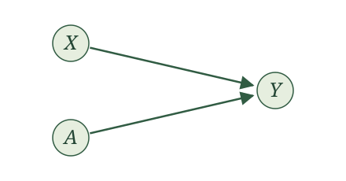
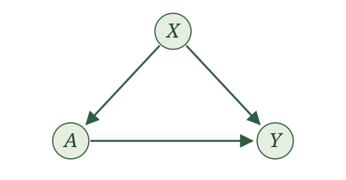
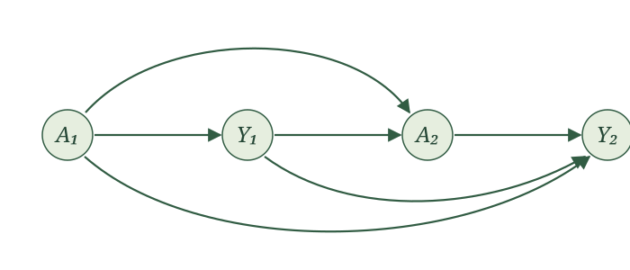
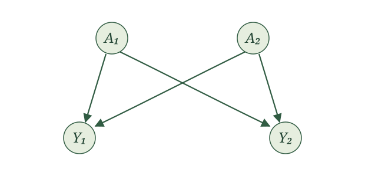
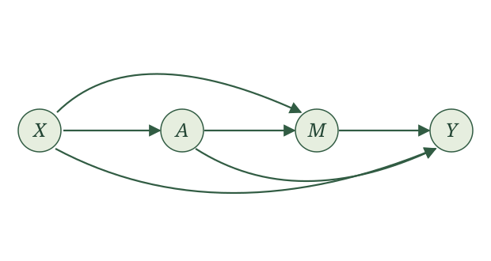

{width=700 fig-align="center" fig-alt="A puzzled squirrel stands beneath a bucket of water, hesitating over a rope handle that would tip the water onto its head. Vintage paperback-style ink illustration."}

## Introduction

The wait is over. We are ready for causal inference.

As the King of Hearts tells the White Rabbit in Alice in Wonderland, "Begin at the beginning, and go on till you come to the end: then stop." So let's appreciate how we got here, since I have had you anticipating this moment.

We started with a story. Causal inference would have to reverse the process that generated our data, so we thought carefully about that process. A probability model alone wasn't enough. We described data generation as a procedure, each variable produced as a function of others.

That commitment became our list of assignments. With a topological order, we could read our list top to bottom as a single run of that procedure. To convince ourselves assignments really do produce data, we simulated from concrete examples, and saw what they implied about the underlying probability model.

Then we realized we were overdoing it. What matters is which variables generate which, and everything else is independent noise. Pared down this way, our list of assignments earned a name, the structural causal model, or SCM.

Next, we drew the graph, since writing out an SCM takes forever. The graph captures the SCM perfectly, and was much easier to learn from.

And yet, we still haven't done any causal inference.

Causal questions ask what happens when we manipulate something, like this poor squirrel contemplating the rope (please don't!). So far we have only seen this for the clinical trial, and it took imagining two worlds, one where everyone got the intervention, another where everyone got placebo. We don't need that thought experiment anymore. With an SCM, we can define an intervention directly, by swapping out an argument and seeing how that changes the data-generating procedure.

## A single intervention

Let's return to the WHI clinical trial. We had a woman's age $X$, her assignment $A$ to HRT ($A=1$) or placebo ($A=0$), and whether she had a CHD event ($Y=1$) or not ($Y=0$). We described how the data came about with the SCM

$$
\begin{aligned}
X &\leftarrow f_X(\epsilon_X)\\
A &\leftarrow f_A(\epsilon_A)\\
Y &\leftarrow f_Y(X, A, \epsilon_Y),
\end{aligned}
$$

whose causal graph looked like:

{#fig-whi width=440 fig-alt="Nodes X and A each have an arrow pointing to Y. There is no arrow between X and A."}

This SCM describes the world as it actually ran. A woman was assigned to a group, and then something happened to her. But the causal question is not about what happened, it is about what would happen if we made the choice ourselves. What if we could reach into the trial and give every woman HRT? Or give every woman placebo? That is the squirrel pulling the rope, instead of watching someone else pull it.

The SCM gives us a precise way to describe an intervention. We use it to construct new variables, keeping the same functions and noise terms. We first give these variables new names. Then we change what the assignments receive: wherever an assignment uses the variable we are intervening on, we supply our chosen value instead.

Let's work through this procedure, starting with giving HRT to everyone in the WHI example. Choose $a=1$. First rename the variables on both sides of every assignment; then replace $A(a=1)$ on the right-hand side with $1$.

A rose underline marks exactly what changes from one display to the next.

**Original assignments**

$$
\begin{aligned}
X&\leftarrow f_X(\epsilon_X),\\
A&\leftarrow f_A(\epsilon_A),\\
Y&\leftarrow f_Y(X,A,\epsilon_Y).
\end{aligned}
$$

**Rename variables**

$$
\begin{aligned}
\style{border-bottom: 2px solid #B83D70; padding-bottom: 2px;}{X(a=1)}&\leftarrow f_X(\epsilon_X),\\
\style{border-bottom: 2px solid #B83D70; padding-bottom: 2px;}{A(a=1)}&\leftarrow f_A(\epsilon_A),\\
\style{border-bottom: 2px solid #B83D70; padding-bottom: 2px;}{Y(a=1)}&\leftarrow f_Y(\style{border-bottom: 2px solid #B83D70; padding-bottom: 2px;}{X(a=1)},\style{border-bottom: 2px solid #B83D70; padding-bottom: 2px;}{A(a=1)},\epsilon_Y).
\end{aligned}
$$

**Substitute intervention value $1$**

$$
\begin{aligned}
X(a=1)&\leftarrow f_X(\epsilon_X),\\
A(a=1)&\leftarrow f_A(\epsilon_A),\\
Y(a=1)&\leftarrow f_Y(X(a=1),\style{border-bottom: 2px solid #B83D70; padding-bottom: 2px;}{1},\epsilon_Y).
\end{aligned}
$$

Read $Y(a=1)$ as “$Y$ under intervention value $a=1$.” The middle display is an intermediate rewriting; the final display gives the assignments we run to generate the new variables.

We can picture running the recipe until just after $A(a=1)$ is generated. *Pause.* Reach into the remaining assignments and replace every use of $A(a=1)$ with $1$. Now press play. The assignment generating $A(a=1)$ stays intact; we change what the assignment for $Y(a=1)$ receives.

To give everyone placebo, repeat the same procedure with $a=0$.

**Original assignments**

$$
\begin{aligned}
X&\leftarrow f_X(\epsilon_X),\\
A&\leftarrow f_A(\epsilon_A),\\
Y&\leftarrow f_Y(X,A,\epsilon_Y).
\end{aligned}
$$

**Rename variables**

$$
\begin{aligned}
\style{border-bottom: 2px solid #B83D70; padding-bottom: 2px;}{X(a=0)}&\leftarrow f_X(\epsilon_X),\\
\style{border-bottom: 2px solid #B83D70; padding-bottom: 2px;}{A(a=0)}&\leftarrow f_A(\epsilon_A),\\
\style{border-bottom: 2px solid #B83D70; padding-bottom: 2px;}{Y(a=0)}&\leftarrow f_Y(\style{border-bottom: 2px solid #B83D70; padding-bottom: 2px;}{X(a=0)},\style{border-bottom: 2px solid #B83D70; padding-bottom: 2px;}{A(a=0)},\epsilon_Y).
\end{aligned}
$$

**Substitute intervention value $0$**

$$
\begin{aligned}
X(a=0)&\leftarrow f_X(\epsilon_X),\\
A(a=0)&\leftarrow f_A(\epsilon_A),\\
Y(a=0)&\leftarrow f_Y(X(a=0),\style{border-bottom: 2px solid #B83D70; padding-bottom: 2px;}{0},\epsilon_Y).
\end{aligned}
$$

Again, we generate $A(a=0)$ as before, but the assignment for $Y(a=0)$ receives $0$ in its place.

A single draw of the noise $(\epsilon_X,\epsilon_A,\epsilon_Y)$ determines the original variables and both new collections of variables. We call the new variables the *potential outcomes*.

Try another example. In the RHC study, we had a patient's blood pressure $X$, whether the patient had an RHC procedure ($A=1$) or not ($A=0$), and whether they died within 30 days $Y$. We described how the data came about with the SCM

$$
\begin{aligned}
X &\leftarrow f_X(\epsilon_X)\\
A &\leftarrow f_A(X, \epsilon_A)\\
Y &\leftarrow f_Y(X, A, \epsilon_Y),
\end{aligned}
$$

whose causal graph looked like:

{#fig-rhc width=440 fig-alt="Three nodes labeled X, A, and Y. Arrows run from X to A, X to Y, and A to Y."}

This SCM describes the world as it is: doctors see a patient's blood pressure, decide whether to do the procedure, and then things happen to the patient. Notice the difference from the WHI trial. There, assignment was a coin flip, and here $A$ listens to $X$. The causal question is the same, though. What would happen to 30-day survival if we reached in and *set* the procedure ourselves, doing RHC for everyone, or for no one?

We follow the same steps. First take $a=1$, RHC for everyone.

**Original assignments**

$$
\begin{aligned}
X&\leftarrow f_X(\epsilon_X),\\
A&\leftarrow f_A(X,\epsilon_A),\\
Y&\leftarrow f_Y(X,A,\epsilon_Y).
\end{aligned}
$$

**Rename variables**

$$
\begin{aligned}
\style{border-bottom: 2px solid #B83D70; padding-bottom: 2px;}{X(a=1)}&\leftarrow f_X(\epsilon_X),\\
\style{border-bottom: 2px solid #B83D70; padding-bottom: 2px;}{A(a=1)}&\leftarrow f_A(\style{border-bottom: 2px solid #B83D70; padding-bottom: 2px;}{X(a=1)},\epsilon_A),\\
\style{border-bottom: 2px solid #B83D70; padding-bottom: 2px;}{Y(a=1)}&\leftarrow f_Y(\style{border-bottom: 2px solid #B83D70; padding-bottom: 2px;}{X(a=1)},\style{border-bottom: 2px solid #B83D70; padding-bottom: 2px;}{A(a=1)},\epsilon_Y).
\end{aligned}
$$

**Substitute intervention value $1$**

$$
\begin{aligned}
X(a=1)&\leftarrow f_X(\epsilon_X),\\
A(a=1)&\leftarrow f_A(X(a=1),\epsilon_A),\\
Y(a=1)&\leftarrow f_Y(X(a=1),\style{border-bottom: 2px solid #B83D70; padding-bottom: 2px;}{1},\epsilon_Y).
\end{aligned}
$$

Just after $A(a=1)$ is generated, we reach into the remaining assignment and supply $1$ wherever it would use $A(a=1)$. Notice that $A(a=1)$ still uses $X(a=1)$, just as the original assignment uses blood pressure. We leave that calculation intact. The assignment for $Y(a=1)$ receives our chosen intervention value instead of its result.

For no RHC, repeat the procedure with $a=0$.

**Original assignments**

$$
\begin{aligned}
X&\leftarrow f_X(\epsilon_X),\\
A&\leftarrow f_A(X,\epsilon_A),\\
Y&\leftarrow f_Y(X,A,\epsilon_Y).
\end{aligned}
$$

**Rename variables**

$$
\begin{aligned}
\style{border-bottom: 2px solid #B83D70; padding-bottom: 2px;}{X(a=0)}&\leftarrow f_X(\epsilon_X),\\
\style{border-bottom: 2px solid #B83D70; padding-bottom: 2px;}{A(a=0)}&\leftarrow f_A(\style{border-bottom: 2px solid #B83D70; padding-bottom: 2px;}{X(a=0)},\epsilon_A),\\
\style{border-bottom: 2px solid #B83D70; padding-bottom: 2px;}{Y(a=0)}&\leftarrow f_Y(\style{border-bottom: 2px solid #B83D70; padding-bottom: 2px;}{X(a=0)},\style{border-bottom: 2px solid #B83D70; padding-bottom: 2px;}{A(a=0)},\epsilon_Y).
\end{aligned}
$$

**Substitute intervention value $0$**

$$
\begin{aligned}
X(a=0)&\leftarrow f_X(\epsilon_X),\\
A(a=0)&\leftarrow f_A(X(a=0),\epsilon_A),\\
Y(a=0)&\leftarrow f_Y(X(a=0),\style{border-bottom: 2px solid #B83D70; padding-bottom: 2px;}{0},\epsilon_Y).
\end{aligned}
$$

The same distinction holds: $A(a=0)$ is still generated using blood pressure, but the assignment for $Y(a=0)$ receives $0$ in its place.

As before, a single draw of the noise $(\epsilon_X,\epsilon_A,\epsilon_Y)$ gives us $Y$, $Y(a=1)$, and $Y(a=0)$ all at once. For a patient who did not get RHC, $Y(a=1)$ is what would have happened to that same patient, with the same blood pressure and the same noise, had we set the procedure to happen.

We can now state the procedure for a general intervention value $a$.

::: {.definition-box}
**Potential outcomes (single intervention).** For an SCM with a topological order, choose a variable $A$ and an intervention value $a$. Construct new assignments as follows:

1. Rename each variable $V$ as $V(a)$
2. Replace every $A(a)$ on the right-hand side with $a$.

Run the resulting assignments in topological order. The variables they generate are the **potential outcomes under intervention value $a$**, denoted $V(a)$ for each original variable $V$.
:::

There is nothing special about intervening on a binary variable. We can repeat this procedure for every possible intervention value $a$.

For example, consider keeping patients in the emergency department until an admission decision. Let $A$ be the time in hours until that decision, $H$ indicate hospital admission, and $Y$ indicate death within 30 days. Suppose interventions from one to eight hours are meaningful at our hospital.

Time in the ED can affect both admission and mortality, and admission can also affect mortality. Consider these assignments:

**Original assignments**

$$
\begin{aligned}
A&\leftarrow f_A(\epsilon_A),\\
H&\leftarrow f_H(A,\epsilon_H),\\
Y&\leftarrow f_Y(A,H,\epsilon_Y).
\end{aligned}
$$

Choose any $a\in[1,8]$ and follow our two steps.

**Rename variables**

$$
\begin{aligned}
\style{border-bottom: 2px solid #B83D70; padding-bottom: 2px;}{A(a)}&\leftarrow f_A(\epsilon_A),\\
\style{border-bottom: 2px solid #B83D70; padding-bottom: 2px;}{H(a)}&\leftarrow f_H(\style{border-bottom: 2px solid #B83D70; padding-bottom: 2px;}{A(a)},\epsilon_H),\\
\style{border-bottom: 2px solid #B83D70; padding-bottom: 2px;}{Y(a)}&\leftarrow f_Y(\style{border-bottom: 2px solid #B83D70; padding-bottom: 2px;}{A(a)},\style{border-bottom: 2px solid #B83D70; padding-bottom: 2px;}{H(a)},\epsilon_Y).
\end{aligned}
$$

**Substitute intervention value $a$**

$$
\begin{aligned}
A(a)&\leftarrow f_A(\epsilon_A),\\
H(a)&\leftarrow f_H(\style{border-bottom: 2px solid #B83D70; padding-bottom: 2px;}{a},\epsilon_H),\\
Y(a)&\leftarrow f_Y(\style{border-bottom: 2px solid #B83D70; padding-bottom: 2px;}{a},H(a),\epsilon_Y).
\end{aligned}
$$

Both the assignment for $H(a)$ and the assignment for $Y(a)$ receive $a$ in place of $A(a)$. The assignment for $Y(a)$ also receives the newly generated $H(a)$.

For example, $H(2)$ indicates whether the patient would be admitted under a two-hour intervention, and $Y(2)$ indicates whether that patient would die within 30 days under that intervention. We can also generate $Y(3)$, $Y(2.5)$, or $Y(a)$ for every other value $a\in[1,8]$.

We now have infinitely many collections of potential outcomes, one for each intervention value in the interval. That is a mouthful! But we have not introduced any new noise terms. One draw of the original noise terms determines all these potential outcomes together.

Instead of listing them separately, consider the function

$$
a\longmapsto Y(a),\qquad a\in[1,8].
$$

This is a response curve: it describes how the potential outcome varies as we change the intervention value. Each draw of the noise terms determines a response curve. Since $Y$ is binary here, the curve takes values zero or one; it need not be smooth. Response curves also arise naturally when studying medication dosage, where $a$ is the dose and $Y(a)$ is the outcome under that dose.

Now try the procedure yourself. Suppose $A$ indicates a randomized offer of treatment, $X$ describes baseline health, $M$ indicates whether treatment is received, and $Y$ is a later health outcome. Consider the SCM

$$
\begin{aligned}
X&\leftarrow f_X(\epsilon_X),\\
A&\leftarrow f_A(\epsilon_A),\\
M&\leftarrow f_M(A,X,\epsilon_M),\\
Y&\leftarrow f_Y(X,M,\epsilon_Y).
\end{aligned}
$$

For intervention value $a=1$, write the renamed assignments and then make the substitution that defines the potential outcomes.

**Rename variables**

$$
\begin{aligned}
\style{border-bottom: 2px solid #B83D70; padding-bottom: 2px;}{X(a=1)}&\leftarrow f_X(\epsilon_X),\\
\style{border-bottom: 2px solid #B83D70; padding-bottom: 2px;}{A(a=1)}&\leftarrow f_A(\epsilon_A),\\
\style{border-bottom: 2px solid #B83D70; padding-bottom: 2px;}{M(a=1)}&\leftarrow f_M(\style{border-bottom: 2px solid #B83D70; padding-bottom: 2px;}{A(a=1)},\style{border-bottom: 2px solid #B83D70; padding-bottom: 2px;}{X(a=1)},\epsilon_M),\\
\style{border-bottom: 2px solid #B83D70; padding-bottom: 2px;}{Y(a=1)}&\leftarrow f_Y(\style{border-bottom: 2px solid #B83D70; padding-bottom: 2px;}{X(a=1)},\style{border-bottom: 2px solid #B83D70; padding-bottom: 2px;}{M(a=1)},\epsilon_Y).
\end{aligned}
$$

**Substitute intervention value $1$**

$$
\begin{aligned}
X(a=1)&\leftarrow f_X(\epsilon_X),\\
A(a=1)&\leftarrow f_A(\epsilon_A),\\
M(a=1)&\leftarrow f_M(\style{border-bottom: 2px solid #B83D70; padding-bottom: 2px;}{1},X(a=1),\epsilon_M),\\
Y(a=1)&\leftarrow f_Y(X(a=1),M(a=1),\epsilon_Y).
\end{aligned}
$$

Only the assignment for $M(a=1)$ receives an explicit $1$. The assignment for $Y(a=1)$ receives $M(a=1)$. An intervention value need not appear explicitly in every calculation it can affect: here it enters the calculation for $Y(a=1)$ through $M(a=1)$.

::: {.callout-note title="Optional technical note: why we still generate A(a)" collapse="true"}

You might wonder why we still generate $A(a)$ when the other assignments use $a$ in its place. Wouldn't it be simpler to replace its assignment with

$$
A(a)\leftarrow a?
$$

That is another common way to capture an intervention. With the same functions and noise terms, it produces the same potential outcomes for the other variables. The difference is what happens to the variable named $A(a)$: that construction makes it the fixed intervention value, while ours retains its original assignment.

We keep that assignment because we will want to study the treatment the original procedure would generate alongside potential outcomes such as $Y(a)$. Retaining both in one SCM lets us ask questions about their joint behavior, rather than studying $Y(a)$ alone.

This distinction is central to the **single-world intervention graphs** introduced by Thomas Richardson and James Robins in 2013 [@richardson2013swigs]. Their construction separates the randomly generated treatment from the fixed intervention value. It is a seemingly small distinction with powerful consequences.

:::

## Consistency and causal irrelevance

We now have several collections of variables: the original variables, their potential outcomes under $a=0$, and their potential outcomes under $a=1$, for example. It would be useful to connect them.

Sometimes the intervention leaves a calculation untouched. Other times it substitutes the very value the calculation would already have used. Both give us opportunities to identify a potential outcome with its original variable. These two implications of our definitions are **causal irrelevance** and **consistency**.

### Causal irrelevance

Start with causal irrelevance, taking the name literally. Which calculations were entirely unaffected by our choice of intervention value $a$?

In the WHI example, compare the original assignments with their potential-outcome counterparts:

$$
\begin{aligned}
X&\leftarrow f_X(\epsilon_X),
& X(a)&\leftarrow f_X(\epsilon_X),\\
A&\leftarrow f_A(\epsilon_A),
& A(a)&\leftarrow f_A(\epsilon_A),\\
Y&\leftarrow f_Y(X,A,\epsilon_Y),
& Y(a)&\leftarrow f_Y(X(a),a,\epsilon_Y).
\end{aligned}
$$

Start with $X(a)$. Its assignment uses the same function and the same noise term as the assignment for $X$. Thus, $X(a)=X$.

The same holds for $A(a)$. Its assignment uses the same function and the same noise term as the assignment for $A$. Thus, $A(a)=A$.

Now consider $Y(a)$. Since $X(a)=X$, both outcome assignments use the same value of $X$ and the same noise term $\epsilon_Y$. But the original assignment receives $A$, while the new assignment receives $a$. These inputs need not agree, so we cannot conclude that $Y(a)=Y$ from an unchanged calculation.

We can therefore replace $X(a)$ with $X$ and $A(a)$ with $A$ throughout the assignments, while retaining $Y(a)$.

**After applying causal irrelevance**

$$
\begin{aligned}
\style{border-bottom: 2px solid #B83D70; padding-bottom: 2px;}{X}
&\leftarrow f_X(\epsilon_X),\\
\style{border-bottom: 2px solid #B83D70; padding-bottom: 2px;}{A}
&\leftarrow f_A(\epsilon_A),\\
Y(a)&\leftarrow f_Y\big(
\style{border-bottom: 2px solid #B83D70; padding-bottom: 2px;}{X},
a,\epsilon_Y\big).
\end{aligned}
$$

Now make the same comparison in the RHC example:

$$
\begin{aligned}
X&\leftarrow f_X(\epsilon_X),
& X(a)&\leftarrow f_X(\epsilon_X),\\
A&\leftarrow f_A(X,\epsilon_A),
& A(a)&\leftarrow f_A(X(a),\epsilon_A),\\
Y&\leftarrow f_Y(X,A,\epsilon_Y),
& Y(a)&\leftarrow f_Y(X(a),a,\epsilon_Y).
\end{aligned}
$$

Start with $X(a)$. Its assignment uses the same function and the same noise term as the assignment for $X$. Thus, $X(a)=X$.

Next consider $A(a)$. Its assignment uses $X(a)$, while the original assignment uses $X$. But we just established that $X(a)=X$. Both assignments therefore use the same function, the same input value, and the same noise term. Thus, $A(a)=A$.

Now consider $Y(a)$. Since $X(a)=X$, both outcome assignments use the same value of $X$ and the same noise term $\epsilon_Y$. But the original assignment receives $A$, while the new assignment receives $a$. These inputs need not agree, so we cannot conclude that $Y(a)=Y$ from an unchanged calculation.

We can therefore replace $X(a)$ with $X$ and $A(a)$ with $A$ throughout the assignments, while retaining $Y(a)$.

**After applying causal irrelevance**

$$
\begin{aligned}
\style{border-bottom: 2px solid #B83D70; padding-bottom: 2px;}{X}
&\leftarrow f_X(\epsilon_X),\\
\style{border-bottom: 2px solid #B83D70; padding-bottom: 2px;}{A}
&\leftarrow f_A\big(
\style{border-bottom: 2px solid #B83D70; padding-bottom: 2px;}{X},
\epsilon_A\big),\\
Y(a)&\leftarrow f_Y\big(
\style{border-bottom: 2px solid #B83D70; padding-bottom: 2px;}{X},
a,\epsilon_Y\big).
\end{aligned}
$$

In both examples, some calculations never use the intervention value $a$, even through their inputs. Causal irrelevance turns this observation into a general statement.

::: {.proposition-box}
**Causal irrelevance.** In the original SCM, look at the parents of $V$, the parents of those parents, and so on. If $A$ never appears among these parents, then

$$
V(a)=V.
$$
:::

This follows from our definitions: an unchanged calculation using the same noise terms produces the same variable.

Return to the ED example and fix an intervention value $a\in[1,8]$. Consider each potential outcome in assignment order.

- **$A(a)$:** $A$ has no parents. Thus, $A(a)=A$.
- **$H(a)$:** $A$ is a parent of $H$. Causal irrelevance does not apply.
- **$Y(a)$:** Again, $A$ is a parent of $Y$, so causal irrelevance does not apply.

We can therefore replace $A(a)$ with $A$ throughout the assignments.

**After applying causal irrelevance**

$$
\begin{aligned}
\style{border-bottom: 2px solid #B83D70; padding-bottom: 2px;}{A}&\leftarrow f_A(\epsilon_A),\\
H(a)&\leftarrow f_H(a,\epsilon_H),\\
Y(a)&\leftarrow f_Y(a,H(a),\epsilon_Y).
\end{aligned}
$$

Return to the treatment-offer example:

$$
\begin{aligned}
X&\leftarrow f_X(\epsilon_X),\\
A&\leftarrow f_A(\epsilon_A),\\
M&\leftarrow f_M(A,X,\epsilon_M),\\
Y&\leftarrow f_Y(X,M,\epsilon_Y).
\end{aligned}
$$

Which potential outcomes equal their original variables by causal irrelevance? Explain, then rewrite the full set of assignments using those equalities.

The assignments generating $X(a)$ and $A(a)$ are unchanged and use the original noise terms. Thus,

$$
X(a)=X,\qquad A(a)=A.
$$

**After applying causal irrelevance**

$$
\begin{aligned}
\style{border-bottom: 2px solid #B83D70; padding-bottom: 2px;}{X}&\leftarrow f_X(\epsilon_X),\\
\style{border-bottom: 2px solid #B83D70; padding-bottom: 2px;}{A}&\leftarrow f_A(\epsilon_A),\\
M(a)&\leftarrow f_M(a,\style{border-bottom: 2px solid #B83D70; padding-bottom: 2px;}{X},\epsilon_M),\\
Y(a)&\leftarrow f_Y(\style{border-bottom: 2px solid #B83D70; padding-bottom: 2px;}{X},M(a),\epsilon_Y).
\end{aligned}
$$

The intervention value enters the calculation for $M(a)$ directly and the calculation for $Y(a)$ through $M(a)$. Causal irrelevance therefore does not guarantee $M(a)=M$ or $Y(a)=Y$. The absence of an explicit $a$ in the final assignment is not enough: we must trace its inputs too.

::: {.callout-note title="Optional technical note: proof of causal irrelevance" collapse="true"}

Fix an intervention value $a$ and consider $V(a)$. Suppose $A$ never appears among the inputs used to generate $V$, the inputs used to generate those inputs, and so on.

Collect the assignment for $V$ and all the assignments needed to generate its inputs. Keep them in their original topological order. We prove by **induction along this order** that each potential outcome equals its original variable.

**Base case.** The first assignment in this collection has no variable inputs: any such input would require an earlier assignment in the collection. Its original and potential-outcome versions therefore use the same function and the same noise term, giving the same value.

**Inductive step.** Suppose every assignment earlier in the collection has produced matching original and potential-outcome values. The next assignment uses those earlier values and its own noise term. None of its inputs is $A$, so none is replaced with $a$. By the induction hypothesis, all its variable inputs agree with their original values. The function and noise term are also unchanged, so this assignment produces matching values too.

Induction therefore gives matching values throughout the collection, including

$$
V(a)=V.
$$

:::

### Consistency

Consistency gives us another opportunity to identify a potential outcome with its original variable. What if the original treatment $A$ already equals the intervention value $a$?

Return to the WHI example. After applying causal irrelevance, we have

$$
\begin{aligned}
X&\leftarrow f_X(\epsilon_X),
& X&\leftarrow f_X(\epsilon_X),\\
A&\leftarrow f_A(\epsilon_A),
& A&\leftarrow f_A(\epsilon_A),\\
Y&\leftarrow f_Y(X,A,\epsilon_Y),
& Y(a)&\leftarrow f_Y(X,a,\epsilon_Y).
\end{aligned}
$$

We have already established that the calculations for $X$ and $A$ are unchanged. The remaining comparison is between $Y$ and $Y(a)$.

Both outcome assignments use the same function, the same value of $X$, and the same noise term $\epsilon_Y$. The only possible difference is that one receives $A$ and the other receives $a$.

Whenever $A=a$, that difference disappears. All the inputs agree, so

$$
Y(a)=Y
\qquad\text{whenever }A=a.
$$

For example, when we choose $a=1$, this equality holds for women whose original assignment was HRT: $Y(a=1)=Y$ whenever $A=1$. When we choose $a=0$, it holds for women whose original assignment was placebo: $Y(a=0)=Y$ whenever $A=0$.

This is **consistency**: replacing an input with the value it already has leaves the calculation unchanged.

Now consider the RHC example. After applying causal irrelevance, we have

$$
\begin{aligned}
X&\leftarrow f_X(\epsilon_X),
& X&\leftarrow f_X(\epsilon_X),\\
A&\leftarrow f_A(X,\epsilon_A),
& A&\leftarrow f_A(X,\epsilon_A),\\
Y&\leftarrow f_Y(X,A,\epsilon_Y),
& Y(a)&\leftarrow f_Y(X,a,\epsilon_Y).
\end{aligned}
$$

Here, treatment assignment uses $X$, but the outcome comparison is the same as in WHI. The assignments for $Y$ and $Y(a)$ differ only in receiving $A$ versus $a$. Whenever these values agree, all the inputs agree, giving

$$
Y(a)=Y
\qquad\text{whenever }A=a.
$$

Thus, $Y(a=1)=Y$ for patients who originally received RHC, and $Y(a=0)=Y$ for patients who did not.

Both examples illustrate the same implication of our definitions:

::: {.proposition-box}
**Consistency.** For any variable $V$ in the SCM,

$$
V(a)=V
\qquad\text{whenever }A=a.
$$
:::

Return to the ED example and fix an intervention value $a\in[1,8]$. After applying causal irrelevance, we have

$$
\begin{aligned}
A&\leftarrow f_A(\epsilon_A),
& A&\leftarrow f_A(\epsilon_A),\\
H&\leftarrow f_H(A,\epsilon_H),
& H(a)&\leftarrow f_H(a,\epsilon_H),\\
Y&\leftarrow f_Y(A,H,\epsilon_Y),
& Y(a)&\leftarrow f_Y(a,H(a),\epsilon_Y).
\end{aligned}
$$

Here we need to carry the comparison through two assignments. Suppose the original time $A$ equals $a$.

Start with admission. The only possible difference between its two assignments is $A$ versus $a$. These agree, so $H(a)=H$.

Next consider mortality. Its inputs include $A,H$ in the original assignment and $a,H(a)$ in the potential-outcome assignment. Both pairs now agree; the remaining inputs and the function are unchanged. Thus, $Y(a)=Y$ too.

For example, choosing $a=2$ gives

$$
H(2)=H,\qquad Y(2)=Y
\qquad\text{whenever }A=2.
$$

For patients whose original time in the ED was two hours, the two-hour intervention reproduces their original admission and mortality outcomes.

Causal irrelevance gave us $A(a)=A$ regardless of the original value of $A$. Consistency additionally gives us $H(a)=H$ and $Y(a)=Y$ whenever $A=a$.

In the treatment-offer example, suppose the original offer $A$ equals the intervention value $a$. What additional equalities follow from consistency?

Causal irrelevance already gives $X(a)=X$ and $A(a)=A$ for every $a$. Whenever $A=a$, we additionally have

$$
M(a)=f_M(a,X,\epsilon_M)
=f_M(A,X,\epsilon_M)=M.
$$

Substitute this equality into the next assignment:

$$
Y(a)=f_Y(X,M(a),\epsilon_Y)
=f_Y(X,M,\epsilon_Y)=Y.
$$

Thus, consistency gives $M(a)=M$ and $Y(a)=Y$ whenever $A=a$. The equality for $M$ carries into the calculation for $Y$.

::: {.callout-note title="Optional technical note: proof of consistency" collapse="true"}

Fix an intervention value $a$ and a realization of the noise terms for which $A=a$.

Run the original and potential-outcome assignments in the same topological order. The first assignments use identical noise terms and therefore produce identical values. At each subsequent assignment, previously generated inputs agree. Wherever the original assignment uses $A$, the potential-outcome assignment uses $a$—but these values agree too. The function and noise term are unchanged, so the outputs agree.

Continuing through the assignments gives

$$
V(a)=V
\qquad\text{whenever }A=a
$$

for every variable $V$. This is the same induction along the topological order used in the preceding proof.

:::

## Multiple interventions

Why stop at one intervention? Sometimes we want to intervene on several variables. We might set treatment at several time points, vaccinate both members of a couple, or set a treatment and an intermediate variable that treatment normally influences.

These examples look different, but the operation is the same. We construct new variables using the original assignments, supplying our chosen intervention values wherever the corresponding variables would be used. There are simply more values to substitute. Let's work through some examples.

### Repeated interventions over time

::: {.example-intro}
Example 1: Adjusting asthma treatment based on response

Consider a patient being treated for asthma. A clinician decides whether to give an initial bronchodilator treatment, assesses the patient's breathing, and then decides whether to give another treatment. The second decision can depend on the response to the first.

:::

Let

- $A_1$ indicate whether the initial treatment is given;
- $Y_1$ be a breathing measurement after the first treatment decision;
- $A_2$ indicate whether another treatment is given;
- $Y_2$ be a breathing measurement after the second treatment decision.

Consider the SCM:

$$
\begin{aligned}
A_1&\leftarrow f_{A_1}(\epsilon_{A_1}),\\
Y_1&\leftarrow f_{Y_1}(A_1,\epsilon_{Y_1}),\\
A_2&\leftarrow f_{A_2}(A_1,Y_1,\epsilon_{A_2}),\\
Y_2&\leftarrow f_{Y_2}(A_1,Y_1,A_2,\epsilon_{Y_2}),
\end{aligned}
$$

with independent noise terms. Its causal graph is

{width=700 fig-align="center" fig-alt="Four labeled circles in time order: A1, Y1, A2, and Y2. A1 points to Y1, A2, and Y2; Y1 points to A2 and Y2; and A2 points to Y2."}

Suppose we want to give treatment at the first opportunity but not the second. Choose $a_1=1$ and $a_2=0$.

First, write each new variable as $V(1,0)$, where the first argument is the intervention value for $A_1$ and the second is the intervention value for $A_2$. Rename variables on both sides of every assignment:

$$
\begin{aligned}
\style{border-bottom: 2px solid #B83D70; padding-bottom: 2px;}{A_1(1,0)}&\leftarrow f_{A_1}(\epsilon_{A_1}),\\
\style{border-bottom: 2px solid #B83D70; padding-bottom: 2px;}{Y_1(1,0)}&\leftarrow f_{Y_1}(\style{border-bottom: 2px solid #B83D70; padding-bottom: 2px;}{A_1(1,0)},\epsilon_{Y_1}),\\
\style{border-bottom: 2px solid #B83D70; padding-bottom: 2px;}{A_2(1,0)}&\leftarrow f_{A_2}(\style{border-bottom: 2px solid #B83D70; padding-bottom: 2px;}{A_1(1,0)},\style{border-bottom: 2px solid #B83D70; padding-bottom: 2px;}{Y_1(1,0)},\epsilon_{A_2}),\\
\style{border-bottom: 2px solid #B83D70; padding-bottom: 2px;}{Y_2(1,0)}&\leftarrow f_{Y_2}(\style{border-bottom: 2px solid #B83D70; padding-bottom: 2px;}{A_1(1,0)},\style{border-bottom: 2px solid #B83D70; padding-bottom: 2px;}{Y_1(1,0)},\style{border-bottom: 2px solid #B83D70; padding-bottom: 2px;}{A_2(1,0)},\epsilon_{Y_2}).
\end{aligned}
$$

Next, on the right-hand sides, replace every $A_1(1,0)$ with $1$ and every $A_2(1,0)$ with $0$:

$$
\begin{aligned}
A_1(1,0)&\leftarrow f_{A_1}(\epsilon_{A_1}),\\
Y_1(1,0)&\leftarrow f_{Y_1}(
\style{border-bottom: 2px solid #B83D70; padding-bottom: 2px;}{1},
\epsilon_{Y_1}),\\
A_2(1,0)&\leftarrow f_{A_2}(
\style{border-bottom: 2px solid #B83D70; padding-bottom: 2px;}{1},
Y_1(1,0),\epsilon_{A_2}),\\
Y_2(1,0)&\leftarrow f_{Y_2}(
\style{border-bottom: 2px solid #B83D70; padding-bottom: 2px;}{1},
Y_1(1,0),
\style{border-bottom: 2px solid #B83D70; padding-bottom: 2px;}{0},
\epsilon_{Y_2}).
\end{aligned}
$$

Now run these assignments in topological order using the original noise terms. The variable $Y_2(1,0)$ is the final breathing measurement under treatment at the first opportunity and no treatment at the second.

We can picture making two swaps as the procedure runs. After generating $A_1(1,0)$, we supply $1$ wherever later assignments would use it. After generating $A_2(1,0)$, we supply $0$ wherever later assignments would use it.

Notice that we still generate both treatment variables. In particular, the assignment for $A_2(1,0)$ uses the first intervention value and the response generated under it. Its calculation can therefore differ from the original calculation for $A_2$, even though we retain its assignment.

With one binary intervention, there are two intervention values, each giving a collection of potential outcomes. With two binary interventions, that number multiplies: there are four combinations, $(a_1,a_2) \in \{(1,1),(1,0),(0,1),(0,0)\}$, each giving its own collection.

We have worked through $(1,0)$. Choosing $(1,1)$, $(0,1)$, or $(0,0)$ changes the values we substitute, but we use the same functions and the same original noise terms each time.

We can also use causal irrelevance and consistency to connect these potential outcomes to the original variables. Continue with intervention values $a_1=1$ and $a_2=0$.

Start with causal irrelevance. Compare the original and potential-outcome assignments:

$$
\begin{aligned}
A_1&\leftarrow f_{A_1}(\epsilon_{A_1}),
& A_1(1,0)&\leftarrow f_{A_1}(\epsilon_{A_1}),\\
Y_1&\leftarrow f_{Y_1}(A_1,\epsilon_{Y_1}),
& Y_1(1,0)&\leftarrow f_{Y_1}(1,\epsilon_{Y_1}),\\
A_2&\leftarrow f_{A_2}(A_1,Y_1,\epsilon_{A_2}),
& A_2(1,0)&\leftarrow f_{A_2}(1,Y_1(1,0),\epsilon_{A_2}),\\
Y_2&\leftarrow f_{Y_2}(A_1,Y_1,A_2,\epsilon_{Y_2}),
& Y_2(1,0)&\leftarrow f_{Y_2}(1,Y_1(1,0),0,\epsilon_{Y_2}).
\end{aligned}
$$

The assignment for $A_1(1,0)$ is unchanged, so $A_1(1,0)=A_1$. The assignment for $Y_1(1,0)$ receives $1$ instead of $A_1$, so its calculation need not match the original. That possible difference carries into $A_2(1,0)$ and $Y_2(1,0)$. The final assignment also receives the second intervention value, $0$.

We can therefore replace only $A_1(1,0)$ with $A_1$.

After applying causal irrelevance, the assignments become

$$
\begin{aligned}
\style{border-bottom: 2px solid #B83D70; padding-bottom: 2px;}{A_1}
&\leftarrow f_{A_1}(\epsilon_{A_1}),\\
Y_1(1,0)&\leftarrow f_{Y_1}(1,\epsilon_{Y_1}),\\
A_2(1,0)&\leftarrow f_{A_2}(1,Y_1(1,0),\epsilon_{A_2}),\\
Y_2(1,0)&\leftarrow f_{Y_2}(1,Y_1(1,0),0,\epsilon_{Y_2}).
\end{aligned}
$$

Consistency gives us additional equalities when the original treatment values match the intervention values. First suppose $A_1=1$. Then the assignments for $Y_1(1,0)$ and $Y_1$ agree, so $Y_1(1,0)=Y_1$. This equality carries into the next assignment:

$$
A_2(1,0)
=f_{A_2}(1,Y_1(1,0),\epsilon_{A_2})
=f_{A_2}(A_1,Y_1,\epsilon_{A_2})
=A_2.
$$

Thus, matching only the first treatment is enough to give

$$
Y_1(1,0)=Y_1,
\qquad
A_2(1,0)=A_2
\qquad\text{whenever }A_1=1.
$$

It is not enough to conclude that $Y_2(1,0)=Y_2$. Its potential-outcome assignment receives $0$, while the original assignment receives $A_2$. If the second treatment also matches, $A_2=0$, then every input agrees and

$$
Y_2(1,0)=Y_2
\qquad\text{whenever }A_1=1\text{ and }A_2=0.
$$

Matching only $A_2=0$ is not enough. If $A_1\ne1$, the first intervention can change $Y_1(1,0)$, so the final outcome assignments can still receive different histories. Consistency carries forward only as far as the treatment history agrees.

### Interventions on connected people

Multiple interventions need not occur at different times for the same person. They can also occur on different people whose outcomes may affect one another.

::: {.example-intro}
Example 2: Vaccinating both members of a couple

Suppose we study influenza in couples. Let $A_1$ and $A_2$ indicate whether each partner is vaccinated, and let $Y_1$ and $Y_2$ indicate whether each partner develops influenza. One partner's vaccination can affect both partners' outcomes, so we allow **interference**.

:::

Consider the SCM

$$
\begin{aligned}
A_1&\leftarrow f_{A_1}(\epsilon_{A_1}),\\
A_2&\leftarrow f_{A_2}(\epsilon_{A_2}),\\
Y_1&\leftarrow f_{Y_1}(A_1,A_2,\epsilon_{Y_1}),\\
Y_2&\leftarrow f_{Y_2}(A_1,A_2,\epsilon_{Y_2}).
\end{aligned}
$$

{width=620 fig-align="center" fig-alt="A causal graph in which both vaccination variables A1 and A2 point to both influenza outcomes Y1 and Y2."}

Under vaccination values $(a_1,a_2)$, the assignments become

$$
\begin{aligned}
A_1(a_1,a_2)&\leftarrow f_{A_1}(\epsilon_{A_1}),\\
A_2(a_1,a_2)&\leftarrow f_{A_2}(\epsilon_{A_2}),\\
Y_1(a_1,a_2)&\leftarrow f_{Y_1}(a_1,a_2,\epsilon_{Y_1}),\\
Y_2(a_1,a_2)&\leftarrow f_{Y_2}(a_1,a_2,\epsilon_{Y_2}).
\end{aligned}
$$

The potential outcome $Y_1(1,0)$ tells us whether the first partner would develop influenza if the first partner were vaccinated and the second were not. Because there is interference, changing $a_2$ can change $Y_1(a_1,a_2)$ even though $A_2$ belongs to the other partner.

### Intervening on a treatment and a mediator

Another common case arises when we intervene on a treatment and on a variable through which some of its effect may travel.

::: {.example-intro}
Example 3: Treatment and mediation

Let $X$ be baseline health, $A$ a treatment, $M$ blood pressure after treatment, and $Y$ a later cardiovascular outcome. The variable $M$ is a **mediator**: treatment can affect blood pressure, which can then affect the outcome.

:::

Consider the SCM

$$
\begin{aligned}
X&\leftarrow f_X(\epsilon_X),\\
A&\leftarrow f_A(X,\epsilon_A),\\
M&\leftarrow f_M(X,A,\epsilon_M),\\
Y&\leftarrow f_Y(X,A,M,\epsilon_Y).
\end{aligned}
$$

{width=620 fig-align="center" fig-alt="A mediation graph in which baseline X points to treatment A, mediator M, and outcome Y; treatment A points to M and Y; and M points to Y."}

To intervene on both treatment and the mediator, choose values $a$ and $m$. Rename the variables using both values, then substitute $a$ for right-hand occurrences of $A(a,m)$ and $m$ for right-hand occurrences of $M(a,m)$:

$$
\begin{aligned}
X(a,m)&\leftarrow f_X(\epsilon_X),\\
A(a,m)&\leftarrow f_A(X(a,m),\epsilon_A),\\
M(a,m)&\leftarrow f_M(X(a,m),a,\epsilon_M),\\
Y(a,m)&\leftarrow f_Y(X(a,m),a,m,\epsilon_Y).
\end{aligned}
$$

The potential outcome $Y(a,m)$ is the outcome under treatment value $a$ and mediator value $m$. Holding $m$ fixed prevents changes in $A$ from reaching $Y$ through the value of $M$, while still allowing any other routes from $A$ to $Y$.

::: {.callout-note title="Optional technical note: random and nested intervention values" collapse="true"}

So far, every intervention value has been fixed. We can also define an intervention value using another random variable. For example, instead of fixing the mediator at one number $m$, we could supply a randomly generated mediator value to the assignment for $Y$.

An especially important construction uses the mediator value that would arise under another treatment. The nested potential outcome

$$
Y\bigl(a,M(a')\bigr)
$$

uses treatment value $a$ in the outcome assignment and supplies the mediator value generated under treatment $a'$. This allows us to define the **natural indirect effect**

$$
E\!\left[Y\bigl(1,M(1)\bigr)-Y\bigl(1,M(0)\bigr)\right]
$$

and the **natural direct effect**

$$
E\!\left[Y\bigl(1,M(0)\bigr)-Y\bigl(0,M(0)\bigr)\right].
$$

The first changes the mediator from the value it would take under $A=0$ to the value it would take under $A=1$, while holding the treatment supplied to the outcome assignment at $1$. The second changes the treatment supplied to the outcome assignment while holding the mediator at the value it would take under $A=0$. These are examples of causal mediation effects studied by @imai2010general and @imai2010identification.

A randomized interventional analogue instead draws a mediator value from a specified distribution, such as the distribution of $M(a')$, rather than using a person's own $M(a')$. The distinction matters: natural and randomized interventional effects are different causal quantities and can require different assumptions.

:::

::: {.callout-note title="Optional technical note: general setting" collapse="true"}

The three examples use the same construction. We can now state it generally.

**Potential outcomes (multiple interventions).** For an SCM with a topological order, choose distinct variables $A_1,\ldots,A_k$ and corresponding intervention values $a_1,\ldots,a_k$.

1. Rename each variable $V$ as $V(a_1,\ldots,a_k)$
2. For each $j=1,\ldots,k$, replace every $A_j(a_1,\ldots,a_k)$ on the right-hand side with $a_j$.

Run the resulting assignments in topological order. The variables they generate are the potential outcomes under intervention values $a_1,\ldots,a_k$, denoted $V(a_1,\ldots,a_k)$ for each original variable $V$.

The same two implications connect these potential outcomes to the original variables.

**Causal irrelevance.** Fix intervention values $a_1,\ldots,a_k$ and consider $V(a_1,\ldots,a_k)$. In the original SCM, look at the inputs used to generate $V$, the inputs used to generate those inputs, and so on. If $A_j$ never appears, then

$$
V(a_1,\ldots,a_k)=V(a_1,\ldots,a_{j-1},a_{j+1},\ldots, a_k).
$$

**Consistency.** Fix intervention values $a_1,\ldots,a_k$ and consider $V(a_1,\ldots,a_k)$. Then,

$$
V(a_1,\ldots,a_k)=V(a_1,\ldots,a_{j-1},a_{j+1},\ldots,a_k) \qquad \text{whenever} \quad A_j(a_1,\ldots,a_{j-1},a_{j+1},\ldots,a_k)=a_j
$$

**Note.** Both results are stated for peeling off one intervention at a time, but they compose. If several of $A_1,\ldots,A_k$ are each irrelevant to $V$ (don't appear among $V$'s inputs, or the inputs to those inputs, and so on), you can drop them one by one, applying causal irrelevance repeatedly, until only the relevant interventions remain. Likewise, if several $A_j$'s each happen to equal their intervention value along the way, you can drop them one by one using consistency, until you're left with $V$ itself. Mixing the two, dropping irrelevant interventions via causal irrelevance and naturally-occurring ones via consistency, in any order, lets you reduce $V(a_1,\ldots,a_k)$ down to whatever subset of interventions actually matters.

:::

## Causal effects

Potential outcomes let us define many causal quantities.

::: {.definition-box}
A **causal quantity** is any quantity involving potential outcomes. A **causal effect** compares potential outcomes under different interventions.
:::

For example, $E\left[Y(1)\right]$ is a causal quantity: it describes the average outcome under intervention value $1$. The difference

$$
E\left[Y(1)\right]-E\left[Y(0)\right]
$$

is a causal effect because it compares outcomes under two interventions.

There is no single causal effect for a study. We must choose the interventions to compare, the outcome, the population, and the scale of the comparison.

### Population-average effects

::: {.definition-box}
**Average treatment effect.** For a binary treatment $A$, the average treatment effect is

$$
\operatorname{ATE}
=
E\left[Y(1)-Y(0)\right].
$$

It is the average change in the outcome when we compare intervention value $1$ with intervention value $0$ in the population represented by the SCM.
:::

For example, suppose $Y$ indicates death within 30 days and

$$
P\{Y(1)=1\}=0.10,
\qquad
P\{Y(0)=1\}=0.20.
$$

Because $Y$ is binary, its expectation is its probability of equaling one. Therefore,

$$
\operatorname{ATE}
=
0.10-0.20
=
-0.10.
$$

Setting treatment to $1$ instead of $0$ reduces 30-day mortality by 10 percentage points, on average. For a binary outcome, the ATE is also called the **causal risk difference**.

::: {.definition-box}
**Causal relative risk.** For a binary outcome, the causal relative risk is

$$
\operatorname{CRR}
=
\frac{P\{Y(1)=1\}}
     {P\{Y(0)=1\}},
$$

provided $P\{Y(0)=1\}>0$.
:::

Using the same example,

$$
\operatorname{CRR}
=
\frac{0.10}{0.20}
=
0.50.
$$

The risk under intervention value $1$ is half the risk under intervention value $0$.

::: {.definition-box}
**Causal odds ratio.** For a binary outcome, the **causal odds ratio** is

$$
\operatorname{COR}
=
\frac{P\{Y(1)=1\}/P\{Y(1)=0\}}
     {P\{Y(0)=1\}/P\{Y(0)=0\}},
$$

provided both odds are defined.
:::

Again using the same probabilities,

$$
\operatorname{COR}
=
\frac{0.10/0.90}{0.20/0.80}
\approx 0.44.
$$

The odds of death under intervention value $1$ are about 44% of the odds under intervention value $0$.

The causal risk difference, relative risk, and odds ratio compare the same two interventions. They describe that comparison on different scales.

### Conditional effects

We can also restrict attention to a population defined by the variables in our SCM.

For example, sometimes we might want the average effect among people with specific baseline characteristics.

::: {.definition-box}
**Conditional average treatment effect.** Suppose $X$ is measured before treatment. The conditional average treatment effect at $X=x$ is

$$
\operatorname{CATE}(x)
=
E\left[Y(1)-Y(0)\mid X=x\right].
$$
:::

For example, let $X=1$ indicate severe illness at baseline and $X=0$ indicate mild illness. We might find

$$
\operatorname{CATE}(1)=-0.15,
\qquad
\operatorname{CATE}(0)=-0.03.
$$

Treatment reduces mortality by 15 percentage points among patients with severe illness and by 3 percentage points among patients with mild illness.

We can similarly define conditional causal relative risks and odds ratios by conditioning every probability on $X=x$. Because $X$ is measured before treatment, causal irrelevance gives $X(a)=X$.

::: {.definition-box}
**Average treatment effect among the treated.** The average treatment effect among the treated is

$$
\operatorname{ATT}
=
E\left[Y(1)-Y(0)\mid A=1\right].
$$

It is the average treatment effect among people whose original treatment value was $1$.
:::

For example, suppose

$$
E\left[Y(1)-Y(0)\mid A=1\right]=-0.12.
$$

Among the people who received treatment in the original data-generating process, treatment reduces the outcome by 12 units on average.

Notice why it is useful that our construction retains the naturally generated $A$. We can describe the potential outcomes $Y(1),Y(0)$ jointly with the original treatment and ask about effects among people with $A=1$.

::: {.definition-box}
**Complier average causal effect.** Let $Z$ indicate whether treatment is offered and let $A$ indicate whether treatment is received. A person is a complier if

$$
A(z=1)=1
\qquad\text{and}\qquad
A(z=0)=0.
$$

The **complier average causal effect** is

$$
\operatorname{CACE}
=
E\!\left[
Y(a=1)-Y(a=0)
\mid
A(z=1)=1,\,
A(z=0)=0
\right].
$$
:::

For example, consider a randomized offer of a smoking-cessation program. Some people participate only when offered the program. These people are compliers. If

$$
\operatorname{CACE}=-4,
$$

then participating in the program reduces the number of cigarettes smoked per day by four, on average, among people whose participation responds to the offer.

This definition describes a causal effect among compliers. Connecting it to an instrumental-variable estimand calculated from observed data requires additional assumptions.

### Effects of a treatment decision over time

::: {.definition-box}
**Blip effect.** Suppose the first treatment $A_1$ was randomized. The blip effect of the second treatment, given $A_1=a_1$ and first response $Y_1=y_1$, is

$$
E\!\left[
Y_2(a_1,1)-Y_2(a_1,0)
\mid
A_1=a_1,\,
Y_1=y_1
\right].
$$

It compares giving versus withholding the second treatment while holding the first treatment at its realized randomized value and considering patients with the same first response.
:::

For example, suppose the first treatment was given, so $A_1=1$, and $Y_1=y_1$ describes patients whose breathing remains poor afterward. If

$$
E\!\left[
Y_2(1,1)-Y_2(1,0)
\mid
A_1=1,\,
Y_1=y_1
\right]
=
0.08,
$$

then giving the second treatment improves the final breathing measurement by 0.08 units on average among patients with that treatment history and clinical history.

Natural direct and indirect effects are further examples. They compare potential outcomes under interventions on both a treatment and a mediator.

The list can continue. Potential outcomes let us choose separately:

1. the interventions to compare;
2. the outcome;
3. the population or baseline group;
4. the point in a sequence of decisions; and
5. the scale of comparison.

A causal question becomes precise only after each of these choices is clear.
