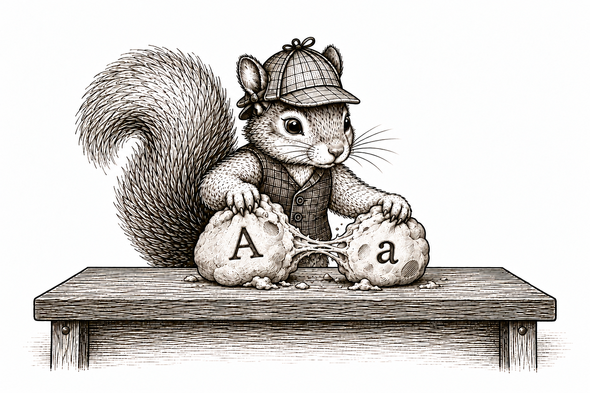{width=700 fig-align="center" fig-alt="The recurring squirrel in its checked cap and waistcoat pulls a large lump of clay into two smaller lumps labeled A and a. Vintage paperback-style ink illustration."}

## Introduction

Potential outcomes came from only a small modification of our original SCM. We renamed the variables, then supplied an intervention value wherever the intervened variable would have been used. The resulting list of assignments is therefore an SCM in its own right: it has variables, assignment functions, independent noise terms, and a topological order.

That means everything we learned about SCMs still applies. We can ask which variables are parents or ancestors of others. We can use the local and global Markov properties. We can trace paths along which dependence may be transmitted. These are now statements about potential outcomes and the other random variables generated alongside them.

Unfortunately, the potential-outcome SCM is every bit as cumbersome as the original SCM. We would rather not copy an entire list of assignments every time we want to study its random variables. So we will use a graph again.

There is one wee addition. Along with nodes for the random variables generated by the potential-outcome SCM, we include the fixed intervention value $a$. The value $a$ is not another random variable; it is the value we deliberately supply to the assignments. The resulting graph is called a [single-world intervention graph]{.glossary-term data-glossary="Single-world intervention graph (SWIG)"}, or SWIG [@richardson2013swigs].

The name is quite literal. It is single-world because we choose one intervention value $a$ and study the one collection of variables generated under that intervention. It is an intervention graph because the fixed value $a$ appears in the graph. A SWIG is simply the graph of the potential-outcome SCM under one chosen intervention.

## Building a SWIG from the potential-outcome SCM

Return to the WHI trial. In the preceding section, intervening on treatment produced the potential-outcome SCM

$$
\begin{aligned}
X(a)&\leftarrow f_X(\epsilon_X),\\
A(a)&\leftarrow f_A(\epsilon_A),\\
Y(a)&\leftarrow f_Y\{X(a),a,\epsilon_Y\}.
\end{aligned}
$$

We build its graph just as we built any other causal graph. Put down one node for each random variable: $X(a)$, $A(a)$, and $Y(a)$. We also put down a separate circle for the fixed intervention value $a$. We place $A(a)$ and $a$ next to one another, leaving a small gap between them.

Now read the assignments. The assignment for $Y(a)$ uses $X(a)$, so draw $X(a)\to Y(a)$. It also uses the fixed value $a$, so draw $a\to Y(a)$. Nothing uses $A(a)$, so that random variable has no outgoing arrows.

{#fig-whi-swig-unsimplified width=620 fig-align="center"}

The fixed value and the random treatment play different roles. The fixed value $a$ is supplied to the outcome assignment. The random variable $A(a)$ records the treatment value that the original treatment procedure generates, even though later assignments do not use it.

Now consider the RHC study. Its potential-outcome SCM was

$$
\begin{aligned}
X(a)&\leftarrow f_X(\epsilon_X),\\
A(a)&\leftarrow f_A\{X(a),\epsilon_A\},\\
Y(a)&\leftarrow f_Y\{X(a),a,\epsilon_Y\}.
\end{aligned}
$$

The assignment for $A(a)$ uses $X(a)$, so we draw $X(a)\to A(a)$. The outcome assignment uses $X(a)$ and $a$, giving $X(a)\to Y(a)$ and $a\to Y(a)$.

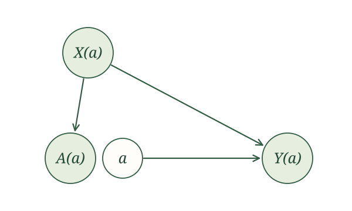{#fig-rhc-swig-unsimplified width=620 fig-align="center"}

The difference from WHI remains visible. Randomization made $A(a)$ parentless in the WHI trial. In the RHC study, the original treatment procedure used blood pressure, so $A(a)$ retains $X(a)$ as a parent.

Try this once yourself. Suppose $A$ is a randomized offer of treatment, $X$ describes baseline health, $M$ indicates whether treatment is received, and $Y$ is a later health outcome. Under an intervention on the offer, the potential-outcome SCM is

$$
\begin{aligned}
X(a)&\leftarrow f_X(\epsilon_X),\\
A(a)&\leftarrow f_A(\epsilon_A),\\
M(a)&\leftarrow f_M\{a,X(a),\epsilon_M\},\\
Y(a)&\leftarrow f_Y\{X(a),M(a),\epsilon_Y\}.
\end{aligned}
$$

Draw the SWIG represented by this potential-outcome SCM. Explain each arrow using the assignments.

The assignment for $M(a)$ uses $a$ and $X(a)$, so we draw $a\to M(a)$ and $X(a)\to M(a)$. The assignment for $Y(a)$ uses $X(a)$ and $M(a)$, so we draw $X(a)\to Y(a)$ and $M(a)\to Y(a)$. Nothing uses $A(a)$, so it is isolated.

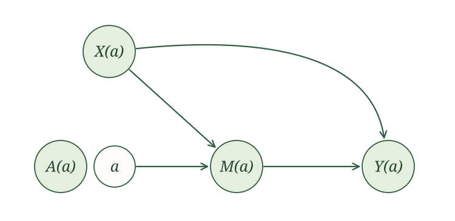{width=700 fig-align="center"}

## Building a SWIG directly from the causal graph

Do we really have to write the entire potential-outcome SCM before drawing its graph? Not once we recognize what the intervention did.

The random variable $A(a)$ kept the assignment that originally generated $A$. It therefore inherited every original parent of $A$. The fixed value $a$ replaced $A(a)$ wherever later assignments would have used it. It therefore inherited every original outgoing arrow from $A$.

Graphically, the original treatment node splits in two. The random part retains the original incoming arrows. The fixed part inherits the original outgoing arrows. We draw these as two separate circles placed next to one another.

::: {.definition-box}
Constructing a SWIG from a causal graph. To construct the SWIG under intervention value $a$:

1. Rename every random node $V$ as $V(a)$.
2. Split the intervened node $A(a)$ into a random part $A(a)$ and a fixed part $a$, drawn as separate circles next to one another.
3. Keep the original incoming arrows attached to $A(a)$.
4. Move the original outgoing arrows to $a$.
:::

For WHI, no arrows originally pointed into $A$, while $A\to Y$. Splitting $A$ therefore leaves the random part $A(a)$ isolated, while the fixed part $a$ points to $Y(a)$. This recovers @fig-whi-swig-unsimplified.

For RHC, the original arrows were $X\to A$, $X\to Y$, and $A\to Y$. The random part $A(a)$ keeps $X(a)\to A(a)$. The fixed part $a$ inherits $a\to Y(a)$. The arrow $X(a)\to Y(a)$ is unchanged. This recovers @fig-rhc-swig-unsimplified.

Consider the emergency-department example. Let $A$ be time in the ED, $H$ indicate admission, and $Y$ indicate death within 30 days. Its causal graph is

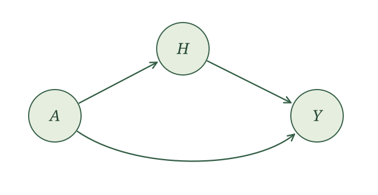{#fig-ed-causal-graph width=700 fig-align="center"}

Split the treatment node. No arrows pointed into $A$, so $A(a)$ has no parents. The fixed part $a$ inherits the arrows to $H(a)$ and $Y(a)$. The remaining arrow becomes $H(a)\to Y(a)$.

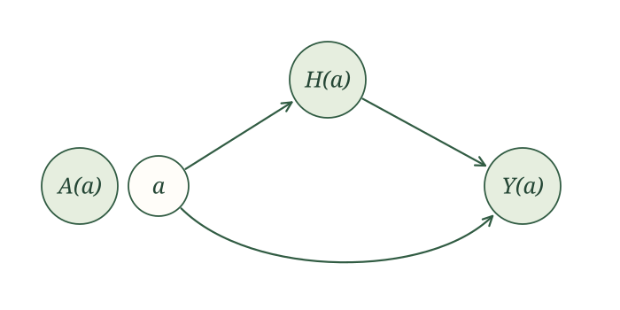{#fig-ed-swig width=700 fig-align="center"}

Now try the shortcut with a graph you have seen before. Let $X$ be baseline characteristics, $A$ a randomized appointment reminder, $M$ attendance, and $Y$ whether blood pressure is measured. Its causal graph is

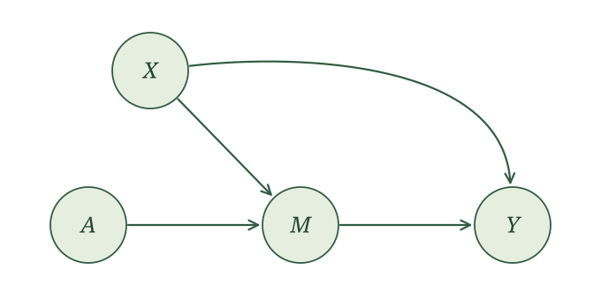{#fig-reminder-causal-graph width=700 fig-align="center"}

Construct the SWIG under an intervention that supplies reminder value $a$.

Rename the nodes, then split $A(a)$. Because the original reminder was randomized, no arrows point into the random part $A(a)$. The fixed part $a$ inherits the arrow to $M(a)$. The other arrows retain their endpoints.

{#fig-reminder-unsimplified width=700 fig-align="center"}

## Seeing causal irrelevance in a SWIG

In the preceding section, we established causal irrelevance by comparing assignments one variable at a time. A SWIG lets us see the same result immediately.

Choose a random variable $V(a)$ in the SWIG and ask whether it is a descendant of the fixed node $a$. If $V(a)$ is not a descendant of $a$, the intervention cannot reach that variable. Causal irrelevance gives $V(a)=V$, and we may drop $a$ from its label. If it is a descendant, we keep $a$ in the label.

::: {.definition-box}
Causal irrelevance in a SWIG. If $V(a)$ is not a descendant of the fixed node $a$ in the SWIG, then

$$
V(a)=V.
$$

:::

Return to the ED SWIG in @fig-ed-swig. The random variable $A(a)$ is not a descendant of the fixed value $a$, so $A(a)=A$. Both $H(a)$ and $Y(a)$ are descendants of $a$, so those labels remain. After applying causal irrelevance, the SWIG contains $A$, $a$, $H(a)$, and $Y(a)$.

{width=700 fig-align="center"}

Apply causal irrelevance to every random variable in the appointment-reminder SWIG in @fig-reminder-unsimplified.

Neither $X(a)$ nor $A(a)$ is a descendant of the fixed value $a$, so

$$
X(a)=X,\qquad A(a)=A.
$$

Both $M(a)$ and, through $M(a)$, $Y(a)$ are descendants of $a$. We retain $a$ in those labels.

{width=700 fig-align="center"}

## Reading conditional independence from a SWIG

Once we apply causal irrelevance, a SWIG is still the graph of an SCM. We can therefore use the global Markov property exactly as we did before.

Start with the WHI trial. Causal irrelevance gives $X(a)=X$ and $A(a)=A$. The random treatment $A$ is isolated from $Y(a)$ in the SWIG. Therefore,

$$
A\mathrel{\perp\!\!\!\perp}Y(a).
$$

This is the exchangeability property we first met in the clinical-trial section. Randomization means that learning a woman's assigned treatment gives us no information about her potential outcome under intervention value $a$.

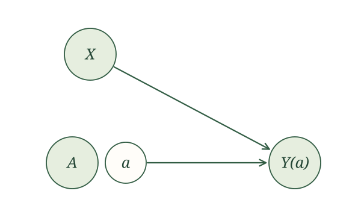{width=620 fig-align="center"}

The RHC study is different. After applying causal irrelevance, its SWIG contains the path

$$
A\leftarrow X\to Y(a).
$$

This fork is open without conditioning, so $A$ and $Y(a)$ may be dependent. Conditioning on $X$ blocks the path. The local Markov property gives

$$
A\mathrel{\perp\!\!\!\perp}Y(a)\mid X.
$$

{width=620 fig-align="center"}

This relationship is called conditional exchangeability. Treatment is not necessarily exchangeable across the entire population, but it is exchangeable within levels of $X$.

The appointment-reminder example returns us to marginal exchangeability. The original reminder was randomized, and its random part $A$ is isolated in the simplified SWIG. In particular,

$$
A\mathrel{\perp\!\!\!\perp}Y(a).
$$

The SWIG shows that exchangeability follows from the causal model. We do not need to assume it separately.

## Multiple interventions

A SWIG remains easy to construct when we intervene on several variables. Instead of splitting one node, split every intervened node. Each random part retains its original incoming arrows, and each fixed part inherits its original outgoing arrows. We then use ancestry to simplify the potential-outcome labels.

### Repeated interventions over time

Return to the asthma example. A clinician chooses an initial treatment $A_1$, observes breathing $Y_1$, chooses a second treatment $A_2$, and then observes $Y_2$. To study intervention values $(a_1,a_2)$, split both treatment nodes.

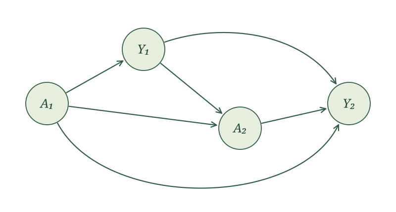{width=700 fig-align="center" fig-alt="The original causal graph for asthma treatment at two time points."}

First construct the SWIG without simplifying any labels. Rename every variable using both intervention values, then split $A_1(a_1,a_2)$ and $A_2(a_1,a_2)$. Each random part retains its incoming arrows, while the corresponding fixed part inherits its outgoing arrows.

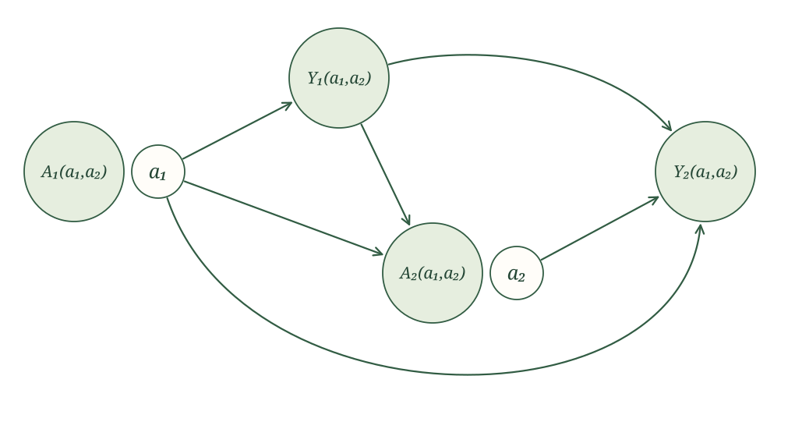{width=800 fig-align="center"}

Now apply causal irrelevance by checking whether each random node is a descendant of each fixed value:

- $A_1(a_1,a_2)=A_1$ because it is a descendant of neither fixed value;
- $Y_1(a_1,a_2)=Y_1(a_1)$ because it is a descendant of $a_1$ but not $a_2$;
- $A_2(a_1,a_2)=A_2(a_1)$ for the same reason;
- $Y_2(a_1,a_2)$ retains both values because it is a descendant of both.

The simplified SWIG is therefore

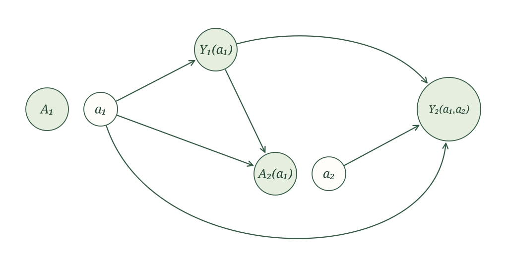{width=760 fig-align="center"}

This graph makes treatment history visible. The second treatment decision $A_2(a_1)$ can change under the first intervention because it is made after observing the response $Y_1(a_1)$. It does not depend on $a_2$: the value $a_2$ is supplied only where the second treatment would later have been used.

### Interventions on connected people

Return to the couple-vaccination example.

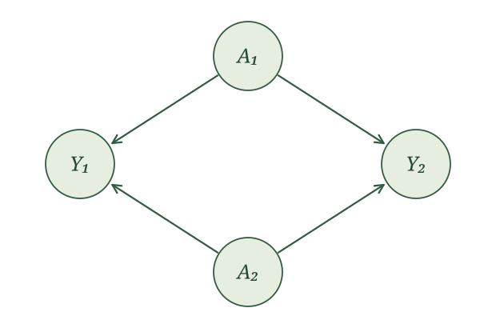{width=620 fig-align="center" fig-alt="The original causal graph for vaccinating both members of a couple."}

First rename every variable using $(a_1,a_2)$ and split both vaccination nodes.

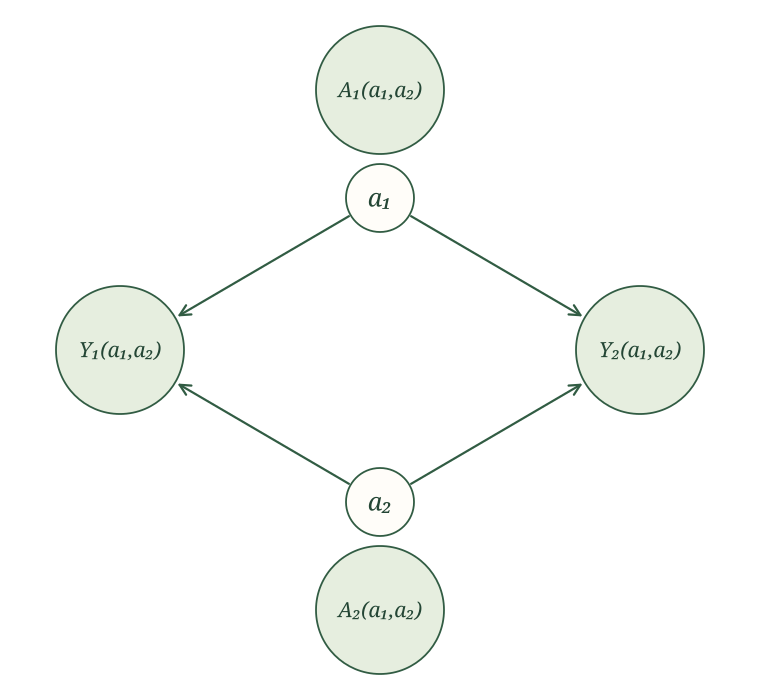{width=760 fig-align="center"}

Neither random vaccination node is a descendant of either fixed value, so

$$
A_1(a_1,a_2)=A_1,
\qquad
A_2(a_1,a_2)=A_2.
$$

Both influenza outcomes are descendants of both fixed values, so those labels remain unchanged. The simplified SWIG is

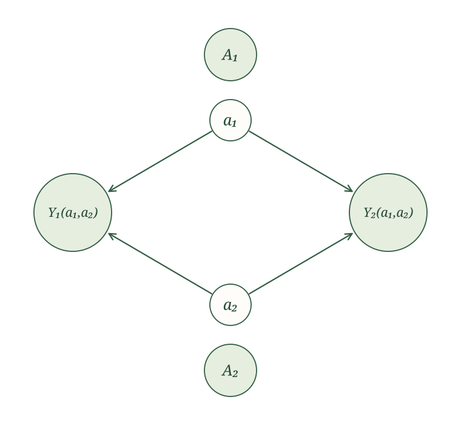{width=720 fig-align="center"}

The graph shows interference directly: $a_2$ is an ancestor of $Y_1(a_1,a_2)$, and $a_1$ is an ancestor of $Y_2(a_1,a_2)$. One person's intervention can therefore change the other person's potential outcome.

### Intervening on treatment and a mediator

Finally, return to the mediation example with baseline health $X$, treatment $A$, mediator $M$, and outcome $Y$. Intervening on both $A$ and $M$ means splitting both nodes.

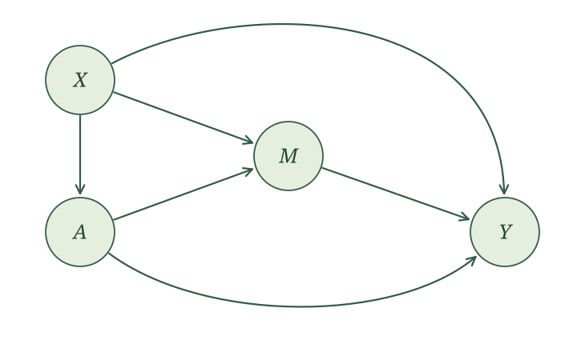{width=620 fig-align="center" fig-alt="The original mediation causal graph."}

First rename every variable using $(a,m)$ and split both $A(a,m)$ and $M(a,m)$.

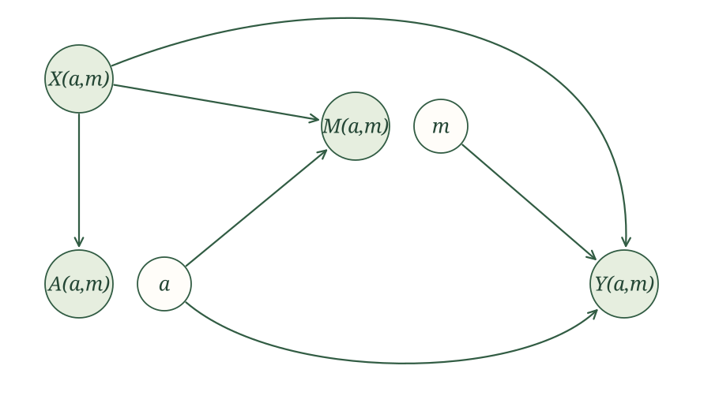{width=800 fig-align="center"}

Now check whether each random node is a descendant of each fixed value. Neither $X(a,m)$ nor $A(a,m)$ is a descendant of either fixed value. The variable $M(a,m)$ is a descendant of $a$, but not $m$. The outcome $Y(a,m)$ is a descendant of both. Causal irrelevance therefore gives

$$
X(a,m)=X,\qquad A(a,m)=A,\qquad M(a,m)=M(a).
$$

The simplified SWIG is

{width=760 fig-align="center"}

The label $M(a,m)$ loses $m$ because it is not a descendant of the fixed mediator value. The final outcome remains $Y(a,m)$ because it is a descendant of both fixed values. Splitting the mediator makes the intervention especially clear. The randomly generated $M(a)$ retains the inputs that originally generated $M$, while the fixed value $m$ inherits the original arrow from $M$ to $Y$.

## The tools we use for identification

We began with a scientific question about cause and effect. Our SCM made our assumptions about how the world generates data precise. Following those assignments, we defined potential outcomes and used them to state exactly which causal quantity we want to learn.

But our data contain the original variables, not every potential outcome appearing in our causal question. The identification problem is to rewrite that causal quantity in terms of the observed-data distribution, using the assumptions in our SCM.

We now have three rules for doing this:

1. **Causal irrelevance** removes intervention values that cannot affect a variable.
2. **The global Markov property** turns d-separation in a SWIG into independence or conditional independence among its random variables.
3. **Consistency** lets us replace a potential outcome with its original counterpart whenever the original treatment agrees with the intervention value.

These are the rules we use to turn the crank, following our causal assumptions to their logical consequences. Our graphs make those consequences easier to see.

These three rules are all we use to follow the implications of our SCM. There is no additional mathematical trick waiting to save the day. Sometimes our SCM and observed data simply do not provide enough information to answer our causal question. And when that happens, we will turn to something more: additional measurements, a different study design, or additional causal assumptions. We might also reconsider the causal question.

The technical note below explains the formal sense in which there is no additional mathematical rule waiting to save the day.

::: {.callout-note title="Optional technical note: the potential-outcome calculus" collapse="true"}

Causal irrelevance, the global Markov property, and consistency form the basis of the potential-outcome calculus, or po-calculus. For important types of causal effects, this calculus is complete. This means that whenever the observed-data distribution identifies one of these effects under the causal model, repeated application of the rules can produce an expression for it using observed variables.

For effects defined by ordinary interventions, po-calculus is equivalent to Pearl's do-calculus and inherits its completeness. Malinsky, Shpitser, and Richardson extend these ideas to give a complete identification algorithm for conditional path-specific effects [@malinsky2019pocalculus].

:::
