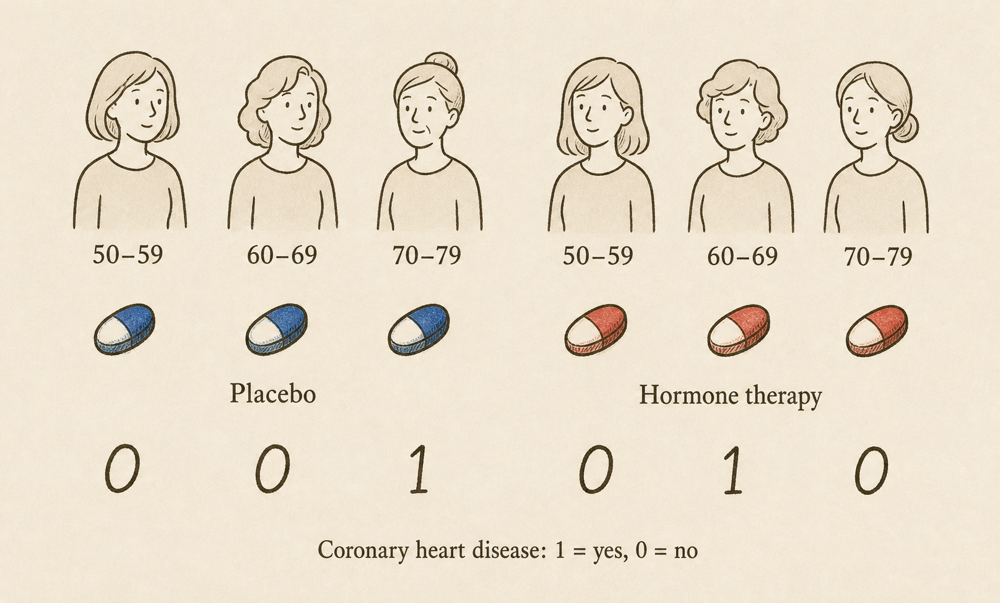

For our first real foray into causal inference, we will use clinical trials as our exemplar. Clinical trials show us how causal inference is possible with randomization. They also introduce a roadmap that we will follow throughout this textbook: **construction, identification, and estimation**.

## An exemplar

::: {.example-intro}
Case study: Women's Health Initiative

The Women's Health Initiative (WHI) included a landmark clinical trial of menopausal hormone therapy. At the time, hormone therapy was widely used to treat menopausal symptoms. Many clinicians also believed that it might prevent coronary heart disease. Most of that evidence came from observational studies.

The trial enrolled 16,608 postmenopausal women ages 50 to 79 with an intact uterus at 40 clinical centers in the United States. Women were randomly assigned to take either a daily tablet containing estrogen plus progestin or a matching placebo. The primary outcome was coronary heart disease, defined as a nonfatal heart attack or death from coronary heart disease [@whi2002].

The WHI hormone-therapy trial is a two-arm randomized controlled trial (RCT). To describe the trial, we need to specify who was studied, what treatment was assigned, what it was compared with, and what outcome was measured.
:::

Specify, as precisely as possible, who was studied, the treatment, the comparator, and the outcome.

- **Who was studied:** 16,608 postmenopausal women ages 50 to 79 with an intact uterus who were recruited at 40 clinical centers in the United States.
- **Treatment:** Assignment to a daily tablet containing 0.625 mg of conjugated equine estrogen plus 2.5 mg of medroxyprogesterone acetate.
- **Comparator:** Assignment to a matching placebo tablet.
- **Outcome:** Coronary heart disease, defined as a nonfatal heart attack or death from coronary heart disease.

*Note.* The treatment in this trial is *assignment* to hormone therapy, not whether a participant took every assigned tablet. This is an important distinction that we revisit later.

{fig-align="center" width="80%"}

We use three variables to describe a patient in the study:

- $X$ is their age: $X=0$ if 50-59 years of age, $X=1$ if 60-69, and $X=2$ if $70-79$.
- $A$ is their treatment assignment: $A=1$ if estrogen plus progestin and $A=0$ if placebo
- $Y$ is their outcome after treatment assignment: $Y=1$ if a coronary heart disease event occurs and $Y=0$ if not.

We treat $X$, $A$, and $Y$ as random variables with a probability model. We also assume that the observations from different participants are independent and that every participant's observations come from the same probability model.

Using the figure, write the observed data as a table with one row for each participant and columns for $X$, $A$, and $Y$.

For this exercise, let $X$ be the participant's age group. Reading from left to right in the figure gives us:

<table class="compact-data-table">
<caption>Observed data represented in the figure.</caption>
<thead>
<tr><th scope="col">Participant</th><th scope="col">$X$</th><th scope="col">$A$</th><th scope="col">$Y$</th></tr>
</thead>
<tbody>
<tr><th scope="row">1</th><td>0</td><td>0</td><td>0</td></tr>
<tr><th scope="row">2</th><td>1</td><td>0</td><td>0</td></tr>
<tr><th scope="row">3</th><td>2</td><td>0</td><td>1</td></tr>
<tr><th scope="row">4</th><td>0</td><td>1</td><td>0</td></tr>
<tr><th scope="row">5</th><td>1</td><td>1</td><td>1</td></tr>
<tr><th scope="row">6</th><td>2</td><td>1</td><td>0</td></tr>
</tbody>
</table>

Calculate the average outcome in each treatment group. What is the difference between the two averages?

Among participants assigned to estrogen plus progestin, the average outcome is

$$
\frac{0+1+0}{3}=\frac{1}{3}.
$$

Among participants assigned to placebo, the average outcome is

$$
\frac{0+0+1}{3}=\frac{1}{3}.
$$

The difference, comparing estrogen plus progestin with placebo, is

$$
\frac{1}{3}-\frac{1}{3}=0.
$$

Because $Y$ is either 0 or 1, the average of $Y$ is also the proportion of participants who experienced a coronary heart disease event. In this small dataset, that proportion is the same in both groups.

The average outcome in the estrogen-plus-progestin group estimates $E[Y\mid A=1]$. This notation tells us to restrict attention to people assigned estrogen plus progestin, and then take the mean of their outcomes. Similarly, the average outcome in the placebo group estimates $E[Y\mid A=0]$. Because $Y$ is either 0 or 1, each of these means is also the probability of a coronary heart disease event in that treatment group.

For both treatment-group means to be defined, each treatment must have a positive probability of being assigned. If everyone received hormone therapy, there would be no placebo group, so $E[Y\mid A=0]$ would not be defined. The same problem would arise for $E[Y\mid A=1]$ if everyone received placebo. This property is called [positivity]{.glossary-term data-bs-toggle="tooltip" data-bs-title="Each treatment under study has a positive probability of being assigned." tabindex="0"}. In the WHI trial, randomization gave each participant a positive probability of assignment to hormone therapy and to placebo.

The difference between the two group averages estimates the [risk difference]{.glossary-term data-bs-toggle="tooltip" data-bs-title="The risk of an outcome under one exposure or treatment minus the risk under another." tabindex="0"}:

$$
E[Y\mid A=1]-E[Y\mid A=0].
$$

Our strategy is not so bad. Because participants provide independent observations from the same probability model, the sample average in each treatment group is [unbiased]{.glossary-term data-bs-toggle="tooltip" data-bs-title="Under a probability model, an estimator is unbiased if its expected value equals the quantity it is intended to estimate." tabindex="0"} for the corresponding treatment-group mean.

This is statistical inference. We are using the observed data to learn about quantities in a probability model. We have not yet stated the causal quantity we want to learn. For that, we need a causal model.

## Construction

For the WHI study, we want to know: Would assigning estrogen plus progestin rather than placebo change the probability of a coronary heart disease event? Before we can answer this question, we need to make it precise. We do this by constructing a causal model and defining the question in terms of that model. We call this step construction.

For now, we think of a causal model as a story about how the data were generated. In the WHI trial, each participant first enters the study with baseline characteristics, such as age, which we represent by $X$. They are then randomly assigned to treatment. The randomization procedure does not use their preferences, characteristics, or prognosis to determine treatment assignment $A$. Later, after treatment is assigned, the outcome $Y$ occurs. Treatment may influence the outcome, and baseline characteristics may influence it too. This ordered story is our first informal causal model.

### A Thought Experiment

Now that we have a story for how the data came about, we can stop in the middle of that story and change something. When we reach treatment assignment, we can set aside the assignment made by randomization and choose what treatment the person receives. We then let the rest of the story play out and ask what the outcome would be.

This thought experiment can feel abstract, perhaps more like science fiction than science. Imagine a multiverse with two parallel universes containing the same woman. In one universe, we give her hormone therapy ($a=1$), shown as the red pill. In the other, we give her placebo ($a=0$), shown as the blue pill. Only one universe is observed in the real world, but the thought experiment asks us to consider both and ask what her outcome would be in each one.

{width="82%" fig-align="center"}

These two imagined outcomes cannot both be represented by the outcome $Y$ that we observe in the real world. We introduce new random variables to describe them. We write $Y(1)$ for the outcome under assignment to estrogen plus progestin and $Y(0)$ for the outcome under assignment to placebo. These random variables are called **potential outcomes**.

Potential outcomes under treatment assignments that were not actually realized are also called *counterfactuals*, meaning “counter to the fact.”

### Well-Definedness

In mathematics, a definition is [well-defined]{.glossary-term data-bs-toggle="tooltip" data-bs-title="A definition is well-defined when each possible input determines one unambiguous object." tabindex="0"} when each possible input determines one unambiguous object. Here, the treatment value $a$ must describe a sufficiently precise change to our causal story that the potential outcome $Y(a)$ has one clear meaning.

::: {.example-intro}
Example: The same nationality

Suppose we ask: If Nadal and Federer were the same nationality, would Federer be from Spain? The proposed change is not well-defined. One version makes both players Spanish. Another makes both players Swiss. Saying only that they have the same nationality does not tell us which change to make.

This example is from Willard Van Orman Quine's *Methods of Logic*, with Nadal and Federer replacing the composers Bizet and Verdi.
:::

Clinical trials try to make their treatments well-defined through precise protocols. The WHI protocol did not simply say “give hormone therapy.” It specified a daily tablet containing 0.625 mg of conjugated equine estrogen plus 2.5 mg of medroxyprogesterone acetate, compared with a matching placebo. Using the same protocol across clinical centers helps ensure that assignment to hormone therapy represents the same intervention everywhere.

Well-definedness can fail when one treatment label hides versions that could lead to different outcomes. For example, “hormone therapy” could refer to different drugs, doses, schedules, or durations. Unless we specify the intervention more precisely, the meaning of $Y(1)$ may be ambiguous.

Well-definedness can also fail when one person's outcome depends on another person's treatment. Suppose two friends participate in the same trial. What one friend receives might change the other's behavior and, in turn, their outcome. In that case, specifying only one person's treatment does not fully specify the scenario needed to determine their potential outcome. This is called **interference**.

Optional technical note: SUTVA

The **stable unit treatment value assumption** (SUTVA) is a traditional name for technical conditions on potential outcomes [@rubin1980]:

- **No hidden versions of treatment.** Each treatment represents one relevant intervention. If several versions exist, they must produce the same potential outcome. The latter condition is sometimes called **treatment-variation irrelevance**.
- **No interference.** One person's potential outcome does not depend on the treatments assigned to other people.
- **Consistency.** Some presentations also include consistency under SUTVA: the observed outcome agrees with the potential outcome under the treatment received.

For us, consistency is a consequence of well-definedness rather than a separate assumption.

### The Fundamental Problem

Well-defined potential outcomes connect our thought experiment to the observed data. If $A=1$, then the observed outcome $Y$ is $Y(1)$. If $A=0$, then the observed outcome $Y$ is $Y(0)$. This connection is called **consistency**.

As a result, we observe only one potential outcome for each person. If a person receives treatment 1, we observe $Y(1)$ but not $Y(0)$. If a person receives treatment 0, we observe $Y(0)$ but not $Y(1)$.

Ideally, we want to know the individual treatment effect:

$$
Y(1)-Y(0).
$$

Calculating this effect requires both potential outcomes, but the other potential outcome is missing. This is called the [fundamental problem of causal inference]{.glossary-term data-bs-toggle="tooltip" data-bs-title="For each person, we observe the potential outcome under the treatment received but not the potential outcome under the other treatment." tabindex="0"}.

Return to the six participants shown above. Complete the table as much as possible. Use the observed treatment and outcome to fill in the potential outcome that we observe. Enter a question mark for the potential outcome that we cannot determine.

<table class="compact-data-table potential-outcomes-table">
<caption>Observed data and blank potential outcomes for six participants.</caption>
<thead>
<tr><th scope="col">$X$</th><th scope="col">$A$</th><th scope="col">$Y$</th><th scope="col">$Y(0)$</th><th scope="col">$Y(1)$</th></tr>
</thead>
<tbody>
<tr><td>0</td><td>0</td><td>0</td><td>_____</td><td>_____</td></tr>
<tr><td>1</td><td>0</td><td>0</td><td>_____</td><td>_____</td></tr>
<tr><td>2</td><td>0</td><td>1</td><td>_____</td><td>_____</td></tr>
<tr><td>0</td><td>1</td><td>0</td><td>_____</td><td>_____</td></tr>
<tr><td>1</td><td>1</td><td>1</td><td>_____</td><td>_____</td></tr>
<tr><td>2</td><td>1</td><td>0</td><td>_____</td><td>_____</td></tr>
</tbody>
</table>

Show the completed table.

<table class="compact-data-table potential-outcomes-table">
<caption>Potential outcomes that can be determined from the observed data.</caption>
<thead>
<tr><th scope="col">$X$</th><th scope="col">$A$</th><th scope="col">$Y$</th><th scope="col">$Y(0)$</th><th scope="col">$Y(1)$</th></tr>
</thead>
<tbody>
<tr><td>0</td><td>0</td><td>0</td><td>0</td><td>?</td></tr>
<tr><td>1</td><td>0</td><td>0</td><td>0</td><td>?</td></tr>
<tr><td>2</td><td>0</td><td>1</td><td>1</td><td>?</td></tr>
<tr><td>0</td><td>1</td><td>0</td><td>?</td><td>0</td></tr>
<tr><td>1</td><td>1</td><td>1</td><td>?</td><td>1</td></tr>
<tr><td>2</td><td>1</td><td>0</td><td>?</td><td>0</td></tr>
</tbody>
</table>

When $A=0$, the observed outcome gives us $Y(0)$. When $A=1$, the observed outcome gives us $Y(1)$. The other potential outcome is unknown for every participant.

### Effects on Average

We cannot observe the effect of hormone therapy for any one woman, but we can ask about its effect across the population represented by the WHI trial. Imagine that every woman in this population receives hormone therapy. The quantity $E[Y(1)]$ is the average of their potential outcomes. Because the outcome is either 0 or 1, this average is also the probability of a coronary heart disease event if everyone receives hormone therapy.

Now imagine that every woman receives placebo. The quantity $E[Y(0)]$ is the probability of a coronary heart disease event in this second scenario.

Our causal question can now be stated precisely: Is

$$
E[Y(1)]-E[Y(0)]
$$

positive, negative, or zero?

This difference is the [average treatment effect (ATE)]{.glossary-term data-bs-toggle="tooltip" data-bs-title="The difference between the average potential outcome under one treatment and the average potential outcome under another treatment." tabindex="0"}. For the WHI study, the ATE is the difference between the probability of coronary heart disease if everyone receives hormone therapy and the probability if everyone receives placebo. A positive value would mean that hormone therapy increases risk, a negative value would mean that it decreases risk, and a value of zero would mean that the risks are the same.

A [causal estimand]{.glossary-term data-bs-toggle="tooltip" data-bs-title="A probabilistic quantity involving potential outcomes that we want to estimate." tabindex="0"} is a probabilistic quantity involving potential outcomes that we want to estimate. The ATE is our causal estimand for the WHI study.

We have now completed construction. We described how the data came about, used that story to define the potential outcomes, and stated the causal question as a comparison between them. The remaining problem is that the potential outcomes are partly missing.

## Identification

Construction told us what we want to learn. **Identification** asks whether the observed data can tell us that answer. This is where randomization returns to our story.

### What Randomization Gives Us

Recall how treatment assignment arose in the WHI trial. Participants entered the trial with baseline characteristics, and then the randomization procedure assigned hormone therapy or placebo. Their preferences, characteristics, and prognosis were not used to decide which treatment they received.

Randomization therefore makes the treatment groups comparable before treatment, apart from differences that arise by chance. In terms of potential outcomes, knowing a person's treatment assignment does not tell us anything about what her outcomes would be under hormone therapy or placebo. This property is called **exchangeability**.

We write exchangeability as

$$
Y(a) \perp\!\!\!\perp A
$$

for each treatment $a$. The notation says that the potential outcome under treatment $a$ is independent of the treatment that was actually assigned.

In an observational study, this property may fail because health, preferences, or prognosis can influence the treatment a person receives. Randomization removes those factors from the treatment-assignment decision. In the WHI trial, the women assigned hormone therapy were not selected because they were more or less likely to experience coronary heart disease under either treatment.

### Properties of the WHI Trial

Three properties of the WHI trial connect our thought experiment to the observed data:

- **Well-definedness.** The trial protocol specified the hormone therapy and placebo precisely enough to define the two potential outcomes.
- **Positivity.** Each participant had a positive probability of assignment to hormone therapy and to placebo, so both observed treatment-group means are defined.
- **Exchangeability.** Randomization made treatment assignment independent of the potential outcomes.

Consistency follows from well-definedness. For a woman assigned hormone therapy, her observed outcome is $Y(1)$. For a woman assigned placebo, her observed outcome is $Y(0)$.

For hormone therapy, these ideas give us

$$
E[Y(1)]=E[Y\mid A=1].
$$

The left side is the average outcome in the universe where everyone receives hormone therapy. Exchangeability tells us that this average is the same among women who were assigned hormone therapy. Consistency tells us that, for these women, $Y(1)$ is the observed outcome $Y$. The right side is therefore the observed average outcome in the WHI hormone-therapy group.

The same reasoning gives us

$$
E[Y(0)]=E[Y\mid A=0].
$$

We can therefore rewrite our causal question using the observed treatment groups:

$$
E[Y(1)]-E[Y(0)]
=E[Y\mid A=1]-E[Y\mid A=0].
$$

We say that a causal estimand is [identified]{.glossary-term data-bs-toggle="tooltip" data-bs-title="A causal estimand is identified when it can be written entirely in terms of observed variables and their probability model." tabindex="0"} when it can be written entirely in terms of observed variables and their probability model. Here, we have identified the average treatment effect by expressing the comparison between our two imagined universes as a comparison between the observed WHI treatment groups.

{width="75%" fig-align="center"}

::: {.key-takeaway}
The critical step

**Randomization lets us replace the average outcomes in the two imagined universes with the average outcomes in the two observed WHI treatment groups.**
:::

Optional technical note: Proving the identification result

Fix one treatment value $a$, either hormone therapy ($a=1$) or placebo ($a=0$).

1. **Well-definedness** ensures that the potential outcome $Y(a)$ has one unambiguous meaning.
2. **Positivity** ensures that $P(A=a)>0$, so the mean among people assigned treatment $a$ is defined.
3. **Exchangeability** says that treatment assignment does not provide information about $Y(a)$. Therefore,

   $$
   E[Y(a)]=E[Y(a)\mid A=a].
   $$

4. **Consistency** says that, among people assigned treatment $a$, the potential outcome $Y(a)$ is the observed outcome $Y$. Therefore,

   $$
   E[Y(a)\mid A=a]=E[Y\mid A=a].
   $$

Combining the last two equalities gives

$$
E[Y(a)]=E[Y\mid A=a].
$$

Applying this result once with $a=1$ and once with $a=0$, and then subtracting, gives

$$
E[Y(1)]-E[Y(0)]
=E[Y\mid A=1]-E[Y\mid A=0].
$$

## Estimation

Identification told us which comparison in the observed data answers our causal question. **Estimation** uses the data to calculate that comparison.

Return to our six-person illustration and the treatment-group averages calculated earlier.

Estimate the average treatment effect and interpret your estimate.

The estimated risk under hormone therapy is $1/3$, and the estimated risk under placebo is also $1/3$. Therefore, the estimated average treatment effect is

$$
\frac{1}{3}-\frac{1}{3}=0.
$$

In this six-person dataset, the estimated probability of a coronary heart disease event is the same under hormone therapy and placebo. The estimated average treatment effect is therefore zero percentage points.

Before identification, this calculation was simply a difference between the observed treatment groups. After identification, we have a reason to interpret it as an estimate of the average causal effect.

Of course, six participants provide very little information. A different group of six participants could give us a different estimate. In a real trial, estimation also includes describing how much uncertainty remains because we observed only a sample of participants.

We chose a risk difference because it directly matches our causal question. Other questions might lead us to compare the groups with a relative risk, odds ratio, or another measure.

## The Causal Inference Roadmap

The randomized trial gives us a complete example of causal inference:

- **Construction:** We tell a causal story, imagine changing the treatment-assignment step, and state the causal question using potential outcomes.
- **Identification:** We use well-definedness, positivity, and exchangeability to connect that question to a comparison between the observed treatment groups.
- **Estimation:** We use the observed outcomes to calculate that comparison and describe our uncertainty.

We will return to this framework throughout the textbook. The methods will change, especially when treatment is not randomized, but the questions remain the same: What causal effect do we want? Under what assumptions can the observed data tell us about it? How do we estimate it?
