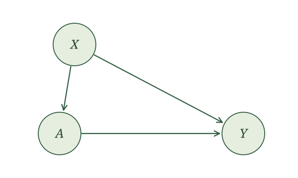
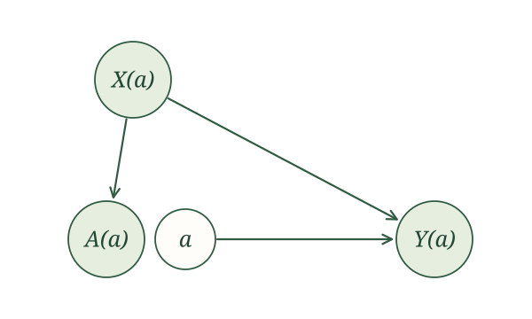

## Introduction

We now have the tools to answer our first identification question. Imagine we have an exposure $A$, an outcome $Y$, and a collection of common causes of $A$ and $Y$. And that's it. We collect those common causes in $X$. When all of them are measured, we call this [measured confounding]{.glossary-term}.  It is the default setup for observational research. Most analyses you will read, and most you will run, assume it, whether or not they say so out loud.

The RHC study fits this setup. Our exposure is receipt of RHC, and our outcome is death within 30 days. Age, sex, diagnosis, blood pressure, heart rate, creatinine, and white blood cell count could all influence both the treatment decision and the patient's outcome, so we collect the relevant pretreatment information into $X$. 

Our causal assumptions are represented by the SCM

$$
\begin{aligned}
X&\leftarrow f_X(\epsilon_X),\\
A&\leftarrow f_A(X,\epsilon_A),\\
Y&\leftarrow f_Y(X,A,\epsilon_Y),
\end{aligned}
$$

with independent noise terms. As a reminder of what this commits us to: the variability in $A$ and $Y$ that $X$ does not explain is independent, so there is no missing variable driving both exposure and outcome. And $X$ is generated before $A$ and $Y$, not after. Collecting lots of variables to put in $X$ does not, by itself, guarantee either of these two things holds.

The corresponding causal graph is

{width=620 fig-align="center" fig-alt="The measured-confounding causal graph. X points to A and Y, and A points to Y."}

For an intervention on $A$ with value $a$, the potential-outcome assignments are

$$
\begin{aligned}
X(a)&\leftarrow f_X(\epsilon_X),\\
A(a)&\leftarrow f_A(X(a),\epsilon_A),\\
Y(a)&\leftarrow f_Y(X(a),a,\epsilon_Y).
\end{aligned}
$$

Their SWIG is

{width=620 fig-align="center" fig-alt="The unsimplified measured-confounding SWIG. X(a) points to A(a) and Y(a). Fixed a points to Y(a). The random A(a) and fixed a are separate nearby circles."}

For binary treatment $A$, a common causal quantity is the average treatment effect:

$$
\operatorname{ATE}=E\left[Y(1)\right]-E\left[Y(0)\right].
$$

For RHC, it compares the risk of death if everyone received RHC with the risk if everyone did not. Because $Y$ is binary, $E\left[Y(a)\right]=P\{Y(a)=1\}$. We can also compare these risks using the causal relative risk,

$$
\frac{E\left[Y(1)\right]}{E\left[Y(0)\right]},
$$

or the causal odds ratio,

$$
\frac{E\left[Y(1)\right]/[1-E\left[Y(1)\right]]}
{E\left[Y(0)\right]/[1-E\left[Y(0)\right]]}.
$$

The ratios require their denominators to be nonzero, and the odds must be defined. All three comparisons can be constructed from the two means $E\left[Y(1)\right]$ and $E\left[Y(0)\right]$. So let us identify $E\left[Y(a)\right]$ for a general intervention value $a$.

## Identification

Our task is to rewrite $E\left[Y(a)\right]$ in terms of the observed-data distribution. We make good use of our three rules: causal irrelevance, the global Markov property, and consistency.

First, causal irrelevance. Neither $X(a)$ nor $A(a)$ is a descendant of the fixed intervention value $a$ in the SWIG. Therefore,

$$
X(a)=X,\qquad A(a)=A.
$$

After applying causal irrelevance, the assignments become

$$
\begin{aligned}
X&\leftarrow f_X(\epsilon_X),\\
A&\leftarrow f_A(X,\epsilon_A),\\
Y(a)&\leftarrow f_Y(X,a,\epsilon_Y).
\end{aligned}
$$

The simplified SWIG is

{width=620 fig-align="center" fig-alt="The simplified measured-confounding SWIG. X points to A and Y(a), and fixed a points to Y(a)."}

Second, global Markov property. The path $A\leftarrow X\to Y(a)$ is blocked when we condition on $X$. Hence,

$$
A\mathrel{\perp\!\!\!\perp}Y(a)\mid X.
$$

This relationship is called [conditional exchangeability]{.glossary-term}. Notice that we never had to assume it. It comes for free from the SCM.

This means $A$ got no extra information about $Y(a)$, beyond what is already known from $X$. In particular, $A$ does not change the conditional mean:

$$
E\left[Y(a)\mid X\right]=E\left[Y(a)\mid X,A\right].
$$

Third, consistency. It tells us that $Y(a)=Y$ whenever $A=a$. Our last expression has $Y(a)$ inside the expectation and $A$ in the conditioning information. We can pick $A$ to take any value we want and leave the conditional mean untouched. It behooves us to let $A$ take the value $a$:

$$
E\left[Y(a)\mid X\right]=E\left[Y(a)\mid X,A=a\right].
$$

Now consistency lets us make the swap. We are conditioning on $A=a$, which is exactly the event where $Y(a)=Y$. So, we swap out $Y(a)$ for $Y$:

$$
E\left[Y(a)\mid X,A=a\right]=E\left[Y\mid X,A=a\right].
$$

Combining the two steps gives

$$
E\left[Y(a)\mid X\right]=E\left[Y\mid X,A=a\right].
$$

The left side concerns a potential outcome. The right side uses only original variables, so it is a feature of the observed-data distribution. 

There is a small aside we need to make. We need $E\left[Y\mid X,A=a\right]$ to be defined. This relates to the positivity condition we saw for randomized trials, but now it is conditional on $X$. In practice, it means that for patients with similar values of $X$, there is a positive chance of getting a treatment close to $a$. It does not follow direcly from the SCM, so it is a condition we have to add.

But we have to remember what we were after. It was $E\left[Y(a)\right]$, not $E\left[Y(a)\mid X\right]$. Fortunately, we have a standard probability trick for getting from one to the other, the law of iterated expectations. Averaging over the distribution of $X$ gives us

$$
E\left[Y(a)\right]=E\big[E\left[Y(a)\mid X\right]\big].
$$

Substitute the expression we just obtained:

$$
E\left[Y(a)\right]=E\big[E\left[Y\mid X,A=a\right]\big].
$$

*Done.* The outer expectation averages over the distribution of $X$.

::: {.proposition-box}
**Identification under measured confounding.** Assume the SCM above. Then,

$$
E\left[Y(a)\right]=E\big[E\left[Y\mid X,A=a\right]\big],
$$
whenever the conditional expectations are defined.
:::

This expression is often referred to as the *g-formula* for this setting. 

The formula applies to any intervention value $a$ for which the relevant conditional means are defined. For a binary treatment, choosing $a=1$ and $a=0$ gives

$$
E\left[Y(1)\right]
=
E\left[E\left[Y\mid X,A=1\right]\right],
$$

and

$$
E\left[Y(0)\right]
=
E\left[E\left[Y\mid X,A=0\right]\right].
$$

These identify the two means needed to calculate the ATE and, for a binary outcome, the causal relative risk and causal odds ratio.

## Estimating the conditional mean

Identification tells us that $E\{Y(a)\}$ can be written using only the distribution of the data we actually observe. No potential outcomes appear on the right-hand side. But we do not know that distribution; all we have is a sample. So the next question is one of estimation. *How do we recover the pieces of that expression from data?*

There are two pieces to estimate, one nested inside the other. Let's start with the inner one. It will help to give it a name. Define

$$\mu(X,A)=E\left[Y\mid X,A\right].$$

This is just a regression function. We hand it a patient's covariates and a treatment, and it hands back the expected outcome. The inner piece of our formula is this same function with $A$ set to a particular value,

$$\mu(X,a)=E\left[Y\mid X,A=a\right].$$

Notice what the notation is doing. The function $\mu$ is something we can learn once, from all of the data. Then $a$ is a number we plug in. After that, $\mu(X,a)$ is random only because $X$ is. That will matter when we get to the outer piece.

So estimating the inner piece means fitting a regression of $Y$ on $X$ and $A$, which gives us some estimate $\hat\mu(X,A)$. 

Let us make this operation concrete before averaging anything.

### Subgroup means

::: {.example-intro}
<span class="example-label">Example: Wildfire smoke and asthma</span>

Earlier, we generated a fake dataset in which $X$ indicates unhealthy wildfire smoke, $A$ indicates staying indoors, and $Y$ indicates asthma symptoms. Return to those 10,000 generated observations. Assume the people in our dataset are independent and identically distributed (i.i.d.).

:::

Here are the numbers of people with each combination of $X$ and $A$, and the numbers among them with $Y=1$.

```{r}
#| echo: false
set.seed(661)
n <- 10000
X <- rbinom(n, size = 1, prob = 0.5)
A <- rbinom(n, size = 1, prob = 0.4 + 0.2 * X)
Y <- rbinom(n, size = 1, prob = 0.3 + 0.2 * X - 0.1 * A)
wildfire_data <- data.frame(X, A, Y)

mean_table <- expand.grid(X = 0:1, A = 0:1)
mean_table <- mean_table[order(mean_table$X, mean_table$A), ]
mean_table$People <- mapply(function(x, a) {
  sum(wildfire_data$X == x & wildfire_data$A == a)
}, mean_table$X, mean_table$A)
mean_table[["People with Y = 1"]] <- mapply(function(x, a) {
  sum(wildfire_data$X == x & wildfire_data$A == a & wildfire_data$Y == 1)
}, mean_table$X, mean_table$A)
mean_table[["Estimated conditional mean"]] <-
  mean_table[["People with Y = 1"]] / mean_table$People
knitr::kable(mean_table[, 1:4], row.names = FALSE)
```

Let us estimate the conditional mean $\mu(X,A)$. Since $X$ and $A$ are binary, we need to do this for just four combinations. For each combination, the sample mean of the binary outcome is the proportion with $Y=1$:

$$
\hat\mu(x,a)
=\frac{\text{number of people with }X=x,\ A=a,\ Y=1}
{\text{number of people with }X=x,\ A=a}.
$$

Using the counts above gives

$$
\begin{aligned}
\hat\mu(0,0)&=\frac{`r mean_table[["People with Y = 1"]][1]`}{`r mean_table$People[1]`}\approx `r round(mean_table[["Estimated conditional mean"]][1], 3)`,\\
\hat\mu(0,1)&=\frac{`r mean_table[["People with Y = 1"]][2]`}{`r mean_table$People[2]`}\approx `r round(mean_table[["Estimated conditional mean"]][2], 3)`,\\
\hat\mu(1,0)&=\frac{`r mean_table[["People with Y = 1"]][3]`}{`r mean_table$People[3]`}\approx `r round(mean_table[["Estimated conditional mean"]][3], 3)`,\\
\hat\mu(1,1)&=\frac{`r mean_table[["People with Y = 1"]][4]`}{`r mean_table$People[4]`}\approx `r round(mean_table[["Estimated conditional mean"]][4], 3)`.
\end{aligned}
$$

We now have $\hat\mu(x,a)$ for every possible combination. Recall why we wanted this function. Our identification argument gave us

$$
E\left[Y(a)\mid X\right]
=
E\left[Y\mid X,A=a\right]
=
\mu(X,a).
$$

So, by estimating $\mu(X,a)$, we are estimating the expected potential outcome under intervention value $a$ for people with that value of $X$. Since $Y$ is binary, this is their probability of asthma symptoms under that intervention.

For someone without unhealthy wildfire smoke, plug in $X=0$ and each treatment value:

$$
\hat\mu(0,1)=0.195,
\qquad
\hat\mu(0,0)=0.303.
$$

Under our SCM, we estimate that 19.5% of people in this group would have asthma symptoms if we intervened to have them stay indoors, compared with 30.3% if we intervened to have them not stay indoors. 


For someone with unhealthy wildfire smoke ($X=1$), the same operation gives

$$
\hat\mu(1,1)=0.391,
\qquad
\hat\mu(1,0)=0.495.
$$

We estimate that 39.1% of people in this group would have asthma symptoms under the stay-indoors intervention, compared with 49.5% under the do-not-stay-indoors intervention.

In each case, we keep $X$ fixed and change the treatment input. This gives us both $\hat\mu(X,1)$ and $\hat\mu(X,0)$ for every person, regardless of their recorded treatment. 

Here are the fitted values for four people, one with each combination of $X$ and $A$.

| $X$ | Recorded $A$ | $\hat\mu(X,A)$ | $\hat\mu(X,1)$ | $\hat\mu(X,0)$ |
|---:|---:|---:|---:|---:|
| 0 | 0 | 0.303 | 0.195 | 0.303 |
| 0 | 1 | 0.195 | 0.195 | 0.303 |
| 1 | 0 | 0.495 | 0.391 | 0.495 |
| 1 | 1 | 0.391 | 0.391 | 0.495 |

The fitted value $\hat\mu(X,A)$ uses the recorded treatment. The other two columns use the same recorded $X$ but substitute $1$ or $0$ for the treatment input. People with the same $X$ therefore receive the same pair of predictions, even when their recorded treatments differ.


### Linear regression

That was straightforward because there were only four combinations of $X$ and $A$. We could estimate a separate mean for each one without imposing a model relating those means. With more covariates, or continuous covariates, we may have few or no observations at a particular combination. A regression model lets us estimate the conditional mean by sharing information across different covariate values.

::: {.example-intro}
<span class="example-label">Example: Smoking and birth weight</span>

The birth-weight dataset contains 189 births recorded at Baystate Medical Center in 1986. Let $A$ indicate smoking during pregnancy, $X$ be maternal weight at the last menstrual period in pounds, and $Y$ be infant birth weight in grams. These are real observations, rather than generated data. [Dataset documentation](https://www.stat.math.ethz.ch/R-manual/R-devel/library/MASS/html/birthwt.html)

:::

For this illustration, assume the observations are i.i.d. and use the measured-confounding SCM with $X$ as the baseline covariate. 

We fit a linear regression to estimate the conditional mean:

```{r}
#| label: fit-birthweight-regression
birthwt <- if (file.exists("data/birthwt.csv")) {
  read.csv("data/birthwt.csv")
} else {
  MASS::birthwt
}
birthwt_fit <- lm(bwt ~ lwt + smoke, data = birthwt)
```

The fitted equation is

$$
\hat\mu(X,A)=2501.125+4.237X-272.081A.
$$

Consider a mother whose recorded weight is 120 pounds. Plug in that weight and each smoking value:

$$
\begin{aligned}
\hat\mu(120,1)
&=2501.125+4.237(120)-272.081(1)
\approx2737.5,\\
\hat\mu(120,0)
&=2501.125+4.237(120)-272.081(0)
\approx3009.6.
\end{aligned}
$$

Recall that our identification argument gives

$$
E\left[Y(a)\mid X\right]=\mu(X,a).
$$

So for mothers whose baseline weight was 120 pounds, we estimate a mean infant birth weight of 2737.5 grams under an intervention in which they smoke during pregnancy, compared with 3009.5 grams under an intervention in which they do not smoke. Under our SCM, smoking therefore lowers mean birth weight for this mother by an estimated 272.1 grams.

The R function `predict()` performs the same substitution. For a mother weighing 120 pounds, supply that weight with smoking set to $1$ or $0$:

```{r}
mother_120 <- data.frame(
  lwt = c(120, 120),
  smoke = c(1, 0)
)

predict(birthwt_fit, newdata = mother_120)
```

The first prediction is 2737.5 grams for smoking during pregnancy ($A=1$). The second is 3009.5 grams for not smoking during pregnancy ($A=0$). These are the same fitted conditional means we calculated by hand.

We can perform these same calculations for different baseline weights. Using the R function `predict()`, we make two copies of the data, retain each mother's recorded weight, and set smoking to a different value in each copy:

```{r}
birthwt_under_1 <- birthwt
birthwt_under_1$smoke <- 1

birthwt_under_0 <- birthwt
birthwt_under_0$smoke <- 0

birthwt_fitted <- predict(birthwt_fit, newdata = birthwt)
birthwt_pred_1 <- predict(birthwt_fit, newdata = birthwt_under_1)
birthwt_pred_0 <- predict(birthwt_fit, newdata = birthwt_under_0)
```

Here are four actual observations, selected to show different weights and both recorded smoking values:

```{r}
#| echo: false
birthwt_rows <- c(1, 2, 3, 4)
birthwt_predictions <- data.frame(
  X = birthwt$lwt[birthwt_rows],
  A = birthwt$smoke[birthwt_rows],
  Y = birthwt$bwt[birthwt_rows]
)
birthwt_predictions[["$\\hat\\mu(X,A)$"]] <- birthwt_fitted[birthwt_rows]
birthwt_predictions[["$\\hat\\mu(X,1)$"]] <- birthwt_pred_1[birthwt_rows]
birthwt_predictions[["$\\hat\\mu(X,0)$"]] <- birthwt_pred_0[birthwt_rows]
knitr::kable(birthwt_predictions, digits = 1, escape = FALSE)
```

The first prediction uses the recorded smoking value. The next two keep the same maternal weight and substitute smoking values $1$ and $0$. 

A more elaborate regression might include several baseline variables, nonlinear terms, or treatment interactions. The prediction operation remains the same.

### Logistic regression

::: {.example-intro}
<span class="example-label">Example: Smoking and low birth weight</span>

Use the same birth-weight dataset, but now let $Y$ indicate low birth weight: $Y=1$ if the infant weighs less than 2,500 grams, and $Y=0$ otherwise. This is the variable `low` in our dataset. As before, $X$ is maternal weight in pounds, and $A=1$ means smoking during pregnancy while $A=0$ means not smoking.
:::

Since $Y$ is binary, its conditional mean is a probability:

$$
\mu(x,a)=E\left[Y\mid X=x,A=a\right]
=P(Y=1\mid X=x,A=a).
$$

We estimate this function using logistic regression:

```{r}
birthwt_logistic_fit <- glm(
  low ~ lwt + smoke,
  family = binomial(),
  data = birthwt
)
```

There is one extra step compared with linear regression. Logistic regression models the log odds of the conditional mean:

$$
\operatorname{logit}\{\mu(x,a)\}
=\log\left[\frac{\mu(x,a)}{1-\mu(x,a)}\right]
=\beta_0+\beta_Xx+\beta_Aa.
$$

The fitted equation is

$$
\operatorname{logit}\{\hat\mu(x,a)\}
\approx0.62-1.33\frac{x}{100}+0.68a.
$$

Plugging in $x$ and $a$ gives estimated log odds. We must transform back to a probability to obtain $\hat\mu(x,a)$.

For a mother weighing 120 pounds, under smoking value $a=1$, the fitted log odds are approximately

$$
0.62-1.33\frac{120}{100}+0.68(1)\approx-0.30.
$$

Transforming back gives

$$
\hat\mu(120,1)
\approx\frac{\exp(-0.30)}{1+\exp(-0.30)}
\approx0.43.
$$

Under smoking value $a=0$, the fitted log odds are approximately

$$
0.62-1.33\frac{120}{100}+0.68(0)\approx-0.98.
$$

Transforming back gives

$$
\hat\mu(120,0)
\approx\frac{\exp(-0.98)}{1+\exp(-0.98)}
\approx0.27.
$$

Recall the connection to our causal question:

$$
E\left[Y(a)\mid X\right]=\mu(X,a).
$$

Under our working causal model, we estimate that 42.5% of infants would have low birth weight if mothers weighing 120 pounds smoked during pregnancy, compared with 27.4% if they did not smoke.

The R function `predict()` performs the same calculation. Supply the same weight with smoking set to $1$ or $0$:

```{r}
mother_120 <- data.frame(
  lwt = c(120, 120),
  smoke = c(1, 0)
)

round(predict(birthwt_logistic_fit, newdata = mother_120), 2)
```

By default, this returns fitted log odds: approximately $-0.30$ and $-0.98$. To obtain the estimated conditional means, ask for predictions on the response scale:

```{r}
round(predict(
  birthwt_logistic_fit,
  newdata = mother_120,
  type = "response"
), 2)
```

This returns $0.43$ and $0.27$. The argument `type = "response"` performs the transformation from log odds back to probabilities.

We can now do this for everyone, using the copies of the data with smoking set to $1$ and $0$:

```{r}
birthwt_risk_1 <- predict(
  birthwt_logistic_fit,
  newdata = birthwt_under_1,
  type = "response"
)

birthwt_risk_0 <- predict(
  birthwt_logistic_fit,
  newdata = birthwt_under_0,
  type = "response"
)
```

These estimate $\mu(X,1)$ and $\mu(X,0)$ for every mother. We retain each mother's recorded weight and change only the smoking input. The additional operation is transforming the fitted log odds back to the conditional mean.

The SCM justified the identification formula. The regression is an additional choice about how to estimate its conditional mean. Here, we assume a linear relationship on the log-odds scale and no treatment interaction.

This is the same logistic regression you may have used before. The only new step is what we report. Instead of odds or odds ratios, we use the fitted model to predict on the probability scale. That is what we need here, because $\mu(X,a)$ is the probability of low birth weight at a given value of $X$ and treatment $a$.

### General case

Nothing about this idea is special to linear or logistic regression. Poisson regression, other generalized linear models, and generalized estimating equations (GEE) all do the same job: they model the conditional mean of $Y$ given $X$ and $A$.

The recipe is the same each time. Regress $Y$ on $X$ and $A$. Then use the fitted model to predict the conditional mean for each person, using their recorded $X$ and each intervention value $a$ we care about. If the model uses a link function, transform back to the outcome scale, just as we did with logistic regression.

There is plenty of room for creativity in how we model this mean. We can include nonlinear relationships and interactions. But the task never changes: we are estimating $\mu(X,a)$. Once we have those predictions for everyone, we can turn to the outer expectation.

## Estimating the outer expectation

Return to the expression we identified:

$$
E\left[Y(a)\right]=E\left[\mu(X,a)\right].
$$

The outer expectation is the mean of some function of $X$. Notice that $a$ is a fixed number. That means $\mu(X,a)$ varies only when $X$ does. The outer expectation averages that function over the distribution of $X$.

We could dream up more elaborate ways to estimate this mean. But there is something we already know how to do: *take a sample mean.* 

First, some notation. For each unit $i$, let $x_i$ be the covariate values we recorded for that unit. These are the observed values of $X$, and they are the numbers we will actually plug in.

We do not know $\mu$, but we have already estimated it. So we start by swapping the fitted function in for the true one:

$$E\left[Y(a)\right]=E\left[\mu(X,a)\right]\approx E\left[\hat\mu(X,a)\right].$$

This still averages over the distribution of $X$, which we do not have. What we do have is a sample. Because we assumed i.i.d. sampling, the observed $x_1,\ldots,x_n$ are draws from that distribution, so we can estimate this expectation with a sample mean. We evaluate $\hat\mu$ at each $x_i$, add up those values, and divide by $n$:

$$E\left[\hat\mu(X,a)\right]\approx\frac{1}{n}\sum_{i=1}^n \hat\mu(x_i,a).$$

Putting the two approximations together gives our estimate,

$$E\left[Y(a)\right]\approx\frac{1}{n}\sum_{i=1}^n \hat\mu(x_i,a).$$

Notice that the sum runs over all $n$ units, whether or not they actually received $a$. For $a=1$, this means averaging the $\hat\mu(X,1)$ values; for $a=0$, the $\hat\mu(X,0)$ values. 

Let's return to our three examples.

Return first to the generated wildfire-smoke and asthma dataset. For each of the 5,036 people with $X=0$, we calculated $\hat\mu(X,1)=0.195$. For each of the 4,964 people with $X=1$, we calculated $\hat\mu(X,1)=0.391$. The sample mean of these 10,000 values is

$$
E\left[Y(1)\right]
\approx\frac{5036(0.195)+4964(0.391)}{10000}
\approx0.29.
$$

Under not staying indoors, we calculated $\hat\mu(X,0)=0.303$ for each of the 5,036 people with $X=0$, and $\hat\mu(X,0)=0.495$ for each of the 4,964 people with $X=1$. The sample mean of these 10,000 values is

$$
E\left[Y(0)\right]
\approx\frac{5036(0.303)+4964(0.495)}{10000}
\approx0.40.
$$

You might have seen this before as **direct standardization**: averaging the conditional means using the same baseline distribution for each treatment value. 

Now bring the two risks together. Their difference gives the ATE:

$$
\operatorname{ATE}=E\left[Y(1)\right]-E\left[Y(0)\right]\approx-0.11.
$$

Under our causal model, staying indoors rather than not staying indoors lowers the risk of asthma symptoms by an estimated 10.6 percentage points. We calculate the contrasts using the fitted values before rounding.

We can also compare the risks as a ratio:

$$
\text{Causal relative risk}
=\frac{E\left[Y(1)\right]}{E\left[Y(0)\right]}
\approx0.73.
$$

The risk under staying indoors is about 0.73 times the risk under not staying indoors. To compare odds instead, convert each risk to odds and take their ratio:

$$
\text{Causal odds ratio}
=\frac{E\left[Y(1)\right]/\left(1-E\left[Y(1)\right]\right)}
{E\left[Y(0)\right]/\left(1-E\left[Y(0)\right]\right)}
\approx0.62.
$$

The odds of asthma symptoms under staying indoors are about 0.62 times the odds under not staying indoors. These are three ways to compare the same two intervention risks.

Now return to the linear-regression birth-weight example. The function $\hat\mu(X,a)$ came from a fitted line, but the outer operation is unchanged. Average the predictions over all 189 mothers:

```{r}
birthwt_mean_1 <- mean(birthwt_pred_1)
birthwt_mean_0 <- mean(birthwt_pred_0)
birthwt_ate <- birthwt_mean_1 - birthwt_mean_0
```

This gives

$$
\begin{aligned}
E\left[Y(1)\right]&\approx2779.0\text{ grams},\\
E\left[Y(0)\right]&\approx3051.1\text{ grams}.
\end{aligned}
$$

The estimated average treatment effect is therefore

$$
\operatorname{ATE}
=E\left[Y(1)\right]-E\left[Y(0)\right]
\approx-272.1\text{ grams}.
$$

Under the working causal model and fitted regression, we estimate that smoking during pregnancy rather than not smoking would lower mean infant birth weight by 272.1 grams.

Notice that $-272.1$ grams is also the coefficient on $A$ in our fitted regression. This works because we used linear regression without treatment interactions: changing $A$ from $0$ to $1$ changes everyone's predicted outcome by the same amount, so averaging those differences gives that coefficient. Do not carry this shortcut over to every regression. 

Finally, return to the logistic-regression example. We already transformed the fitted log odds to probabilities, giving us $\hat\mu(X,a)$. The outer expectation is the mean of these probabilities, so average them over all 189 mothers:

```{r}
low_risk_1 <- mean(birthwt_risk_1)
low_risk_0 <- mean(birthwt_risk_0)

low_ate <- low_risk_1 - low_risk_0
low_causal_rr <- low_risk_1 / low_risk_0
low_causal_or <- (low_risk_1 / (1 - low_risk_1)) /
  (low_risk_0 / (1 - low_risk_0))
```

This gives estimated risks of

$$
E\left[Y(1)\right]\approx0.40,
\qquad
E\left[Y(0)\right]\approx0.26.
$$

Their difference gives

$$
\operatorname{ATE}
=E\left[Y(1)\right]-E\left[Y(0)\right]
\approx0.14.
$$

Under our working causal model, smoking during pregnancy rather than not smoking increases the risk of low birth weight by an estimated 14.3 percentage points. Comparing the risks as a ratio gives

$$
\text{Causal relative risk}
=\frac{E\left[Y(1)\right]}
{E\left[Y(0)\right]}
\approx1.56.
$$

The risk under smoking is about 1.56 times the risk under not smoking. Converting the risks to odds gives

$$
\text{Causal odds ratio}
=\frac{E\left[Y(1)\right]/\left(1-E\left[Y(1)\right]\right)}
{E\left[Y(0)\right]/\left(1-E\left[Y(0)\right]\right)}
\approx1.93.
$$

The odds of low birth weight under smoking are about 1.93 times the odds under not smoking. Again, all three comparisons use the same two risks, calculated from the predictions.

For treatments with other possible values, we can repeat the same prediction-and-averaging operation at the intervention values we want to compare. For example, subtracting the estimated mean under $a$ from the estimated mean under $a'$ estimates $E\left[Y(a')\right]-E\left[Y(a)\right]$.

We fitted one outcome regression, predicted for everyone under each treatment value, and averaged those predictions. Then we combined those averages to answer our causal question. Bob's our uncle.

## Beyond binary exposures

Nothing in this procedure requires the exposure to be binary. We can predict and average at each intervention value $a$ of interest, then compare the resulting means with the mean under a reference value.

::: {.example-intro}
<span class="example-label">Example: Blood pressure and the RHC decision</span>

Return to the RHC data, but change the question. Let $A$ be mean blood pressure in mmHg and $Y$ indicate receiving RHC. Collect age, diagnosis, and creatinine in $X$.

For this worked example, assume an i.i.d. sample and the measured-confounding SCM with arrows $X\to A$, $X\to Y$, and $A\to Y$, and independent noise terms. We are treating the covariates as preceding blood pressure and blood pressure as preceding the RHC decision. These are working assumptions; the recorded measurements do not by themselves establish this ordering or that these covariates capture all common causes. The intervention sets blood pressure in this SCM, rather than specifying a particular drug used to change it.
:::

The conditional mean is now the probability of receiving RHC. Fit a logistic regression with a spline for blood pressure and an interaction with diagnosis:

```{r}
rhc_source <- read.csv("data/rhc.csv")
rhc_bp <- data.frame(
  mean_blood_pressure = rhc_source$meanbp1,
  rhc = as.integer(rhc_source$swang1 == "RHC"),
  age = rhc_source$age,
  diagnosis = factor(rhc_source$cat1),
  creatinine = rhc_source$crea1
)

rhc_bp_fit <- glm(
  rhc ~ splines::ns(mean_blood_pressure, df = 3) *
    diagnosis + age + creatinine,
  family = binomial(),
  data = rhc_bp
)
```

The spline allows the relationship to bend, and the interaction allows its shape to differ by diagnosis. We do not need to write out every coefficient to use the fitted function. As before, `predict(..., type = "response")` gives us $\hat\mu(X,a)$ on the probability scale.

Start with $a=80$ mmHg. Keep everyone's recorded covariates, set blood pressure to 80, predict, and average:

```{r}
rhc_bp_80 <- rhc_bp
rhc_bp_80$mean_blood_pressure <- 80

rhc_bp_predictions_80 <- predict(
  rhc_bp_fit, newdata = rhc_bp_80, type = "response"
)
rhc_bp_mean_80 <- mean(rhc_bp_predictions_80)
```

This gives $E\left[Y(80)\right]\approx$ `r sprintf("%.2f", rhc_bp_mean_80)`. Under our working model, an estimated `r sprintf("%.1f", 100 * rhc_bp_mean_80)`% would receive RHC if we set mean blood pressure to 80 mmHg.

Now repeat that operation for each blood pressure we want to consider:

```{r}
mean_rhc_at <- function(a) {
  under_a <- rhc_bp
  under_a$mean_blood_pressure <- a
  mean(predict(rhc_bp_fit, newdata = under_a, type = "response"))
}

blood_pressure_values <- seq(60, 120, by = 1)
rhc_bp_curve <- vapply(blood_pressure_values, mean_rhc_at, numeric(1))
```

Each point estimates $E\left[Y(a)\right]$ at one value of $a$. Together, they give an estimated mean response curve:

```{r}
#| echo: false
#| fig-alt: "Estimated probability of receiving RHC under interventions setting mean blood pressure between 60 and 120 mmHg, averaging fitted probabilities over the same recorded covariates at each value."
plot(
  blood_pressure_values, rhc_bp_curve,
  type = "l", lwd = 3, col = "#55783d",
  xlab = "Intervention value: mean blood pressure (mmHg)",
  ylab = "Estimated probability of receiving RHC"
)
abline(v = 80, lty = 2, col = "#a65b75")
```

To compare values, choose a reference. Using 80 mmHg, compare 60 and 100 mmHg with that same reference:

```{r}
rhc_bp_mean_60 <- mean_rhc_at(60)
rhc_bp_mean_100 <- mean_rhc_at(100)
```

At 60 mmHg, the estimated probability of receiving RHC is `r sprintf("%.2f", rhc_bp_mean_60)`. The difference from the reference is

$$
E\left[Y(60)\right]-E\left[Y(80)\right]
\approx `r sprintf("%.2f", rhc_bp_mean_60 - rhc_bp_mean_80)`.
$$

That is an estimated change of `r sprintf("%.1f", 100 * (rhc_bp_mean_60 - rhc_bp_mean_80))` percentage points. The causal relative risk is

$$
\frac{E\left[Y(60)\right]}{E\left[Y(80)\right]}
\approx `r sprintf("%.2f", rhc_bp_mean_60 / rhc_bp_mean_80)`.
$$

Under our model, the probability of receiving RHC at 60 mmHg is about `r sprintf("%.2f", rhc_bp_mean_60 / rhc_bp_mean_80)` times the probability at 80 mmHg.

At 100 mmHg, the corresponding probability is `r sprintf("%.2f", rhc_bp_mean_100)`. Comparing with 80 mmHg gives

$$
\begin{aligned}
E\left[Y(100)\right]-E\left[Y(80)\right]
&\approx `r sprintf("%.2f", rhc_bp_mean_100 - rhc_bp_mean_80)`,\\
\frac{E\left[Y(100)\right]}{E\left[Y(80)\right]}
&\approx `r sprintf("%.2f", rhc_bp_mean_100 / rhc_bp_mean_80)`.
\end{aligned}
$$

The estimated change is `r sprintf("%.1f", 100 * (rhc_bp_mean_100 - rhc_bp_mean_80))` percentage points, and the probability is about `r sprintf("%.2f", rhc_bp_mean_100 / rhc_bp_mean_80)` times that at the reference blood pressure. These comparisons use the same people's covariates at every intervention value.

The same idea works for a count exposure: evaluate the fitted conditional mean at each allowed integer value, average over the sample, and compare with a reference. Binary, count, or continuous, the operation stays the same. The values we choose must still be ones for which we can estimate the relevant conditional means.

::: {.callout-note title="The overall idea"}
Outcome regression comes down to three steps: regress $Y$ on $X$ and $A$, predict the conditional mean for everyone at each intervention value $a$, and average those predictions. Then compare the averages to estimate the causal quantity we care about. The regression model can change, and the exposure need not be binary. The idea stays the same.
:::
