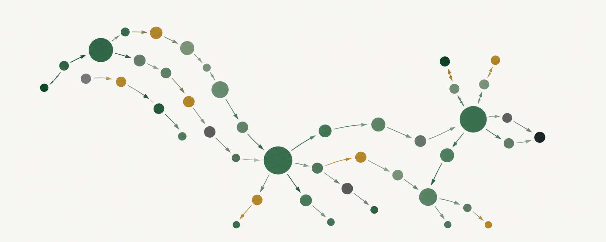

{width=100% fig-alt="Abstract composition of a squirrel as a graph in forest greens"}

This site contains course materials for *Causal inference, surveys, and missing data* (PHS/BMI 661).

- See the [Syllabus](00-syllabus.qmd) for course policies and schedule.
- Course notes are listed in the menu bar

## Background

This course builds a foundation for making causal claims from observational data. We want to move past associations — *this thing is related to that thing* — and actually say that one thing **causes** another. Does vaping give you cancer? Is intermittent fasting bad for your heart? Can I eat eggs every morning? People are acting on these questions regardless (vaping, skipping breakfast, eating eggs) and the science they rely on should meet them with honest answers rather than a shrug about causation.

Making those claims is hard. Without randomization, there are always at least two explanations for any pattern we see, and ruling them out requires both the right tools and honest accounting of their limits. 

We build those tools from the ground up. Causal models and graphs give us a rigorous shared language for representing cause and effect. From those models, we define potential outcomes and the causal effects they imply. Those quantities in hand, we turn to confounding. 

Measured confounding is the easier case, when our data contains everything needed to rule out alternative explanations. Unmeasured confounding is harder, and demands more creativity. And when that creativity is not enough, we are not out of options. Sensitivity analysis flips the burden of proof onto those who would dismiss a finding as mere association, asking how strong an unmeasured confounder would have to be to explain it away. That is exactly the question Cornfield put to the skeptics who challenged the link between smoking and lung cancer. 

These topics cover the most common problems in everyday public health and epidemiology, but confounding is not all there is to causal inference. We extend the same tools to practical complications like missing data and complex survey designs, and we point toward richer questions — sequential decision-making, mediation, and interference — even if we cannot cover them fully.

Those tools are learned by using them. We write code in R, analyze real data in class, and the final project involves emulating a target trial from observational data.