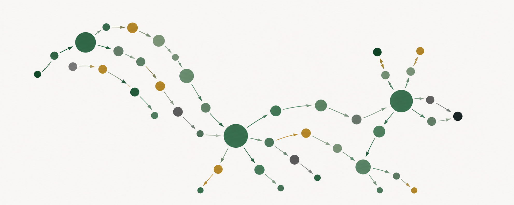

{width=100% fig-alt="Abstract composition of a squirrel as a graph in forest greens"}

Course materials for *Causal Inference, Surveys, and Missing Data* (PHS/BMI 661). The course develops practical tools for reasoning about cause and effect from observational data and extends them to missing data and complex surveys.

- See the [syllabus](00-syllabus.qmd) for policies and the course schedule.
- Find course notes in the menu bar.

::: {.callout-note title="About these notes"}
These notes began as materials for another course aimed at a mathematical audience and have since been adapted for an epidemiology audience. I used OpenAI Codex to assist with parts of that process, including translating and reorganizing explanations, checking claims against the literature, designing and editing figures, and editing prose and course materials. Because AI-assisted work can contain errors, I review and revise the material and take full responsibility for its content, including any mistakes that remain.
:::
